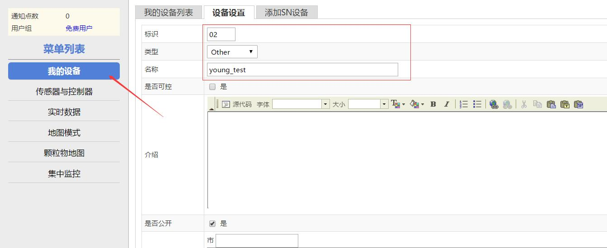
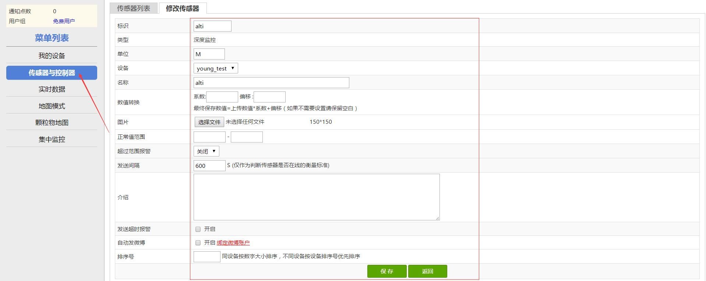
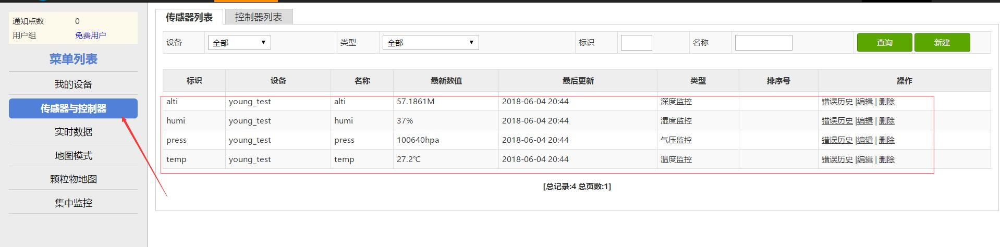
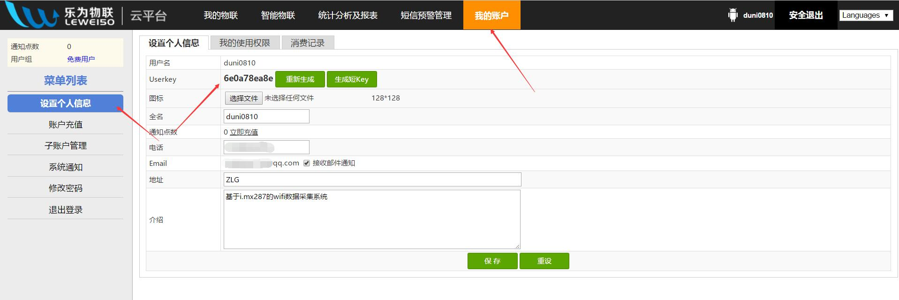

-> 目录 <-

[toc]

# 1.网址

[乐联网](https://www.lewei50.com/)
https://www.lewei50.com/
# 2. 基本信息配置
 进入网站后先注册一个账号。这里就不做细说明，注册一个信息也就==1min==的时间，快的很。 注册完之后，我们要设置一些设备和传感器的基本信息，例如设备号，传感器上传的数据单位什么的。如下图配置：
 
-><-

这里的设备标识在写socket会用到。
配置完设备还有传感器信息需要配置，点击左侧的”传感器与控制器“栏目，添加一些传感器信息即可，如下：

-><-

-><-

这里还需要配置一个==userkey==,在用户信息中，如下图：

-><-

这里差不多就配置这些东西，接下来讲解下乐联网的长连接方法的实现和代码的仿真。
# 3.发送用户网关数据到TCP服务器
之前说过要连接别的网络得有公网iP和网关等信息才能建立链接，下面是乐联网的公网的一些基本信息：
公网IP：tcp.lewei50.com（==101.37.32.173 #afc131==）
端口   ： 9960

我们给服务器发数据的数据格式是json格式，但是C中没有这个，这个我们在写代码的时候在说怎么解决这个问题。
如果你想链接乐联网，就得给服务器发送用户信息。格式如下：

``` javascript	
{

    "method": ">>==update==<<",

    "gatewayNo": "你的网关号",

    "userkey": "你的userkey"

}>>==&^!==<<
```
_*method固定为==update==；TCP服务器对于==1min==之内未发送数据的客户端主动断开，所以请保证定时间隔小于==1min==；必须发送该数据才能让TCP服务器识别出用户身份，才能进行下一步的上传数据，每次重新连接都需要重新发送该数据，这里设置的网关号是之前设置的设备标识，我设置的是==02==。*_

 - 如果只想反向控制，仅需要定时发送网关数据，并及时响应服务器发来的各种请求即可。
 - 如果需要上传测量设备数据，需要在首次连接时发送网关数据，然后定时上传测量设备数据。
 - 发送和接收都以&^!为结束符来判断是否完整包。

# 4.通过TCP长连接上传数据

``` javascript
{

    "method": ">>==upload==<<",

    "data":[

    {

        "Name":"humi",

        "Value":"data"

    },
	
    {

        "Name":"press",

        "Value":"data"

    }

]

}>>==&^!==<<
```
_*method固定为==upload==，name为==传感器的名称==，Value的值为传感器的==采集到的数据==，值得注意的是各个传感器的中间有一个 ==“，”== 隔开。*_


----------


关于乐联网的使用，大概说到这里。其实他的使用不仅仅只有这些，这里使用的仅仅是往服务器发数据而已，其实我们还可以通过服务器反向控制我们的硬件，这里我就不多说了，有兴趣可以自己去官网了解下，下面给出一份乐联网TCP长链接参考文档。[点击这里](https://www.lewei50.com/dev/doc/155)

# 5.代码测试
本该用板子搭载wifi联网发数据的，这里我没有硬件平台，我就在linux下写个网络socket仿真下整个过程。如果感兴趣的话，可以自己在stm32上搭载一个wifi（esp8266）,因为这个比较常见，而且他们都把lwip给你们移植好了，简单点。
先贴上代码：

``` javascript
#include<stdio.h>
#include<unistd.h>
#include<string.h>
#include<sys/types.h>
#include<sys/socket.h>
#include<netinet/in.h>
#include<netdb.h>
 
#define PORT            9960       // 端口号  
#define KEY             "6e0a78ea8e" // userkey 
#define GATEWAY          "02"
 
#define MAXDATASIZE 255              // 数据缓冲区最大长度 
 
int main(int argc, char *argv[])
{
	int  num            = 0;
    int  sockfd          = 0;
	struct hostent *he     = NULL;
    char  buffer[MAXDATASIZE] = {0};
 
    struct sockaddr_in server;       // 存储服务器端socket地址结构
    int i = 0;
 
    // 参数判断， 需要输入IP地址
    if(argc != 2)
    {
        printf("Usage: %s <IP Address>\n", argv[0]);
        return 0;
    }
 
    //通过gethostbyname()得到服务端的主机信息
    if((he = gethostbyname(argv[1])) == NULL)
    {
        printf("gethostbyname() error\n");
        return 0;
    }
 
    //使用socket()创建套接字
    if((sockfd= socket(AF_INET, SOCK_STREAM, 0)) == -1)
    {
        printf("socket() error\n");
        return 0;
    }
 
    //初始化server地址信息，端口号信息，并使用 IPv4 进行通信
    bzero(&server, sizeof(server));
    server.sin_family = AF_INET;
    server.sin_port = htons(PORT);
    server.sin_addr = *((struct in_addr *)he->h_addr);
     
    //使用connect()函数来配置套接字，建立一个与TCP服务器的连接
    if(connect(sockfd,(struct sockaddr *)&server,sizeof(server)) == -1)
    {
        printf("connect() error\n");
        return 0;
    }
     while (1)
    {
      i++;
      if (i == 70) {
	      i = 0;
      }

     //clear buffer
      memset(buffer, 0, MAXDATASIZE);
	  
      //组成buffer信息，发送给服务器
      sprintf(buffer, "{\"method\":\"update\", \"gatewayNo\""
	                  ":\"%s\", \"userkey\":\"%s\"}&^!",GATEWAY,KEY);
      send(sockfd, buffer, strlen(buffer), 0);
	  
	  // 接受服务器返回的数据
      recv(sockfd, buffer, strlen(buffer), 0);
      printf("1.received data is %s\n", buffer);
     
      // clear buffer
      memset(buffer, 0, MAXDATASIZE);
	  
	  // 组成传感器信息，发送给服务器
      sprintf(buffer, "{\"method\":\"upload\", \"data\":["
                      "{\"Name\":\"temp\",\"Value\":\"%d\"},"
                      "{\"Name\":\"humi\",\"Value\":\"%d\"}"
                      "]}&^!", i, 11);

      send(sockfd, buffer, strlen(buffer), 0);
      recv(sockfd, buffer, strlen(buffer), 0);
      printf("2. %s \n", buffer);
	  
	  // 延时5s 原则上要延时10s 因为服务器是10s更新一次
      sleep(5);
    }
 
    return 0;
}

```


		
		
		
		
		
		
		
		
		
		
		
		
		
		
		


