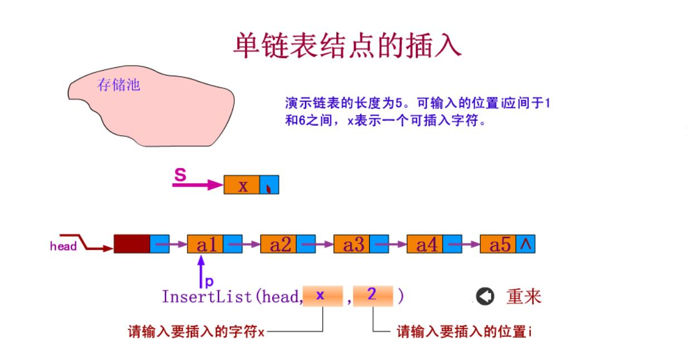
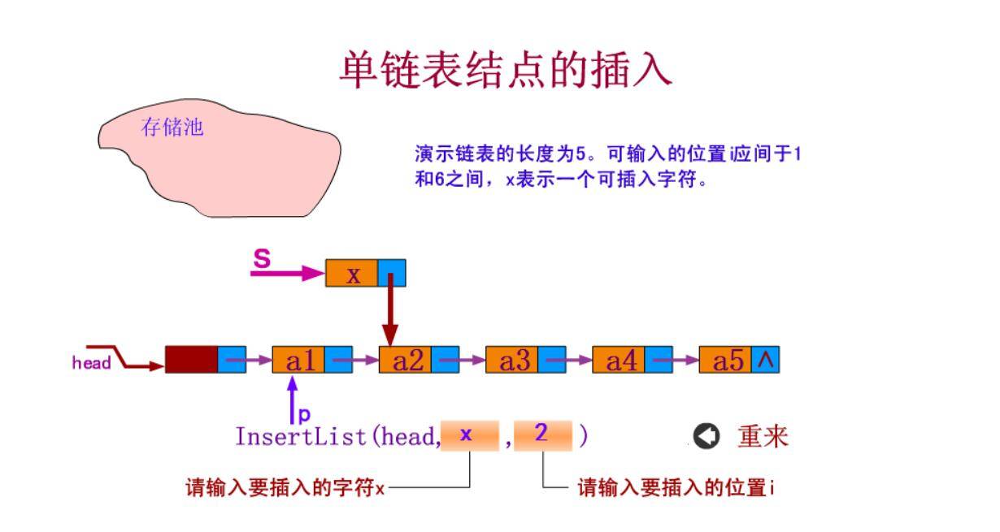
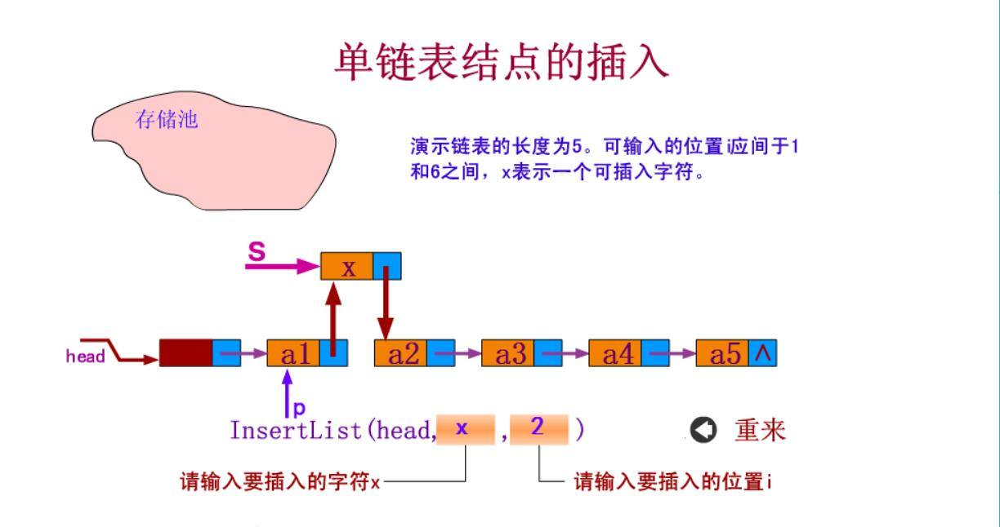
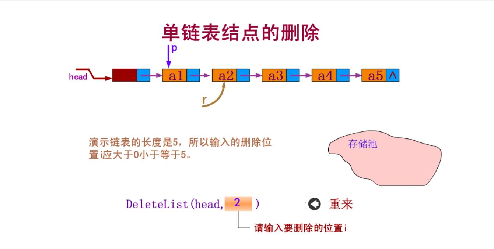
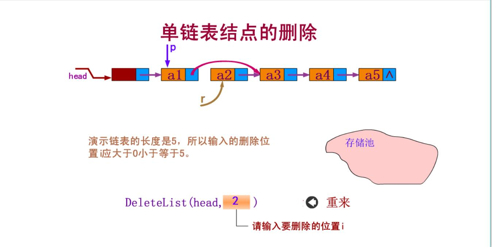
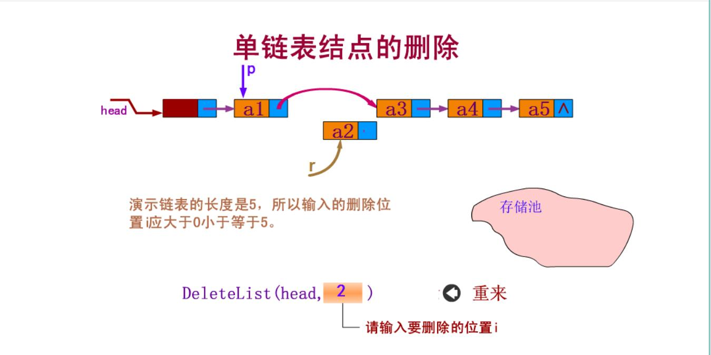

==文档制作工具：小书匠（markdown工具）==
==制作人     ：young==
==制作时间：2018-9-9==


----------

最近young本人发现做软件相关的还是得学学数据结构和面向对象编程。因本人我本科专业是自动化，没学过数据结构那玩意儿，什么二叉树呀，图呀……这些基本的概念几乎没有，所以就开始学习数据结构了。呃，还有一个事儿，就是我写笔记一般是在最近使用到啥就写点啥，上次用到网络就写写，可能下次还用到不一样的，还会继续更新，并不会写了就丢了，那就几没意思。
这篇我们还是从最简单的数据结构开始-单链表。我们说说可以复用的单链表结构和部分代码解析。

# 1. 单链表的操作的基本概念
这里就简单的说说，相信大家都学过C，老师上课都喜欢用排队这个例子介绍我就不多说了。链表的操作无非是“增，删，改，查”。

## 1.1 单链表-“增”

增-无非就是往已经有的链表中插入一个节点。我们在插入节点的时候必须先将待插入节点的指针指向下一个节点，将上一个节点指针指向插入的节点。用下图表示下：

一般分三步执行
 : 第一步找到待插入的节点；
 : 第二步将待插入节点指针指向下一个节点；
 : 第三步将找到的节点指针指向待插入节点；







## 1.2 单链表-“删”

删-删除一个节点和增加一个节点类似，先找到节点位置，然后将上一个节点指向下下一个节点，将该节点的指针指向NULL即可。下图表示：
删除节点一般也是三步
 : 第一步找到节点位置；
 : 第二步将待删节点的上一个指针指向待删除节点的下一个节点。
 : 第三步将待删除节点的指针指向空。







## 1.3 单链表-“改”

链表修改比较简单，就是找到该节点位置，修改该节点的信息即可。

## 1.4 单链表-“查”

链表的查也是找到节点，打印该位置的信息即可。

# 2 具体实现

下面是链表中基本函数的申明。

## 2.1 函数的申明和代码结构

``` c
/**
 * \brief 创建一个节点 
 *
 * \ret  节点的地址 
 */ 
LinkList* LinkList_Create (void);

/**
 * \brief 摧毁整个链表 
 *
 * \param list[in]   节点的地址 
 */ 
void LinkList_Destroy (LinkList* list);

/**
 * \brief 清空整个链表 
 *
 * \param list[in]  链表的表头 
 */ 
void LinkList_Clear (LinkList* list);

/**
 * \brief 获取链表长度 
 *
 * \param list[in]  链表的头节点 
 *
 * \ret 链表的长度 
 */ 
int LinkList_Length_Get (LinkList* list);

/**
 * \brief 插入链表 
 *
 * \param list[in]  链表的表头 
 * \param node[in]  待插入的链表
 * \param pos[in]   待插入的位置  
 *
 * \ret 1 ok  else error 
 */ 
int LinkList_Insert (LinkList* list, LinkListNode_t* node, int pos);

/**
 * \brief 获取链表节点信息
 * 
 * \param list[in]
 * \param pos[in]
 *
 * \ret 返回节点的地址 
 */
LinkListNode_t* LinkList_Get (LinkList* list, int pos);

/**
 * \brief 删除一个节点 
 * 
 * \param list[in]  头节点
 * \param pos[in]   待删除的节点位置 
 * 
 * \ret 要删除的节点地址 
 */ 
LinkListNode_t* LinkList_Delete (LinkList* list, int pos);
```
这个比较简单，就按照这个函数原型来写函数的定义即可。这里我分析两个函数的实现---链表的插入和删除。因为这两个比较具有代表性。
在介绍实现以前先说下代码的基本架构。在 `list.h` 文件中的结构题和类型定义如下:

``` c
/* void *  做一个万能类型的匹配 */ 
typedef void LinkList; 

typedef struct LinkListNode {
	struct LinkListNode *next; /**< \brief 指向下一个节点的地址 */
} LinkListNode_t;
```
在`list.c` 文件中的结构体和定义如下：

``` c
/** \brief 链表信息 */
typedef struct _tag_ListNode {
	LinkListNode_t hander; /**< \brief 链表的头指针 */ 
	int length;        /**< \brief 链表长度         */ 
} TListNode_t;
```

## 2.2 链表插入的实现

这里我做了一个代码的分层管理，这个在后面的代码中会讲到，在之前的笔记中提到过，需要注意的是在这个结构中指向下一个节点的指针必须在结构体中的第一个参数，这个我们在之前的文章有说明过，出门左转找到 ==嵌入式C实现oop== 的文章有介绍 。我们先附上一段链表插入的定义代码：

``` c
/**
 * \brief 插入链表 
 *
 * \param list[in]  链表的表头 
 * \param node[in]  待插入的链表
 * \param pos[in]   待插入的位置  
 */ 
int LinkList_Insert (LinkList* list, LinkListNode_t* node, int pos)
{
	int i = 0;
    TListNode_t *slist = (TListNode_t *)list; /* 保存头节点 */
	int ret   = (NULL != slist) &&  (NULL != node)  && (pos >= 0);
	
	/* 合法判断 */
	if (ret != 0) {
		
		LinkListNode_t *current = (LinkListNode_t *)slist; 
		
		/* 先找到待位置 要多一个条件判断保证不是空链表 */
		for (i = 0; (i < pos) && (slist->hander.next != NULL); i++) {
			current = current->next;
		} 
		
		node->next    = current->next; /* 将新节点的指针直线下一个节点 */
		current->next = node;  /* 将上一个节点的位置指向新节点 */ 
	
        (slist->length)++;	
	} /* ret */
	
	return ret;
}
```
上面的 `LinkList` 的类型其实void类型，这个我在`list.h` 文件中做了一个假封装，为了就是让传入的参数有类型可以自己定义，方便抽象。实际上我们将 `TListNode_t` 定义在C文件中其实类似与私有量。外部文件实际上是不能直接访问，只能通过定义的方法来访问，这样就保护了链表内部信息的安全性，也是为了便于管理内部文件。
函数首先得有一个参数合法性的判断，保证正确性。在上面的代码中，有一个判断不能丢失`(slist->hander.next != NULL)`,防止访问到空。我在 `list.c` 文件中还有一个参数就是结构体的长度，我们在每插入一个节点的时候，必须将节点长度加1。

## 2.3 链表的删除

``` c
/**
 * \brief 删除一个节点 
 * 
 * \param list[in]  头节点
 * \param pos[in]   待删除的节点位置 
 * 
 * \ret 要删除的节点地址 
 */ 
LinkListNode_t* LinkList_Delete (LinkList* list, int pos)
{
	int i = 0;
	LinkListNode_t *ret = NULL;
	TListNode_t *slist = (TListNode_t *)list;
	
	/* 合法判断 */
	if ((slist != NULL) && (pos >= 0) && (slist->length > pos)) {
		
		LinkListNode_t *current = (LinkListNode_t *)slist;
		
		/* 找到要删除的节点 */
		for(i = 0; i < pos; i++) {
			current = current->next;
		}
		ret = current->next; /* 指向要删除的节点 */
		current->next = ret->next; /* 上一个节点对接下一个节点 */ 
		
		ret->next = NULL;
		
		(slist->length)--; /* 长度减一 */
	}
	return ret;
}
```
删除和插入是差不多的实现方式，找到位置，然后指指向修改，让要删除的节点指针指向为空。就可以了。

这里我们在说明下在 `main.c` 中是如何定义的。

``` c
struct Value {
	LinkListNode_t header; /* 头指针 */
	int        value;  /* 数据 */
}; 
```

