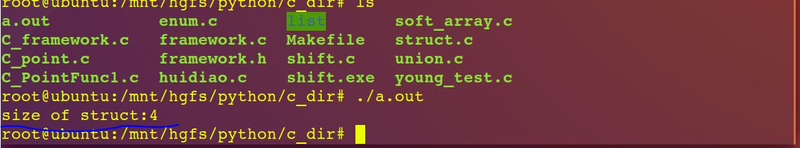
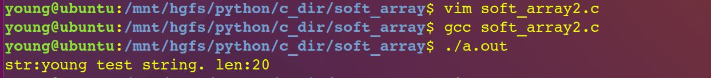
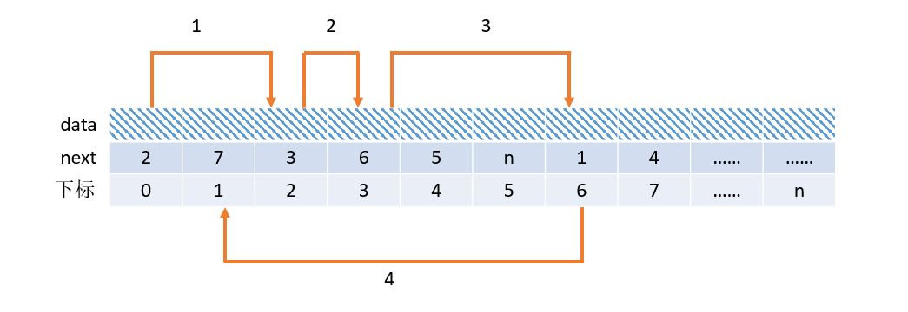

==文档制作工具：小书匠（markdown工具）==
==制作人     ：young==
==制作时间：2018-9-15==


----------

这篇文章我们来讲解下什么柔性数组，具体的应用是什么和还有静态链表的实现。

# 1.  柔性数组

## 1.1 柔性数组的定义

我们先来说说什么是柔性数组。

柔性数组
 : 结构中**最后一个元素**允许是未知大小的数组，这个数组就是柔性数组。
 直接给一个实例定义看看是啥玩意儿：
 

``` c
typedef struct soft_array
{
    int len;
    int array[]; // 柔性数组
} soft_array_t;
```

 换句话说，实际上柔性数组是一个不定长的数值，也就是我们常说的不完整类型，如果我们直接定义的话，编译报错，但是我们赋值的话，不会报错。如下:
 
``` C 
 a[];  // 编译报错
 a1[] = "young test!"; //编译成功
```
上面说到柔性数组的一个不定长的数值，那他在程序中的内存是什么分布的呢？下面我们写一段代码测试一下柔性数组在内存中的表示：

``` c
#include <stdio.h>

typedef struct soft_array {
    int len;
    int array[]; // 柔性数组
} soft_array_t; 

int main()
{
    soft_array_t test;
    printf("size of struct:%ld \r\n", sizeof(test));
    return 0;
}
```


## 1.2 柔性数组的使用

我们可以看到输出的结果为4字节，只有一个int的大小，并没有柔性数组的空间大小。我们知道指是会占用一个指针大小的空间的，但是柔性数值只会占用一个占位符号，不占用任何的空间。
这里我们可以再写一个实例，看下既然是不定长的数组，那我们应该怎么使用他呢？看下面的代码：

``` c
#include <stdio.h>
#include <malloc.h>
#include <string.h>

typedef struct soft_array {
    int  len;
    char array[];
} soft_array_t;

#define  VAL "young test string."

//创建柔性数组
soft_array_t *creat_soft_array(int num)
{
    soft_array_t *ret = NULL;
    
    if(num > 0) {
        //printf("size num:%ld \r\n", sizeof(soft_array_t) + sizeof(*(ret->array)) * num);
        ret = (soft_array_t *)malloc((sizeof(soft_array_t) + sizeof(*(ret->array))) * num);
        //初始化
        memset(ret->array, 0, sizeof(*(ret->array) * num));
        ret->len = num;
    }
    return ret;
}

int main ()
{
    // 申请20个字节的空间
    soft_array_t *array = creat_soft_array(20);
   
    strcpy(array->array, VAL);
    printf("str:%s \t len:%d\r\n",array->array, array->len);

    free(array);
    return 0;
}
```


上面简单的代码测试过程我们很容易得出柔性数组的基本作用，当我们结构体想分配一个不固定的内存空间的时候，柔性数组会自动指向那段内存，使用柔性数组的优势是他本身不占用任何空间。
当然柔性数组和指针很像，但是与指针还有有一些本质上的不同，比如指针可以在结构体中的任何一个位置，但是如果想要使用**柔性数组必须放在结构体中的最后的位置**；我们指针使用比较灵活，可以指针指向的位置可以是任意的不连续的，但是我们使用柔性数值内部必然是连续的；在结构体中指针是会占用一定大小的空间，但是**柔性数组不会占用空间，只会占用一个符号而已，可以单做一个地址符号。**


# 2.  静态链表

## 2.1 静态链表的定义

为什么要理解柔性数值呢？主要是为了讲解下面的静态链表，那什么是静态链表呢？既然使用柔性数组表示的链表，我们可以简单的理解他的定义：**就是用数值来表示的链表，就是静态链表。**
我们之前说过单链表，这个就是一个动态的链表，比如在linux内核中应用的比较广泛，那静态链表的在哪些场合中使用呢？例如我们使用的TCP/IP协议，还有需要动态生成ID的场合等。

## 2.2 静态链表的原理

那下面我们来画张图讲解下这东西的具体实现是什么样子的。



如上图我们知道静态链表的最少有两个数据段，一个是data，另一个就是next，这个和我们的单链表类似，**只是我们这里的next表示的是下一个元素在数组中存放的数值下标**。例如我们的链表从第0个元素开始，他的next值为2，表示他的下一个元素存在数组下标为2的地址中；下标为2的元素的next为3，表示他的下一个元素的地址存储在表为数组下标为3的地址中；数组下标为3的next值存储为6，表示他的下一个元素存储在数组下标为6的位置，以此类推。

其实本质上静态链表的实现和我们单链表的实现是差不多的。那么我们现在来看看静态链表的一些定义。

``` c
// 节点定义 
typedef struct _tag_StaticListNode {
	unsigned int data;		// 数据以地址的形式保存（x86） 
	int next;					// 保存下一个数据的位置 
} staticlistnode_t;

// 静态链表的结构体的定义 
typedef struct _tag_StaticList {
	int              capacity;			// 表示链表最多容纳的元素 
	staticlistnode_t header;	// 保存头节点
	staticlistnode_t node[];	// 保存数据的柔性数组 
} staticlist_t;
```
值得注意的是结构体中节点信息中的数据，这里我统一保存的是地址，并不是将数据直接保存，原因是为了实现复用。

_以上程序是运行在32位系统上，因为在32系统上指针类型占4个字节，64位系统上是8个字节。_

关于静态链表的实现和单链表比较像，这里我主要讲下静态链表的插入和删除，其他的都比较简单，可以参看单链表的实现。

## 2.3 静态链表的插入与删除

### 2.3.1 静态链表的插入

关于静态链表的插入大概可以分为如下几个小步实现：

 - 判断线性表是否合法
- 判断插入位置是否合法
- 在数组中查找空闲位置index
- 由表头开始通过next域移动pos次后，当前元素的next域为要插入的位置
- 将新元素插入
- 线性表长度加1

下面我们用代码的方式来看下具体的实现过程。

``` c
int StaticList_Insert (StaticList* list, StaticListNode* node, int pos)
{
	int i   = 0; 
	int index = 0; // 用与记录找到空闲位置的标识
	int current = 0;
	staticlist_t *slist = (staticlist_t *)list;
	int ret  = ((slist != NULL) && (node != NULL));
	
	// 数据大小不能溢出
	ret = ret && (slist->header.data + 1 <= slist->capacity); 
	ret = ret && (pos >= 0) && (pos < slist->capacity); 
	
	if (ret) {
		
		// 遍历空闲数值， 找一个可插入的空闲位置 
		for (i = 0; i < slist->capacity; i++) { 
			if (slist->node[i].next == -1) {
				// 记录空闲位置 ,并且退出查找空闲位置 
				index = i;                      
				break; 
			}
		} 
		
		// 给结构体节点信息赋值 
		slist->node[index].data = (unsigned int)node; 
		
		// 赋值静态链表头 
		slist->node[0] = slist->header;                  
		
		for (i = 0; (i < pos) && (slist->node[current].next != 0); i++) {
			current = slist->node[current].next;   
		} 
		
		slist->node[index].next   = slist->node[current].next; 
		slist->node[current].next = index;
		
		// 插入完成，数据元素+1 并更新链表 
		slist->node[0].data++;          
		slist->header = slist->node[0]; 
	}
	
	return ret;
}
```

在初始化的时候，一般将没有用到的位置将他的next值标记为 **-1**，主要是为了将来在找空闲位置的时候方便。
这里我们传进来的第一参数是链表的首地址，第二个参数是插入的数据（以地址的形式存储），第三个是位置信息。我们第二个数据是一个地址，为什么不直接将值传进来呢？主要是我们要保存的是这个地址，如果传值的话太过于死板。
结合我们的结构体来看，我们的链表的第0个元素是作为链表的表头，他保留着链表的信息，例如大小等。


