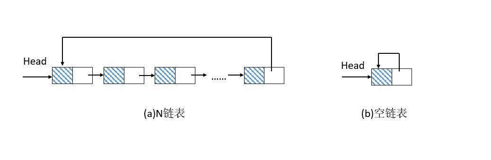
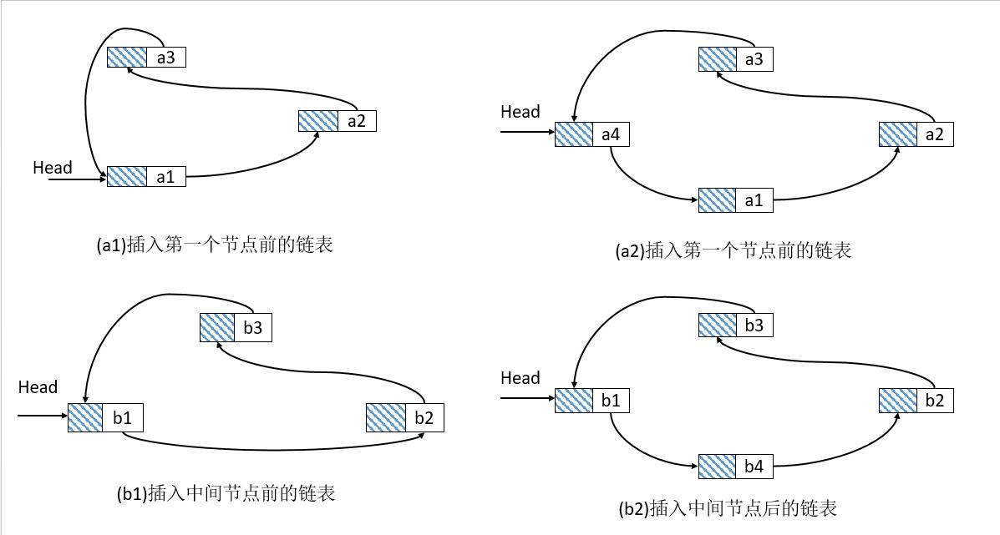
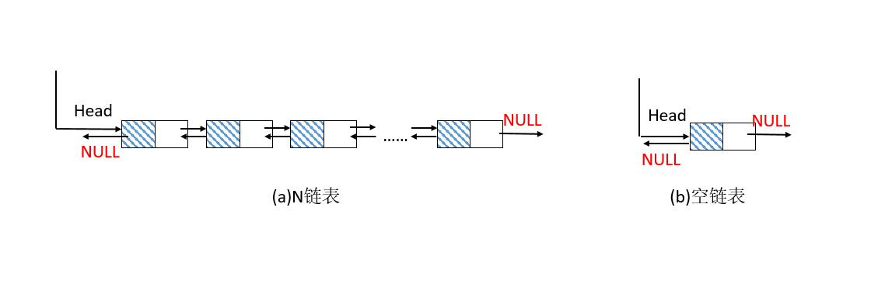
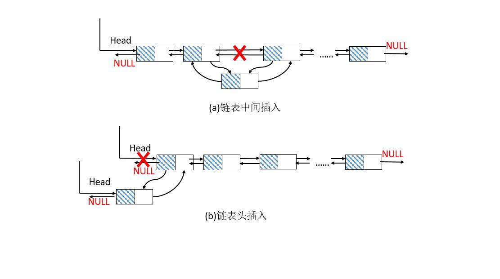
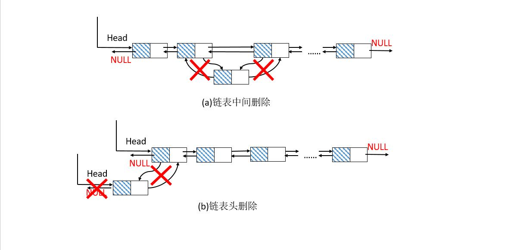
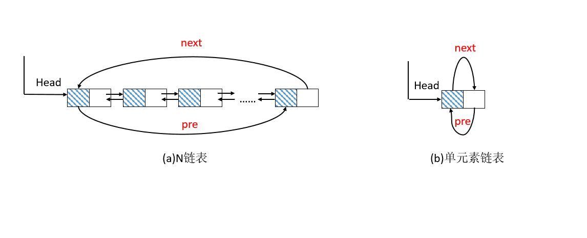

==文档制作工具：小书匠（markdown工具）==
==制作人     ：young==
==制作时间：2018-10-3==


----------

这篇文章讲解下 **==循环链表==** ，==**双向链表**== 和 ==**双向循环链表**== 的实现，其实他们的实现和是在单链表的基础上实现的，这里我们只讲关于实现他们的注意事项，其实他们呢实现过程中，要注意的点只有两个， **==插入和删除的第一个节点的处理 #e03324==** 。

# **1 循环链表**

在循环链表中，他的特点无非是最后一个节点指向第一个节点构成一个循环（如果只有一个节点，那么这这个节点就是指向自己）。画个图理解下就比较直观。



这个好理解，我们现在说说循环链表的插入操作点，一样用画图的方式理解。

## **1.2 循环链表的插入**

先看下图



图中的（a1）（a2）为一组；（b1）（b2）为一组。那么我们分两组来讨论这个问题，下面我就简称**a组**和**b组**了。

对于b组而言：数据内容是插入到头指针指向的第一个节点位置，所以我们要变化的是找到节点位置，将待插入的节点指向下一个节点，上一个节点指向插入的节点就可以了。

``` clj
		 node->next   = current->next;
		 current->next = node; 
```

对于a组而言：数据内容是插入到头指针指向的第一个节点位置，所以我们要变化的不仅仅是找到最后一个节点，将最后一个节点指向第一个节点（插入的节点），**我们还要做的是将头指(Head)针指向插入的节点**。

代码实例如下：

``` c
// 插入节点 
// 1.参数合法性判断
// 2.找到插入位置
// 3.实施插入算法，并将链表信息的长度加 1 
// 4.插入有几个比较特殊的地方：如果是空；
//	(1)链表插入的话，游标指向第一个元素；
//	(2)如果是插入在第一个元素的话,我们得找到链表的最后一个元素，将他的next指向插入的元素 
int CircleList_Insert(CircleList *list, circlelist_node_t *node, int pos)
{
	int i = 0;
	circlelist_t *slist = (circlelist_t *)list;  // 类型解封装 
	int ret = ((slist != NULL) && (node != NULL) && (pos >= 0));
	
	// 参数合法
	if (ret) {  
		circlelist_node_t *current = (circlelist_node_t *)slist;
		 
		 // 遍历链表的位置 
		 for (i = 0; (i < pos) && (current->next != NULL); i++) {
		 	current = current->next; 
		 }
		 
		 // 找到位置之后 插入链表  node 就是我们要插入的链表
		 // 这里的操作和单链表一致 
		 node->next   = current->next;
		 current->next = node; 
		 
		 // 如果是第一次插入的话要让 node 指向自己
		 if (slist->length == 0) {
		 	slist->slider = node;
		 } 
		 
		 // 插入一个节点位置自然要加 1 处理 
		 slist->length++;
		  
		 // 这里我们做的是循环链表 所以有几个特殊的位置需要单独的处理
		 // 例如  如果是插入第一个位置的话 
		 if (current == (circlelist_node_t *)slist) {
			// 如果插入的位置在头指针，那么要找到最后一个元素，
			//然后将最后一个元素的下一个位置指向current的下一个 
		 	circlelist_node_t *last = CircleListNode_Get(slist, slist->length - 1);
		 	last->next = current->next;
		 }
	}	
	return ret;
}
```

 _代码中的的slider是游标，详情看代码悉知。_


## **1.3 循环链表的删除**

一样先上图。


图中图（a）是原始的链表，图（b）是删除第一个节点后的链表，图（c）是删除中间任意节点的链表，这个我们好理解，删除一个节点无非是将上一个节点链接就可以了。

``` clj
		ret = current->next;
		current->next = ret->next;
```

但是也有一个特殊的地方，那就是第一个元素，要特殊处理，其实也就多了两步：
 (1) 找到最后一个元素，将最后一个元素指向删除元素的下一个元素
 (2) 头指针指向删除元素的下一个元素

_代码中用到一个游标参数，如果游标正好指向删除元素的话，将游标指向删除元素的下一个元素_

``` c
// 删除位置节点 
// 1. 合法性判断 
// 2. 找到要删除的节点位置
// 3. 实施删除算法，并且链表长度 -1 
// 4. 删除也有几个比较重要的点，特别是：如果删除的是第一个节点 
//	(1) 为了提高代码的效率问题，如果我们要删除的是第一个节点，应该是先找到最后一个节点，
//		保存节点，这可以在第 3 步之前实施判断,避免每次都要循环找到最后一个节点。
//	(2) 如果真的是删除第一个节点，我们将最后一个节点指向删除节点的下一个节点，并且游标也移动。
//	(3) 如果节点都被删除完(节点的长度为0)，那么一切回 0 
circlelist_node_t *CircleList_Delete(CircleList *list, int pos)
{
	// 解封装 
	circlelist_t *slist = (circlelist_t *)list;
	circlelist_node_t *ret = NULL;
	int i = 0;
	 
	// 合法性判断 
	if ((slist != NULL) && (pos >= 0) && (slist->length > 0)) {
		circlelist_node_t *current = (circlelist_node_t *)slist;
		circlelist_node_t *last = NULL; // 定义最后一个节点 
			
		for(i = 0; i < pos; i++) {
			current = current->next;
		}
		// 如果删除的是第一个节点
		if(current == (circlelist_node_t *)slist) {
			last = CircleListNode_Get(slist, slist->length - 1);
		} 
		
		// 删除节点操作 
		ret = current->next;
		current->next = ret->next;
		slist->length--;
		
		// 删除的是第一个节点 
		//将头节点的指向删除节点的下一个节点，最后一个节点也指向删除节点的下一个节点 
		if (last != NULL) {
			slist->header.next = ret->next;
			last->next = ret->next; 
		}
		
		// 如果游标所在的位置被删除，那么游标也顺表下移一位 
		if (slist->slider == ret) {
			slist->slider = ret->next;
		}
		// 如果节点被删完了，让头节点指向NULL，游标也指向NULL 
		if (slist->length == 0) {
			slist->header.next	= NULL;
			slist->slider = NULL;
		} 
	} 
	return ret;
}
```
_循环链表可以解决约瑟夫环问题，代码中有介绍和实现。_

# **2. 双向链表**

一样先上图



值得注意的是，我们说的双向链表就是在 **==单链表的结点中增加一个指向其前驱的pre指针==** ，然后就是第一个元素的前驱就是指向NULL和最后一个节点的下一个节点也是指向NULL的；如果他们的节点只有一个的话，那他的前驱和后继都是为NULL的。

依然我们讲解下他的插入与删除，因为这两个操作对于第一个元素而言比较特殊。

## **2.1 双向链表的插入**



双向链表的插入会稍微的复杂点，在中间插入的话，操作步骤一般是保留当前节点 ==current== 和下一个节点 ==next== ；将==current== 的next指向插入的节点；将插入的节点next指向下一个节点==next==；将==next==的前驱指针指向插入节点，将插入节点的前驱节点指向==current==。

``` c
	current->next = node;
	node->next = next;
	next->pre = node;
	node->pre = current;
```

如果是第一个节点的话，不同的是插入节点的上一个节点必须指向NULL,并且**头指针的指向必须发生变化。**

``` c
// 5. 插入链表 
int DoubleList_Insert(DoubleList* list, doublelist_node_t* node, int pos)
{
	int i = 0;
	doublelist_t *slist = (doublelist_t *)list;
	int ret = ((slist != NULL) && (node != NULL) && (pos >= 0));
	
	// 合法性判断 
	if (ret) {
		doublelist_node_t *current = (doublelist_node_t *)slist;
		doublelist_node_t *next = NULL; 
		 
		for(i = 0; (i < pos) && (current->next != NULL); i++) {
			current = current->next; 
		}
		next = current->next; // 保存下一个节点
		
		// 执行插入算法
		current->next = node;
		node->next = next; 
		
		// 下一个节点不为 NULL 
		if (next != NULL) {
			next->pre = node;
		}
		node->pre = current;

		// 如果是一个空链表
		if (slist->length == 0) {
			slist->slider = node;
		} 
		
		slist->length++;
		
		// 如果插入第一个节点
		if(current == (doublelist_node_t *)slist) {
			node->pre = NULL;
		} 
	}
	return ret;
}
```
_同样的代码中的slider为游标。_


## **2.2 双向链表的删除**

删除和插入差不多，他们特殊的也是第一个元素的删除。这里就说下操作问题。



双向链表中的删除也是分两种，删除第一个元素还是删除其他元素。删除其他元素的话没什么好说的，无非是指向变化一下.

``` c
	current->next = next;
	next->pre = current;
```

还是说说删除第一个元素的特殊的地方。如果删除第一个元素，那么头指针指向必须变化，向后顺移一位；而后是头指针指向的节点的前驱得设置为NULL。

``` c
// 7. 删除某个位置链表节点 
doublelist_node_t* DoubleList_Delete(DoubleList* list, int pos)
{
	doublelist_t *slist = (doublelist_t *)list;
	doublelist_node_t * ret = NULL;
	int i = 0;
	if ((slist != NULL) && (pos >= 0) && (pos < slist->length)) {
		
		doublelist_node_t *current = (doublelist_node_t *)slist;
		doublelist_node_t *next = NULL;
		for (i = 0; i < pos; i++) {
			current = current->next;
		}
		ret  = current->next; // 待删除的元素 
		next = ret->next;     // 下一个元素
		
		// 执行删除算法
		current->next = next;
		if (next != NULL) {
			next->pre = current;
			// 如果删除的是第一个元素 
			if (current = (doublelist_node_t *)slist) {
				next->pre = NULL; 
			}
		}
		slist->length--;
		
		// 如果游标所在的位置被删除，瞬移一位 
		if (slist->slider = ret) {
			slist->slider = next;	
		} 
	}

	return ret;
}
```
_代码中的slider为游标，具体的可以看源码得知。_

# **3. 双向循环链表**

最后我们再介绍下双向循环链表，上图。



如果掌握了双向链表和循环链表的话，其实双向循环链表是比较简单的。无非就是在循环链表中加上一个循环就好了。比较特殊的就是最后一个节点必须指向第一个节点和第一个节点的前驱指向最后一个节点罢了。
我们看看具体改动了些什么，先看看插入的代码：

``` c
// 5. 插入链表 
int Circle_Double_List_Insert(Circle_Double_List* list, circle_doublelist_node_t* node, int pos)
{
	int i = 0;
	Dcirclelist_t *slist = (Dcirclelist_t *)list;
	int ret = ((slist != NULL) && (node != NULL) && (pos >= 0));
	
	// 合法性判断 
	if (ret) {
		circle_doublelist_node_t *current = (circle_doublelist_node_t *)slist;
		circle_doublelist_node_t *next = NULL; 
		 
		for(i = 0; (i < pos) && (current->next != NULL); i++) {
			current = current->next; 
		}
		next = current->next; // 保存下一个节点
		
		// 执行插入算法
		current->next = node;
		node->next = next; 
		
		// 下一个节点不为 NULL 也就是不为空链表 
		if (next != NULL) {
			next->pre = node;
		}
		node->pre = current;
		
		// 如果是一个空链表
		if (slist->length == 0) {
			slist->slider = node;
		} 
		
		slist->length++;
		
		// 如果插入第一个节点
		if(current == (circle_doublelist_node_t *)slist) {
			// 找到最后一个元素 
			circle_doublelist_node_t* last = Circle_Double_List_Get(slist, slist->length -1);
			
			last->next = current->next;
			node->pre = last;
		} 
	}
	return ret;
}
```
其实改动部分就是如果是第一个元素的时候，我们将插入元素的上一个节点指向最后一个元素，最后一个元素指向插入的元素而已。对应的删除其实也是差不多的操作。

``` c
//7. 删除某个位置链表节点 
circle_doublelist_node_t* Circle_Double_List_Delete(Circle_Double_List* list, int pos)
{
	Dcirclelist_t *slist = (Dcirclelist_t *)list;
	circle_doublelist_node_t * ret = NULL;
	int i = 0;
	
	// 合法性判断 
	if ((slist != NULL) && (pos >= 0) && (pos < slist->length)) {
		
		circle_doublelist_node_t *current = (circle_doublelist_node_t *)slist;
		circle_doublelist_node_t *next = NULL;
		circle_doublelist_node_t *last = NULL; 
		
		for (i = 0; i < pos; i++) {
			current = current->next;
		}
		ret  = current->next; // 待删除的元素 
		next = ret->next;    // 下一个元素
		
		// 执行删除算法
		current->next = next;
		next->pre = current;
			
		// 如果删除的是第一个元素 
		if (current = (circle_doublelist_node_t *)slist) {
			
			// 先找到最后一个元素 
			last = Circle_Double_List_Get(slist, slist->length -1);
			last->next = next;
			next->pre = last;
		}
		slist->length--;
		
		// 如果游标所在的位置被删除，顺移一位 
		if (slist->slider = ret) {
			slist->slider = next;	
		} 
		
		// 如果链表为空 
		if (slist->length == 0)  {
			current->next = NULL;
			current->pre = NULL; 
			slist->slider = NULL;
		}
	}

	return ret;
}
```
==好了，关于链表我就介绍到这里了。虽然学过链表，但是在写可以复用的链表中还是遇到乱七八糟的问题，其实很多人不理解，为什么还要学数据结构，都已经工作了。其实我想的是我写代码的思维方式还是有很大的问题，很少考虑代码的复用性和通用性，还是一点就是我是做嵌入式软件的，但是我在本科阶段真的没学过数据结构，计算机组成原理，编译原理什么的，现在要捡起来一点点的补齐。毕竟不在学校，重新学东西还是挺费时费神的，特别是写文章的时候，虽然代码写好了，但是写文章要画图，测试代码啥的，挺烦的说实在。但是做公众号我也是有自己的一点私心，除了兑现大学时候的承诺之外，就是我希望我之后考研或者跳槽，对我有点实质性的帮助吧。==
好了，就这样吧，下回见。


