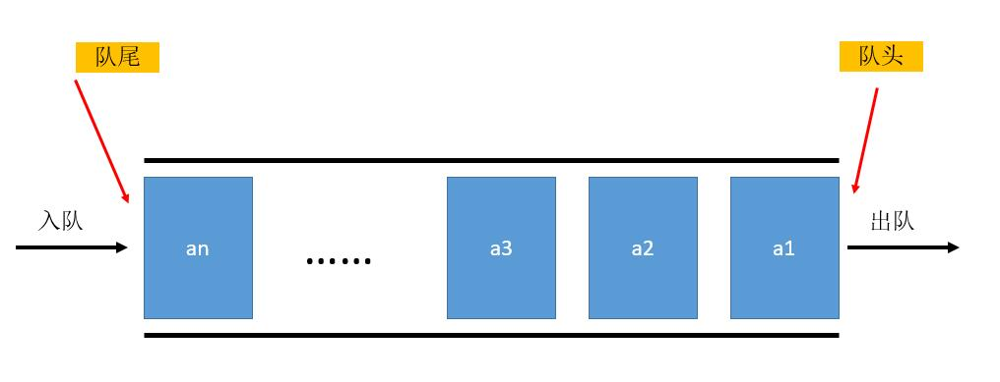
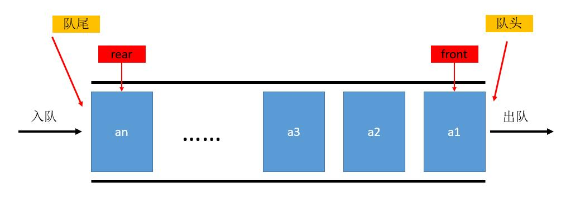

==文档制作工具：小书匠（markdown工具）==
==制作人     ：young==
==制作时间：2018-10-14==


----------

# 1. 队列的定义和性质

这篇文章咱们来聊聊队列的实现。其实队列的应用在操作系统中应用很广泛的。例如：邮箱，消息队列等，内部实现机制大部分都用到队列。所以咱们今天来说说队列的定义与实现。

队列和栈有类似的地方，他也是一种特殊的线性表。如果忘记栈的实现，出门左拐，可以看到之前的文章。我们说过的栈是在线性表的一端操作，而队列是在线性表的两端操作，在队头的地方取出数据元素，在队尾插入元素。队列和栈一样不允许在中间部位进行操作。总的来说他的性质就是 ==**先进先出**==，我们可以看下他的示意图，如下：



# 2. 队列的操作与代码实现

其实看起来和栈的操作无非是两头操作的区别，其他好像都差不多，所以他么的操作也是一样的，如下：

* 创建队列
* 销毁队列
* 清空队列
* 进队列
* 出队列
* 获取队头元素
* 获取队列的长度

差不多吧，所以队列的实现差不多，我们也可以复用之前写过的单链表实现一个队列。下面是链式队列的实现文件中的节点结构体。

``` c
// 链式信息 
typedef struct _tag_LinkQueueNode
{
    LinkListNode_t header;
    void* item;				// 保存信息 
} LinkQeueNode_t;
```
其中 ==item== 和之前的栈一样，用于保存该节点的信息，所以用 ==void *== 保存信息。

代码如下：

``` c
/ 创建队列 
LinkQueue* LinkQueue_Create() 
{
    return LinkList_Create();
}

// 销毁队列 
void LinkQueue_Destroy(LinkQueue* queue)
{
    LinkQueue_Clear(queue);
    LinkList_Destroy(queue);
}

// 清空队列 
void LinkQueue_Clear(LinkQueue* queue) 
{
    while( LinkQueue_Length_Get(queue) > 0 )
    {
        LinkQueue_Retrieve(queue);
    }
}

// 入队 将信息插入队列空间的最后 
int LinkQueue_Append(LinkQueue* queue, void* item) 
{
    LinkQeueNode_t* node = (LinkQeueNode_t*)malloc(sizeof(LinkQeueNode_t));
    int ret = (item != NULL) && (node != NULL);
    
    if(ret)
    {
        node->item = item;
        
        ret = LinkList_Insert(queue, (LinkListNode_t*)node, LinkList_Length_Get(queue));
    }
    
    if(!ret)
    {
        free(node);
    }
    
    return ret;
}

// 出队   从第一个位置出列 
void* LinkQueue_Retrieve(LinkQueue* queue) 
{
    LinkQeueNode_t* node = (LinkQeueNode_t*)LinkList_Delete(queue, 0);
    void* ret = NULL;
    
    if(node != NULL) 
    {
        ret = node->item;
        
        free(node);
    }
    
    return ret;
}

// 返回队列的头信息 
void* LinkQueue_Header(LinkQueue* queue) 
{
    LinkQeueNode_t* node = (LinkQeueNode_t*)LinkList_Get(queue, 0);
    void* ret = NULL;
    
    if(node != NULL)
    {
        ret = node->item;
    }
    
    return ret;
}

// 返回队列的长度 
int LinkQueue_Length_Get(LinkQueue* queue) 
{
    return LinkList_Length_Get(queue);
}
```

代码中的 ==LinkQueue== 类型为 ==void== ， 在头文件中定义的类型。代码中的实现和栈差不多吧，实现起来比较容易。但是呢？有没有发现我们如果简单的复用单链表，他在**实现队尾入队的时候每次都得遍历一遍链表才能找到队尾**。假设呢，我们这个队列的元素有好1000个，那插入的时候，得便利1000个元素，效率贼低，所以我们可以利用游标的方式，简化一下程序。那如何使用游标呢？看下面的讲解。

# 3.队列优化实现

我们可以设立两个游标，一个为游标指向队头（front）,另一个游标指向队尾（rear）。当我们入队的时候，在链表的队尾插入，并且将指向队尾的游标更新到插入的位置（rear++）；同理，如果出队列，我们在队列的头操纵，并且移动相应游标（front++）。如下图：



## 3.1 顺序表优化

使用游标的时候，他们有几个特性在顺序表中，几个状态如下：

``` markdown
初始状态 ：length == 0, front == 0, rear == 0;
空队列状态：length == 0, front == rear;
满队列状态：length == capacity, front == rear;

length : 队列中实际元素的长度
capacity: 顺序表的实际容量
front: 队头
rear; 队尾
```

现在还有一个问题，就是在顺序表的大小是固定的，所以如何循环的使用循序表也是一个问题。其实这个问题比较好解决，我们利用运算中的取余(%)符号计算。可以实现循环使用。

``` markdown
入队：rear = (rear + 1) % capacity;
出队：front = (front + 1) % capacity;
```

原理说了，这样我们只要知道队头或者队尾的游标位置，就可以进行操作了，剩去了遍历的时间，可以自己尝试实现下，当然，young本人的测试代码也可以获取，文章末尾会说明怎么获取。

## 3.1 链式表优化

链式表优化比较简单，我们只要定义rear指针始终指向链表中的最有一个元素，入队时将新元素通过rear插入队尾，且将rear指向新元素就可以了，而front 始终指向第一个元素。链式队列的状态如下：

``` markdown
空队列状态：front == NULL, rear == NULL;
```
他的关键操作如下操作：

``` c
//入队
rear->next = node;
rear = node;
node->next = NULL;
//出队：
front = front->next;
```
原理比较简单，可以选择自己实现下，当然young本人的测试代码和笔记也可以在公众号中获取，获取的方式在文章后有介绍。


# 4. 队列的另类实现

其实队列的实现还有一种方式，就是利用两个栈实现一个队列。这个是一个经典的面试和笔试题，反正young本人在当初校招的时候遇到过。下面我们说说怎么实现，就复用我们之前写过的代码。先说说原理，看下图：


