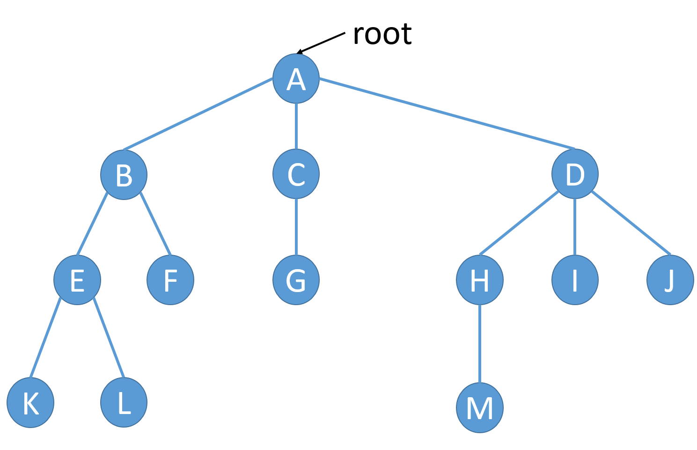
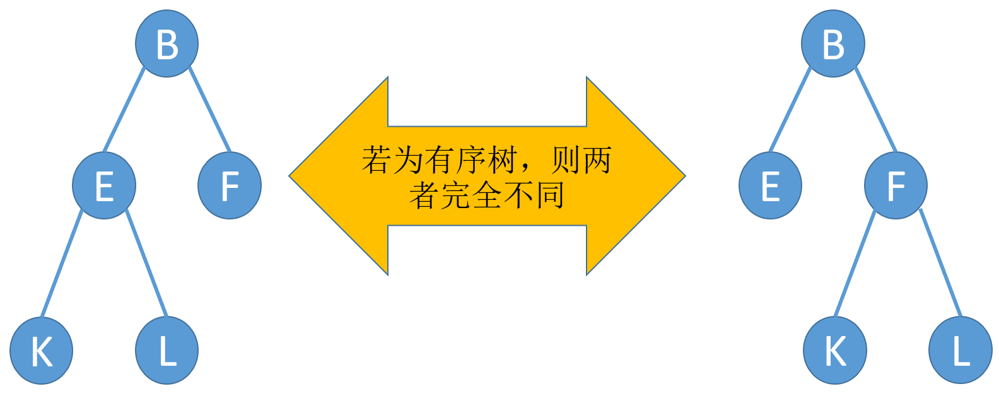
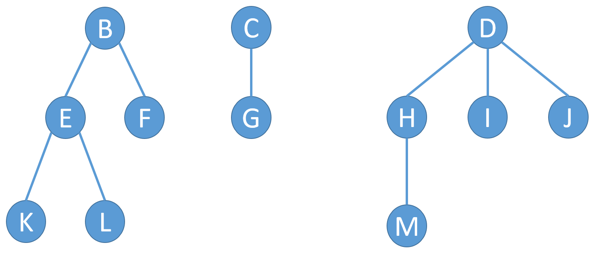
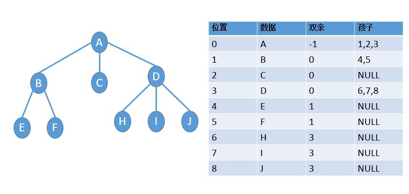
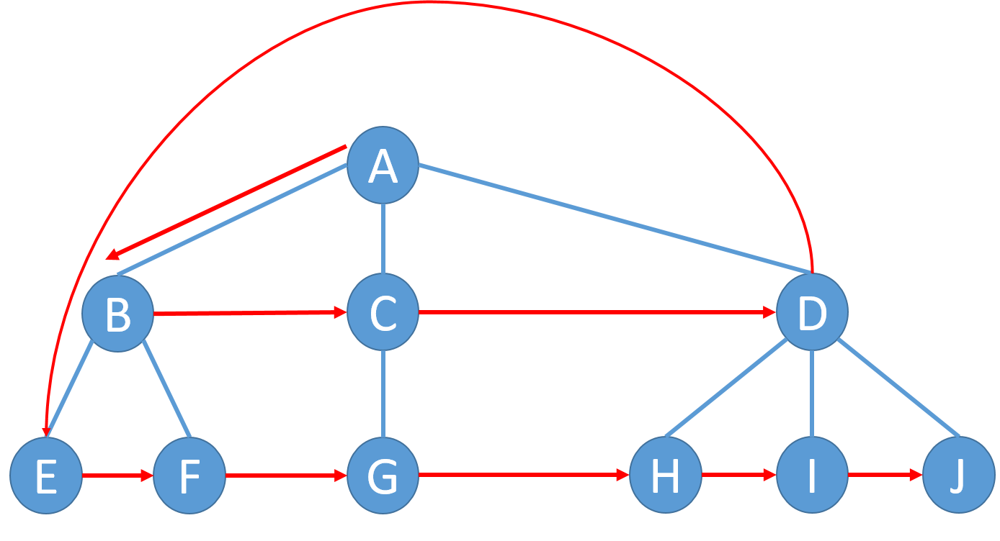
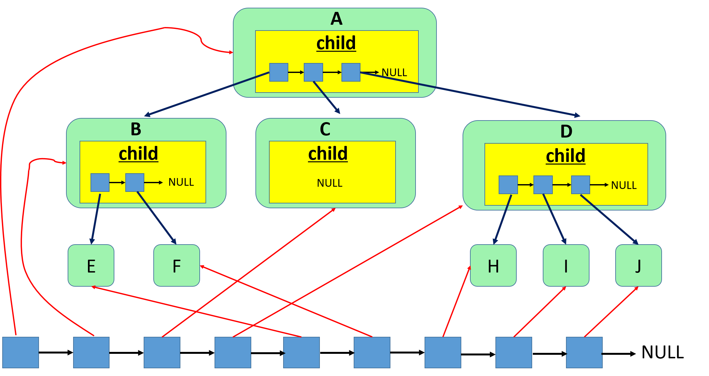

==文档制作工具：小书匠（markdown工具）==
==制作人     ：young==
==制作时间：2018-10-20==


----------

# 树的概念

这篇开始我们开始说说复杂的点的数据结构。之前介绍的数据结构比较简单，也使用的比较广泛，比较好理解。这篇开始的数据结构可能会复杂点，但是也相对比较有意思。
这篇呢，我们先介绍”树“这种数据结构，我们先看下下面这张图：



从图中我们可以看出我们应用这种数据结构是一对多的形式，这个和我们之前的链表不太一样，链表是一对一形式。我们生活中也经常用这种数据结构，例如：家谱，还有目录结构。其实用的就是这种数据结构。

树中有机构和基本的概念，我们得理解下，否则会给之后的代码带来困扰。

1. 树的结点包含一个数据及若干指向子树的分支。
2. 结点拥有的子树数称为结点的度。
度为0的结点称为叶结点。
度不为0的结点称为分支结点。
3. 树的度定义为所有结点中的度的最大值。
4. 结点的直接后继称为该结点的孩子，相应的，该结点称为孩子的双亲。
5. 结点的孩子的孩子的……称为该结点的子孙，相应的，该结点称为子孙的祖先。
6. 同一个双亲的孩子之间互称兄弟。
7. 结点的层次。
根为第1层
根的孩子为第2层
……
8. 树中结点的最大层次称为树的深度或高度。


9. 如果树中结点的各子树从左向右是有次序的，子树间不能互换位置，则称该树为有序树，否则为无序树。



10. 森林是由 n ( n ≥0 ) 棵互不相交的树组成的集合。



从上面的概念和图来看，应该不难理解这个树的一些概念了。


# 树的存储结构

现在呢树的概念我们是理解里，但是我应该怎么存储这种树的结构呢？因为树中的每个节点的孩子数目不是固定的，怎么定义他呢？主要是从根节点到叶节点不是线性，但是叶节点到根节点是线性。

其实我们可以设计结构体数组对节点的关系进行表述，如下图：





利用上面的关系就可以将数的关系理清楚，但是怎么存储还是没清晰。我们可以创建一个通链，这个通链就是将树中的各个节点串一起，然后每个树节点自己管理自己的自己的孩子节点，孩子节点也是通过链表串成。具体看下图：



这里有基地几点要说明下：（0）我们利用链表组织树中的各个结点；（1）链表中的前后关系不代表结点间的逻辑关系；（2）结点的逻辑关系由child数据域描述；（3）child数据域保存其他结点的存储地址；（4）树中每一个结点都是同一个链表中的数据元素。

有上面的关系我们可以得出树的框架，如下：

``` c

// GTree 节点信息结构体 
typedef struct _tag_GTreeNode {
	GTreeData *data;	// 节点数据 
	LinkList  *child;	// 孩子节点 
	struct _tag_GTreeNode *parent;	// 父亲节点
} tree_node_t;

// 链式树节点 
typedef struct _tag_TLNode {
	LinkListNode_t header;
	tree_node_t   *node; 
} tree_list_node_t;
```
其中关于 ==GTree== 和 ==GTreeData== 的类型为 void , 为了做数据封装，在 ==.h== 文件中定义。
# 通用树代码实现

树也是一种数据结构，所以他的操作和之前说的链表也有相似的地方，但是他也有自己特有的操作，如下：
 * 创建树
 * 销毁树
 * 清空树
 * 插入树节点
 * 删除树节点
 * 获取树节点
 * 获取根节点
 * 获取树的节点树
 * 获取树的高度
 * 获取树的度
 * 获取树的位置

我们是和之前的一样，对树的一些操作当作函数一样的实现。

## 创建树

之前说过通用树的实现实际上用了一个通链将树中的元素串在一起，所以创建树复用了单链表的代码。我们这里创建的链表为通链的头而已。

``` c
// 1.创建树 
GTree *GTree_Create(void)
{
	return LinkList_Create();
}
```

## 插入树元素

关于插入树元素有点讲究的， 因为插入树我们得知道他的位置，还得知道管理他的孩子。那么我们实现的想法就是分别管理他们的关系，我们用通链将树节点串一起，孩子节点由各自节点自己管理，节点中的数据有父节点信息和孩子节点信息。我们可以自己定义树中的位置信息，例如我们定义根节点为0， 依次至上而下，从左到右的顺序进行排列编号。如下图：


所以上图中的顺序   ==A->0, B->1 …… J->8== ,如果我们想插入的位置为1的话，就表示为在1为要插入节点的父节点。知道这点话不够，我们得知道怎么插入。现在说说插入的操作。
**（1）合法性判断；（2）申请通链节点的空间，申请孩子节点空间，还得申请树节点信息空间；（3）获取要插入节点的父亲节点，用作孩子节点的插入；（4）申请的树节点的信息填充并申请相应的孩子链表；（5）将孩子节点和通链申请的节点插入相应链表。**
下面我们用框图来表示下整个过程：


代码如下：

``` c
// 4.插入树元素 
int GTree_Insert(GTree *tree, GTreeData *data, int pPos)
{
	LinkList *list = (LinkList *)tree;  // 先转为通链的头 
	
	// pPos 表示父亲节点 
	int ret = ((list != NULL) && (data != NULL) && (pPos < LinkList_Length_Get(list)));
	
	if (ret) {
		// 树型通链空间申请  与 树形子链申请 
		tree_list_node_t *trnode  = (tree_list_node_t *)malloc(sizeof(tree_list_node_t));
		tree_list_node_t *cldnode = (tree_list_node_t *)malloc(sizeof(tree_list_node_t));
		
		// 获取 通链中的pPos点的数据 其实就为父节点 
		tree_list_node_t *pnode  = (tree_list_node_t *)LinkList_Get(list, pPos);
		
		// 创建树节点信息结构体空间
		tree_node_t *cnode = (tree_node_t *)malloc(sizeof(tree_node_t));
		
		ret = ((trnode != NULL) && (cldnode != NULL) && (cnode != NULL));
		
		if (ret) {
			cnode->data = data;
			cnode->child = LinkList_Create(); // 重新创建一个链
			cnode->parent = NULL;	// 先不做判断 ，因为可能是根节点
			
			trnode->node = cnode;
			cldnode->node = cnode; 
			
			// 将节点插入通链的最后一位 
			LinkList_Insert(list, (LinkListNode_t *)trnode, LinkList_Length_Get(list));
			
			// 如果插入的父节点不为空 ，表示不为根节点
			if (pnode != NULL) {
				
				// 父节点指向 
				cnode->parent = pnode->node;

				// 插入子节点链式表中 
				LinkList_Insert(pnode->node->child, (LinkListNode_t *)cldnode, LinkList_Length_Get(pnode->node->child)); 
			} 
		} else {  //  空间申请失败 ,释放空间 
			free(trnode);
			free(cldnode);
			free(cnode); 
		} 
	}  
	
	return ret;
}
```
程序中第一个参数为该树的位置，第二个参数为要插入的数据，第三个参数pPos表示的是要插入元素的父节点位置。

## 删除树节点

由于树节点的删除可能比较繁琐，因为我们在删除树节点的时候，我们还得考虑他的孩子节点，不清空他的孩子节点，容易照成内存泄露。但是我们并不知道他的孩子节点具体的个数。这个时候，我们得用递归的方式，分而治之，一个个的将他的孩子节点删除并释放空间。

具体应该怎么做呢？ **（1）先找到要删除的节点，并保存他的父节点；（2）判断他的父节点是不是根节点， 因为根节点的没有父节点。如果不是根节点，在父节点的孩子节点中找到他的孩子节点，删除并释放空间；（3）循环遍历待删除节点的孩子节点，递归调用该函数，之后摧毁孩子节点并释放空间。** 具体看下面代码实现：

``` c
// 5.删除树元素
GTreeData *GTree_Delete(GTree *tree, int pos)
{
	// 获取树节点位置信息 
	tree_list_node_t *trnode = (tree_list_node_t *)LinkList_Get(tree, pos);
	GTreeData *ret = NULL;
	
	if (trnode != NULL) {
		// 保存数据 
		ret = trnode->node->data;
		
		// 递归删除分支节点下的叶节点 
		Recursive_delete(tree, trnode->node);
	} 
	return ret;
}
```
上面函数的第一个参数为树的地址，第二个参数为要删除为树节点的位置信息。关于递归代码实现，如下：

``` c
static void Recursive_delete (LinkList *list, tree_node_t *node) 
{
	if ((list != NULL) && (node != NULL)) {
		// 保存父节点 
		tree_node_t *parent = node->parent;
		int index = -1;  // 位置信息
		int i = 0;
		
		// 遍历 数的通链 
		for (i = 0; i < LinkList_Length_Get(list); i++) {
			
			// 获取通链节点信息 
			tree_list_node_t *trnode = (tree_list_node_t *)LinkList_Get(list, i);
			
			if(trnode->node == node) {
				// 删除通链节点 
				LinkList_Delete(list, i);
				free(trnode); 
				index = i;
				break;
			} 
		}  // 删除通链 
		
		// 找到要删除的节点 
		if (index  >= 0) {
			
			// 不是根节点 
			if (parent != NULL)  {
				
				// 循环找节点 删除该节点 
				for (i = 0; i < LinkList_Length_Get(parent->child); i++) {
					tree_list_node_t *trnode = (tree_list_node_t *)LinkList_Get(parent->child, i);
					
					if (trnode->node == node) {
						LinkList_Delete(parent->child, i);
						free(trnode);
						break; 
					} 
				} // 查找 
			} // if (parent != NULL) 
			
			// 到这里为止 已经删除通链的节点 和 孩子节点 
			// 这里开始循环递归 删除 
			while (LinkList_Length_Get(node->child) > 0) {
				tree_list_node_t *trnode = (tree_list_node_t *)LinkList_Get(node->child, 0);
				
				Recursive_delete(list, trnode->node); 
			} 
			
			// 摧毁链 
			LinkList_Destroy(node->child);
			
			// 清空节点信息 
			free(node); 
		}  // 删除孩子节点 
	}
} 
```

递归函数的第一个参数为树的地址（或者通链地址），第二个参数为要删除元素的节点。

## 获取位置树节点

这个比较简单，直接遍历通链位置地址就可以，直接返回该位置数据即可。代码如下：

``` c
// 6.获取树节点
GTreeData *GTree_Get(GTree *tree, int pos)
{
	tree_list_node_t *trnode = (tree_list_node_t *)LinkList_Get(tree, pos);
	GTreeData *ret = NULL;
	if (trnode != NULL) {
		ret = trnode->node->data;
	}
	return ret;
}
```

代码中复用单链表的　==**get**==　函数，上述函数的参数，第一个为该树的地址，第二个参数为要获取树的位置信息。

## 获取根节点数据

这个也比较简单，因为根节点的位置我们默认为０，所以调用获取树节点的函数即可。

``` c
// 7.获取树根节点
GTreeData *GTree_Root_Get(GTree *tree)
{
	return GTree_Get(tree, 0);
}
```
## 树的节点数获取

这个也比较简单，我们直接获取通链的长度就可以，因为我们是通过通链将树节点的串在一起。代码如下：

``` c
// 9.树的节点数
int GTree_Count_Get(GTree *tree)
{
	return LinkList_Length_Get(tree);
}
```

## 树的高度

树的高度的求法也得通过递归来获取。我们要知道一棵树的高度，我们得知道他得有多深呐，所以一个一个获取代码量也是有点多，所以还是采用递归的分而治之的思想。我们递归的遍历所有的树，直到他的孩子为空为止，递归一层返回值加1。保留最大的数据作为最后的返回值。我们用动态比较的方法，这样就不必将所有的分支的高度全求出来比较。代码如下：

``` c
// 8.树的高度
int GTree_Hight_Get(GTree *tree)
{
	tree_list_node_t *trnode = (tree_list_node_t *)LinkList_Get(tree, 0);
	int ret = 0;
	if(trnode != NULL) {
		ret = Recursive_hight(trnode->node);
	}

	return ret;
}
```
递归代码如下实现。

``` c
// 递归 找树的高度 
static int Recursive_hight(tree_node_t *node) 
{
	int ret = 0;
	
	if(node != NULL) {
		int subhight = 0;  // 子数的高度 
		int i = 0;
		
		for (i = 0; i < LinkList_Length_Get(node->child); i++) {
			tree_list_node_t *trnode = (tree_list_node_t *)LinkList_Get(node->child, i);
			
			subhight = Recursive_hight(trnode->node);
			
			// 如果 返回的变量小于树的高度  赋值   
			if (subhight > ret) {
				ret = subhight;
			}
		}
		
		// 递归完成一个父节点  高度+1 
		ret = ret + 1;
	} 	
	return ret; 
}
```

## 树的度

之前说过，一棵树的度为该树所有结点中的度的最大值。所以要知道这棵树的节点，我们还得遍历这棵树。想也知道，着肯定又得是递归的遍历了。我们只要获取树节点孩子节点的长度就可以了。我们也用动态比较的方式，获取最大度为多大即可，代码如下：

``` c
// 10.树的度
int GTree_Degree_Get(GTree *tree)
{
	int ret = 0;
	tree_list_node_t *trnode = (tree_list_node_t *)LinkList_Get(tree, 0);
	
	if (trnode != NULL) {
		ret = Recursive_degree(trnode->node);
	}
	 
	return ret;
}
```
递归代码如下：

``` c
static int Recursive_degree(tree_node_t *node)
{
	int ret = -1;
	if(node != NULL) {
		int subdegree = 0;
		int i = 0;
		
		// 根节点的长度 就是度 
		ret =LinkList_Length_Get(node->child);
		
		for (i = 0; i < LinkList_Length_Get(node->child); i++) {
			tree_list_node_t *trnode = (tree_list_node_t *)LinkList_Get(node->child, i);
			
			subdegree =  Recursive_degree(trnode->node);
	
			// 动态比较
			if (subdegree > ret) {
				ret = subdegree;
			}
		} 
	}
	
	return ret;
}
```

## 树的清空

顾名思义，一棵树的清空，必定是从根节点开始，那这就简单了，我们实现了删除函数，只要将待删除的节点设置为根节点即可。代码如下：

``` c
// 3.清空树
void GTree_Clear(GTree *tree)
{
	GTree_Delete(tree, 0); 
}
```

## 摧毁树
要摧毁一棵树，也简单，但是我们不能直接free根节点，因为这样他的子节点并没有被清空，还是占用空间，这样容易造成内存泄露。所以在摧毁树之前我们得先清空树，然后在销毁数即可。代码如下：

``` c
// 2.摧毁树
void GTree_Destroy(GTree *tree)
{
	GTree_Clear(tree);
	LinkList_Destroy(tree);
} 
```

## 打印树结构

到这里为止规划i，我们已经将树的基本操作都已经讲解完毕了。因为我们实现的通用树结构，并没有真正的直观的实现他，而是间接的实现，打印出来并不直观。之前我们说过 ，目录的实现就是通过树这种数据结构实现的，我们如何实现那种直观的显示方式呢。
要打印树的结构，不用想都知道我们肯定得遍历所有的树元素，所以还得用递归的方式咯。函数定义如下：

``` c
// 树的打印函数  类型定义
typedef void (*Gtree_Printf)(GTreeData *);

// 11.打印树结构
void GTree_Display(GTree *tree, Gtree_Printf pfunc, int gap, char div)
{
	// 获取根节点信息 
	tree_list_node_t *trnode = (tree_list_node_t *)LinkList_Get(tree, 0); 
	
	if ((trnode != NULL) && (pfunc != NULL)) {
		Recursive_display(trnode->node, pfunc, 0, gap, div);
	} 
} 
```
上面代码你会发现，参数有点多呀。不用慌，我来说说这几个参数作用。第一个参数 ==tree== 是待打印树的地址；第二个参数 ==pfunc== 为打印函数的函数指针，因为要用户存储的元素我并不知道他的数据类型，所以这个留给用户自己管理；第三个参数 ==gap== 表示父节点与子节点的中间空多少个分隔符；第四个参数 ==div== 为分隔符；


