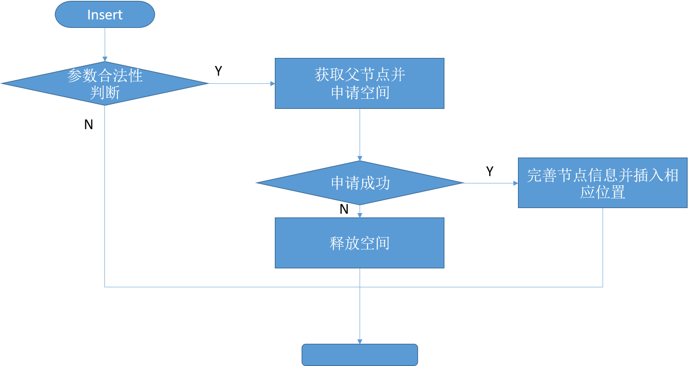
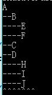
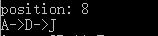

==文档制作工具：小书匠（markdown工具）==
==制作人     ：young==
==制作时间：2018-10-20==


----------

# 树的概念

这篇开始我们开始说说复杂的点的数据结构。之前介绍的数据结构比较简单，也使用的比较广泛，比较好理解。这篇开始的数据结构可能会复杂点，但是也相对比较有意思。
这篇呢，我们先介绍”树“这种数据结构，我们先看下下面这张图：


从图中我们可以看出我们应用这种数据结构是一对多的形式，这个和我们之前的了解的链表不太一样，链表是一对一形式，而树是一对多的形式。我们生活中也经常用这种数据结构，例如：家谱，还有目录，本质上用的就是这种数据结构。

树中有几个基本的概念，我们得理解下，否则会给之后的写通用树代码带来困扰。

1. 树的结点包含一个数据及若干指向子树的分支。
2. 结点拥有的子树数称为结点的度。
度为0的结点称为叶结点。
度不为0的结点称为分支结点。
3. 树的度定义为所有结点中的度的最大值。
4. 结点的直接后继称为该结点的孩子，相应的，该结点称为孩子的双亲。
5. 结点的孩子的孩子的……称为该结点的子孙，相应的，该结点称为子孙的祖先。
6. 同一个双亲的孩子之间互称兄弟。
7. 结点的层次。
根为第1层
根的孩子为第2层
……
8. 树中结点的最大层次称为树的深度或高度。


9. 如果树中结点的各子树从左向右是有次序的，子树间不能互换位置，则称该树为有序树，否则为无序树。


10. 森林是由 n ( n ≥0 ) 棵互不相交的树组成的集合。


从上面的概念和图来看，应该不难理解这个树的一些概念了。


# 树的存储结构

现在呢树的概念我们是理解里，但是我应该怎么存储这种树的结构呢？因为树中的每个节点的孩子数目不是固定的，怎么定义他呢？主要是从根节点到叶节点不是线性，但是叶节点到根节点是线性。

其实我们可以设计结构体数组对节点的关系进行表述，如下图：


利用上面的关系就可以将数的关系理清楚，但是怎么存储还是没清晰。我们可以创建一个通链，这个通链就是将树中的各个节点串一起，然后每个树节点自己管理自己的自己的孩子节点，孩子节点也是通过链表串成。具体看下图：


这里有基地几点要说明下：（0）我们利用链表组织树中的各个结点；（1）链表中的前后关系不代表结点间的逻辑关系；（2）结点的逻辑关系由child数据域描述；（3）child数据域保存其他结点的存储地址；（4）树中每一个结点都是同一个链表中的数据元素。

有上面的关系我们可以得出树的框架，如下：

``` c

// GTree 节点信息结构体 
typedef struct _tag_GTreeNode {
	GTreeData *data;	// 节点数据 
	LinkList  *child;	// 孩子节点 
	struct _tag_GTreeNode *parent;	// 父亲节点
} tree_node_t;

// 链式树节点 
typedef struct _tag_TLNode {
	LinkListNode_t header;
	tree_node_t   *node; 
} tree_list_node_t;
```
其中关于 ==GTree== 和 ==GTreeData== 的类型为 void , 为了做数据封装，在 ==.h== 文件中定义。
# 通用树代码实现

之前介绍了，树也是一种特殊的数据结构，所以他的操作和之前说的链表也有相似的地方，但是他也有自己特有的操作，操作目录如下：
 * 创建树
 * 销毁树
 * 清空树
 * 插入树节点
 * 删除树节点
 * 获取树节点
 * 获取根节点
 * 获取树的节点树
 * 获取树的高度
 * 获取树的度
 * 获取树的位置

我们实现这些操作和之前的一样，对树的操作统一当作函数的实现。

## 创建树

之前说过通用树的实现实际上用了一个通链将树中的元素串在一起，所以创建树复用了单链表的代码。我们这里创建的链表实际为通链的头而已。

``` c
// 1.创建树 
GTree *GTree_Create(void)
{
	return LinkList_Create();
}
```

## 插入树元素

关于插入树元素有点讲究的， 因为插入树我们得知道他的位置，还得知道管理他的孩子。那么我们实现的想法就是分别管理他们的关系，我们用通链将树节点串一起，孩子节点由各自节点自己管理，节点中的数据有父节点信息和孩子节点信息。我们可以自己定义树中的位置信息，例如我们定义根节点为0， 依次至上而下，从左到右的顺序进行排列编号。如下图：


所以上图中的顺序   ==A->0, B->1 …… J->8== ,如果我们想插入的位置为1的话，就表示为在1为要插入节点的父节点。知道这点话不够，我们得知道怎么插入。现在说说插入的操作。
**（1）合法性判断；（2）申请通链节点的空间，申请孩子节点空间，还得申请树节点信息空间；（3）获取要插入节点的父亲节点，用作孩子节点的插入；（4）申请的树节点的信息填充并申请节点相应的孩子链表空间；（5）将孩子节点和通链申请的节点插入相应链表。**
下面我们用框图来表示下整个过程：



代码如下：

``` c
// 4.插入树元素 
int GTree_Insert(GTree *tree, GTreeData *data, int pPos)
{
	LinkList *list = (LinkList *)tree;  // 先转为通链的头 
	
	// pPos 表示父亲节点 
	int ret = ((list != NULL) && (data != NULL) && (pPos < LinkList_Length_Get(list)));
	
	if (ret) {
		// 树型通链空间申请  与 树形子链申请 
		tree_list_node_t *trnode  = (tree_list_node_t *)malloc(sizeof(tree_list_node_t));
		tree_list_node_t *cldnode = (tree_list_node_t *)malloc(sizeof(tree_list_node_t));
		
		// 获取 通链中的pPos点的数据 其实就为父节点 
		tree_list_node_t *pnode  = (tree_list_node_t *)LinkList_Get(list, pPos);
		
		// 创建树节点信息结构体空间
		tree_node_t *cnode = (tree_node_t *)malloc(sizeof(tree_node_t));
		
		ret = ((trnode != NULL) && (cldnode != NULL) && (cnode != NULL));
		
		if (ret) {
			cnode->data = data;
			cnode->child = LinkList_Create(); // 重新创建一个链
			cnode->parent = NULL;	// 先不做判断 ，因为可能是根节点
			
			trnode->node = cnode;
			cldnode->node = cnode; 
			
			// 将节点插入通链的最后一位 
			LinkList_Insert(list, (LinkListNode_t *)trnode, LinkList_Length_Get(list));
			
			// 如果插入的父节点不为空 ，表示不为根节点
			if (pnode != NULL) {
				
				// 父节点指向 
				cnode->parent = pnode->node;

				// 插入子节点链式表中 
				LinkList_Insert(pnode->node->child, (LinkListNode_t *)cldnode, LinkList_Length_Get(pnode->node->child)); 
			} 
		} else {  //  空间申请失败 ,释放空间 
			free(trnode);
			free(cldnode);
			free(cnode); 
		} 
	}  
	
	return ret;
}
```
程序中第一个参数为该树的位置，第二个参数为要插入的数据，第三个参数pPos表示的是要插入元素的父节点位置。插入数的时候，我们得注意他是不是根节点，因为根节点并没有父节点，这点得特殊处理。

## 删除树节点

由于树节点的删除可能比较繁琐，因为我们在删除树节点的时候，我们还得考虑他的孩子节点，不清空他的孩子节点，容易照成内存泄露。但是我们并不知道他的孩子节点具体的个数。这个时候，我们得用递归的方式，分而治之，一个个的将他的孩子节点删除并释放空间。

具体应该怎么做呢？ **（1）先找到要删除的节点，并保存他的父节点；（2）判断他的父节点是不是根节点， 因为根节点的没有父节点。如果不是根节点，在父节点的孩子节点中找到他的孩子节点，删除并释放空间；（3）循环遍历待删除节点的孩子节点，递归调用该函数，之后摧毁孩子节点并释放空间。** 具体看下面代码实现：

``` c
// 5.删除树元素
GTreeData *GTree_Delete(GTree *tree, int pos)
{
	// 获取树节点位置信息 
	tree_list_node_t *trnode = (tree_list_node_t *)LinkList_Get(tree, pos);
	GTreeData *ret = NULL;
	
	if (trnode != NULL) {
		// 保存数据 
		ret = trnode->node->data;
		
		// 递归删除分支节点下的叶节点 
		Recursive_delete(tree, trnode->node);
	} 
	return ret;
}
```
上面函数的第一个参数 ==tree== 为树的地址，第二个参数 ==pos== 为要删除为树节点的位置信息。关于递归代码实现，如下：

``` c
static void Recursive_delete (LinkList *list, tree_node_t *node) 
{
	if ((list != NULL) && (node != NULL)) {
		// 保存父节点 
		tree_node_t *parent = node->parent;
		int index = -1;  // 位置信息
		int i = 0;
		
		// 遍历 数的通链 
		for (i = 0; i < LinkList_Length_Get(list); i++) {
			
			// 获取通链节点信息 
			tree_list_node_t *trnode = (tree_list_node_t *)LinkList_Get(list, i);
			
			if(trnode->node == node) {
				// 删除通链节点 
				LinkList_Delete(list, i);
				free(trnode); 
				index = i;
				break;
			} 
		}  // 删除通链 
		
		// 找到要删除的节点 
		if (index  >= 0) {
			
			// 不是根节点 
			if (parent != NULL)  {
				
				// 循环找节点 删除该节点 
				for (i = 0; i < LinkList_Length_Get(parent->child); i++) {
					tree_list_node_t *trnode = (tree_list_node_t *)LinkList_Get(parent->child, i);
					
					if (trnode->node == node) {
						LinkList_Delete(parent->child, i);
						free(trnode);
						break; 
					} 
				} // 查找 
			} // if (parent != NULL) 
			
			// 到这里为止 已经删除通链的节点 和 孩子节点 
			// 这里开始循环递归 删除 
			while (LinkList_Length_Get(node->child) > 0) {
				tree_list_node_t *trnode = (tree_list_node_t *)LinkList_Get(node->child, 0);
				
				Recursive_delete(list, trnode->node); 
			} 
			
			// 摧毁链 
			LinkList_Destroy(node->child);
			
			// 清空节点信息 
			free(node); 
		}  // 删除孩子节点 
	}
} 
```

递归函数的第一个参数 ==list== 为树的地址（或者通链地址），第二个参数 ==node== 为要删除元素的节点。删除元素的时候，我们得知道他的父节点，这个很重要，因为我在插入元素的时候 ==malloc== 了父节点的中的一个空间，这个空间的是指向我们要删除的节点，我们必须将他从父节点删除，并释放空间。

## 获取位置树节点

这个比较简单，直接遍历通链位置地址就可以，直接返回该位置数据即可。代码如下：

``` c
// 6.获取树节点
GTreeData *GTree_Get(GTree *tree, int pos)
{
	tree_list_node_t *trnode = (tree_list_node_t *)LinkList_Get(tree, pos);
	GTreeData *ret = NULL;
	if (trnode != NULL) {
		ret = trnode->node->data;
	}
	return ret;
}
```

代码中复用单链表的　==**get**==　函数，上述函数的参数，第一个为该树的地址，第二个参数为要获取树的位置信息。

## 获取根节点数据

这个也比较简单，因为根节点的位置我们默认为０，所以调用获取树节点的函数即可。

``` c
// 7.获取树根节点
GTreeData *GTree_Root_Get(GTree *tree)
{
	return GTree_Get(tree, 0);
}
```
## 树的节点数获取

这个也比较简单，我们直接获取通链的长度就可以，因为我们是通过通链将树节点的串在一起，所以通链的链表元素个数就代表着我们这颗树的节点个数。代码如下：

``` c
// 9.树的节点数
int GTree_Count_Get(GTree *tree)
{
	return LinkList_Length_Get(tree);
}
```

## 树的高度

树的高度的求法也得通过递归来获取。我们要知道一棵树的高度，我们得知道他得有多深呐，所以一个一个获取代码量也是有点多，所以还是采用递归的分而治之的思想。
我们递归的遍历所有的树，直到他的孩子为空为止，递归一层返回值加1。保留最大的数，作为返回值返回。我们用动态比较的方法，这样就不必将所有的分支的高度全求出来比较。代码如下：

``` c
// 8.树的高度
int GTree_Hight_Get(GTree *tree)
{
	tree_list_node_t *trnode = (tree_list_node_t *)LinkList_Get(tree, 0);
	int ret = 0;
	if(trnode != NULL) {
		ret = Recursive_hight(trnode->node);
	}

	return ret;
}
```
递归代码如下实现。

``` c
// 递归 找树的高度 
static int Recursive_hight(tree_node_t *node) 
{
	int ret = 0;
	
	if(node != NULL) {
		int subhight = 0;  // 子数的高度 
		int i = 0;
		
		for (i = 0; i < LinkList_Length_Get(node->child); i++) {
			tree_list_node_t *trnode = (tree_list_node_t *)LinkList_Get(node->child, i);
			
			subhight = Recursive_hight(trnode->node);
			
			// 如果 返回的变量小于树的高度  赋值   
			if (subhight > ret) {
				ret = subhight;
			}
		}
		
		// 递归完成一个父节点  高度+1 
		ret = ret + 1;
	} 	
	return ret; 
}
```

## 树的度

之前说过，一棵树的度为该树所有结点中的度的最大值。所以要知道这棵树的节点，我们还得遍历这棵树。想也知道，着肯定又得是递归的遍历了。我们只要获取树节点孩子节点的长度就可以了。我们也用动态比较的方式，获取最大度为多大即可，代码如下：

``` c
// 10.树的度
int GTree_Degree_Get(GTree *tree)
{
	int ret = 0;
	tree_list_node_t *trnode = (tree_list_node_t *)LinkList_Get(tree, 0);
	
	if (trnode != NULL) {
		ret = Recursive_degree(trnode->node);
	}
	 
	return ret;
}
```
递归代码如下：

``` c
static int Recursive_degree(tree_node_t *node)
{
	int ret = -1;
	if(node != NULL) {
		int subdegree = 0;
		int i = 0;
		
		// 根节点的长度 就是度 
		ret =LinkList_Length_Get(node->child);
		
		for (i = 0; i < LinkList_Length_Get(node->child); i++) {
			tree_list_node_t *trnode = (tree_list_node_t *)LinkList_Get(node->child, i);
			
			subdegree =  Recursive_degree(trnode->node);
	
			// 动态比较
			if (subdegree > ret) {
				ret = subdegree;
			}
		} 
	}
	
	return ret;
}
```

## 树的清空

顾名思义，一棵树的清空，必定是从根节点开始，那这就简单了，我们实现了删除函数，只要将待删除的节点设置为根节点即可。代码如下：

``` c
// 3.清空树
void GTree_Clear(GTree *tree)
{
	GTree_Delete(tree, 0); 
}
```

## 摧毁树
要摧毁一棵树，也简单，但是我们不能直接free根节点，因为这样他的子节点并没有被清空，还是占用空间，这样容易造成内存泄露。所以在摧毁树之前我们得先清空树，然后在销毁数即可。代码如下：

``` c
// 2.摧毁树
void GTree_Destroy(GTree *tree)
{
	GTree_Clear(tree);
	LinkList_Destroy(tree);
} 
```

## 打印树结构

到这里为止规划i，我们已经将树的基本操作都已经讲解完毕了。因为我们实现的通用树结构，并没有真正的直观的实现他，而是间接的实现，打印出来并不直观。之前我们说过 ，目录的实现就是通过树这种数据结构实现的，我们如何实现那种直观的显示方式呢。
要打印树的结构，不用想都知道我们肯定得遍历所有的树元素，所以还得用递归的方式咯。函数定义如下：

``` c
// 树的打印函数  类型定义
typedef void (*Gtree_Printf)(GTreeData *);

// 11.打印树结构
void GTree_Display(GTree *tree, Gtree_Printf pfunc, int gap, char div)
{
	// 获取根节点信息 
	tree_list_node_t *trnode = (tree_list_node_t *)LinkList_Get(tree, 0); 
	
	if ((trnode != NULL) && (pfunc != NULL)) {
		Recursive_display(trnode->node, pfunc, 0, gap, div);
	} 
} 
```
上面代码你会发现，参数有点多呀。不用慌，我来说说这几个参数作用。 **第一个参数 ==tree== 是待打印树的地址；第二个参数 ==pfunc== 为打印函数的函数指针，因为要用户存储的元素我并不知道他的数据类型，所以这个留给用户自己管理；第三个参数 ==gap== 表示父节点与子节点的中间空多少个分隔符；第四个参数 ==div== 为分隔符；**

下面我们来看下递归函数的是具体实现如何：

``` c
static void Recursive_display(
		tree_node_t *node, Gtree_Printf pfunc, int format, int gap, char div)
{
	int i  = 0;
	
	if ((node != NULL) && (pfunc != NULL)) {
		for(i = 0; i < format; i++) {
			printf("%c", div);
		} 
		
		// 执行用户闯入的函数 
		pfunc(node->data);
		
		//  换行 
		printf("\n");
		
		for (i = 0; i < LinkList_Length_Get(node->child); i++) {
			tree_list_node_t *trnode = (tree_list_node_t *)LinkList_Get(node->child, i);
			Recursive_display(trnode->node, pfunc, format + gap, gap, div);
		} 
	} 
}
```
我们会发现递归函数好像多了一个参数 **format**？这玩意儿是啥呢？ 这个参数表示为我们目录的起始位置为在哪儿，递归中要用到。我们可以看下他应用与实现之后的效果，直观点，如下：

``` c
GTree_Display(tree, printf_data, 2, '-');
```
代码的意思为：该树的打印分隔符为 ==“-”== ，并且打印间隔为2个字符。他的打印函数定义如下：

``` c
void printf_data(GTreeData *data)
{
	printf("%c", (int)data);	
}
```



这样看起来这棵树显示比较直观了。

## 树元素的查找及其位置锁定

这个内容内容老师是没有讲的，他作为一个思考题让我们回去思考并自己实现。被怕，百度上是找不到这部分内容的，我讲下我实现的方法，测试是通过的。老师的本意为找到树中对应的元素，并且能指向他的位置,直观显示出来，类似 ==A->D->J== 。好，我们来实现下呗。
找到元素并不难，只要遍历通链就可以了，只要用一个if 判断如果相等就表示找到位置了呗。我们找到位置保存位置，并且递归的找他的父节点就可以了。在这篇文章的上面我们说过，树这种数据结构至上而下并不是线性的，但是之下而上却是线性结构，我们利用这点就可以找到了。看代码：

``` c
// 12.查找并定位
int GTree_Search(GTree *tree, GTreeData *data, Gtree_Printf pfun)
{
	// 获取根节点信息 
	LinkList *list = (LinkList *)tree;  // 先转为通链的头 
	int ret = -1;
	int i = 0;
	
	// 合法判断 
	if((list != NULL) && (data != NULL) && (pfun != NULL)) {
		
		// 遍历通链 
		for (i = 0; i < LinkList_Length_Get(list); i++) {
			tree_list_node_t *trnode = (tree_list_node_t *)LinkList_Get(tree, i); 
			
			// 找到数据 
			if (trnode->node->data == data) {
				ret = i;
				printf("position: %d\n", i);
				Recursive_search(trnode->node, pfun);
				printf("\n");
				break;
			}
		}	
	}	
	return ret;
}
```

如何实现我打印呢？我们只要判断他的父节点是否是空，如果不为空，就递归；如果为空打调用打印函数即可，代码如下：

``` c
static void Recursive_search(tree_node_t *node, Gtree_Printf pfunc)
{
	if (node != NULL) {
		
		// 如果为根节点
		if (node->parent == NULL) {
			pfunc(node->data);
		} else {
			Recursive_search(node->parent, pfunc);
			printf("->");
			pfunc(node->data);
		} 
	}
}
```
我们看下他的实现效果是啥吧，如下图：





----------

到目前为止所有的通用树操作都实现了，我做个小总结：为什么好多学校老师讲数据结构，基本上就讲到树不怎么讲通用树而重点讲了二叉树。因为 **通用树的实现比较抽象，树结构的非线性特性和递归定义的特性是树结构实现难度较大的根本原因**；我们实现的这种通用树并没有真正实现他的线性关系，而是间接的实现他的逻辑关系，因为树本身就是一个非线性的数据结构。
还有一点要注意的是：我们实现的通用树这种数据结构， ==**树结点在链表中的位置不代表树的任何逻辑关系。**== 这点非常重要。


上面这篇一万多字的笔记，本意并非弄哭你，而是通用树实现本身就有这么多的内容。好了，这篇文章我们就先介绍到这里了，下篇说下二叉树的内容。
想要获取笔记和通用树的代码，公众号后台回复 **==【2018-10-14】 #e52914==** 即可。


