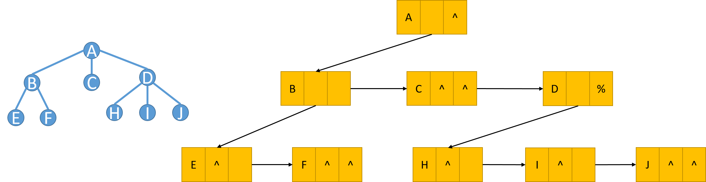

==文档制作工具：小书匠（markdown工具）==
==制作人     ：young==
==制作时间：2018-10-22==

----------

# 二叉树的定义（孩子兄弟表示法）
上一篇文章我们提到 ==双亲孩子表示法== 实现的二叉树，他的性质为：（1）每个结点都有一个指向其双亲的指针；（2） 每个结点都有若干个指向其孩子的指针。实际上我们还有另一种表示方法叫 ==孩子兄弟表示法== 。我们先看下他长什么样子。

孩子兄弟表示法模型性质如下：（1）每个结点都有一个指向其第一个孩子的指针；（2）每个结点都有一个指向其第一个右兄弟的指针.
## 特殊的二叉树

### 完全二叉树

### 满二叉树

