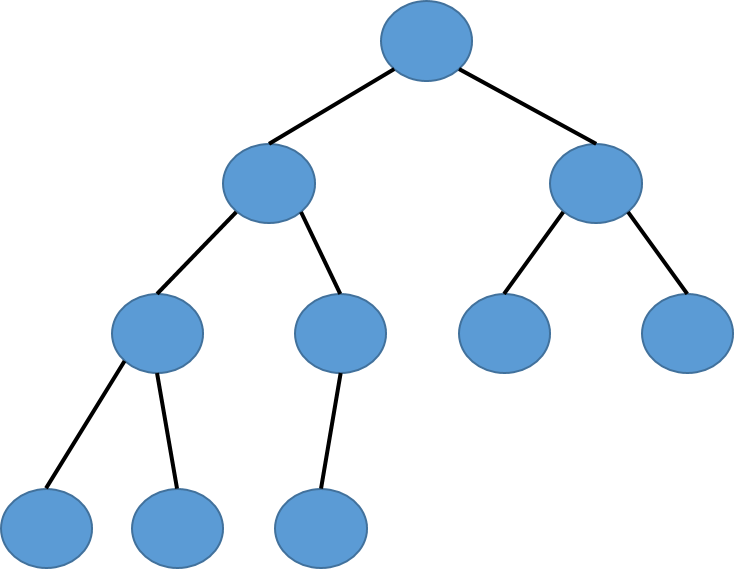
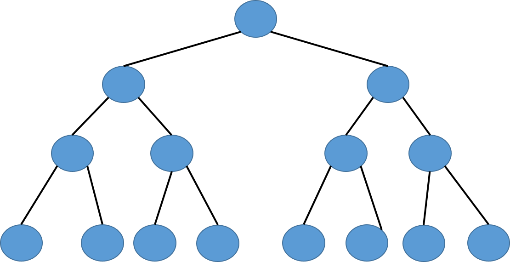
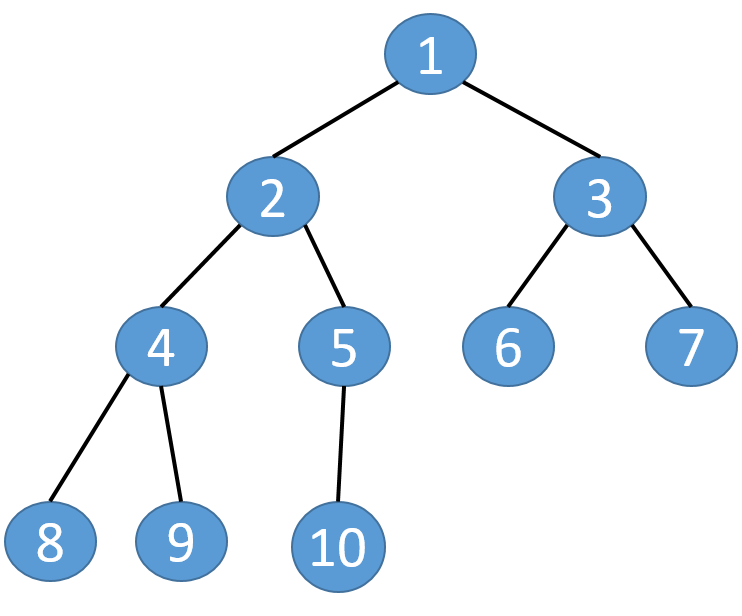
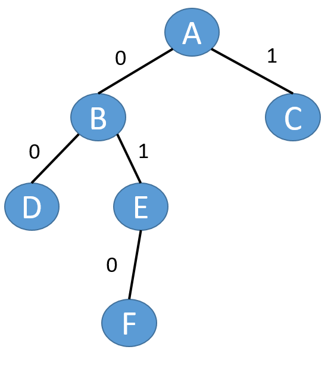

==文档制作工具：小书匠（markdown工具）==
==制作人     ：young==
==制作时间：2018-10-22==


----------

# 二叉树的定义（孩子兄弟表示法）
上一篇文章我们提到 ==双亲孩子表示法== 实现的二叉树，他的性质为：（1）每个结点都有一个指向其双亲的指针；（2） 每个结点都有若干个指向其孩子的指针。实际上我们还有另一种表示方法叫 ==孩子兄弟表示法== 。我们先看下他长什么样子。


孩子兄弟表示法模型每个结点包含一个数据指针和两个结点指针，性质如下：（1）每个结点都有一个指向其第一个孩子的指针；（2）每个结点都有一个指向其第一个右兄弟的指针。
孩子兄弟表示法的特点
* 能够表示任意的树形结构
* 每个结点中有且仅有三个指针域
 数据指针，孩子结点指针，兄弟结点指针
* 每个结点的结构简单,只有孩子结点指针和兄弟结点指针构成了“树杈”

二叉树的定义如下：二叉树是由 n ( n ≥0 ) 个结点组成的有限集合，该集合或者为空，或者是由一个根结点加上两棵分别称为左子树和右子树的、互不相交的二叉树组成。
## 特殊的二叉树

### 完全二叉树
完全二叉树 (Complete Binary Tree)如果一棵具有n个结点的高度为k的二叉树，它的每一个结点都与高度为k的满二叉树中编号为1—n的结点一一对应，则称这棵二叉树为完全二叉树。（从上到下从左到右编号）。




### 满二叉树 (Full Binary Tree)
如果二叉树中所有分支结点的度数都为2，且叶子结点都在同一层次上，则称这类二叉树为满二叉树。




（1）完全二叉树的叶结点仅出现在最下面两层；（2）最下层的叶结点一定出现在左边；（3）倒数第二层的叶结点一定出现在右边；（4）完全二叉树中度为1的结点只有左孩子；（5）同样结点数的二叉树，完全二叉树的高度最小；（6）满二叉树一定是完全二叉树，完全二叉树不是满二叉树。

## 二叉树的性质

性质一：在而二叉树的第 i 层最多有 2^i-1^ 个树节点。（i≥1）
性质二：深度为k的二叉树最多有2^k^-1 个节点（k ≥0）
性质三：对任意一棵二叉树，如果其叶节点有n~0~个，度为2的非叶节点有n~2~个，则有n~0~ = n~2~ + 1。
性质四：具有n个节点的完全二叉树的高度为 |log~2~n| +1。
性质五：一棵有n个节点的二叉树，按层次对节进行编号（从上到下，自左向右），对任意节点i 有：
 * 如果 i = 1，则节点 i是二叉树的根；
 * 如果i > 1，其父节点为|i/2|；
 * 如果 2i <= n，则节点 i 的左孩子为2i；
 * 如果 2i > n ，则节点 i 无左孩子；
 * 如果 2i + 1 <= n，则节点的右孩子为2i + 1；
 * 如果 2i + 1 > n，则节点i无右孩子；


# 创建二叉树

因为二叉树只有两个孩子，所以他的结构也相对简单不少，毕竟孩子有限，和我们之前的结构比是简单不少。因为他只有两个孩子所以他的定位也容易了不少。这里我们使用新的一种定位方式，就是指路法。
所谓的指路法是通过根节点与目标节点的相对位置进行定位，指路法的好处是可以避开二叉树递归的性质的一种线性定位方法，我们在C语言中是通过bit位来进行指路。假设我们定义左走为0，右走为1，如下图：



例如我们要找到他的节点9的路径{左，左，右}，就可以到。所以我们用结构来定义他的指针域。

``` c
// 树节点结构体 
typedef struct _tag_BTreeNode {
	struct _tag_BTreeNode *left;		// 左子树 
	struct _tag_BTreeNode *right;	// 右子树 
} BTreeNode;
```
因为树结构不是线性结构，我们也可以用结构体定义他的头节点，如下：

``` c
typedef struct _tag_BTree {
	int count;		// 树节点
	BTreeNode *root;	// 根节点
} btree_t;
```

## 代码实现

树的操作和之前实现的通用树差不多，无非是插入，删除，高度，度等。下面来一个一个讲解如何实现的。

### 创建树

申请一段空间，并将头节点信息初始化，最后返回申请空间地址作为树的头信息。代码如下：

``` c
// 创建树 
BTree *BTree_Create()
{
	btree_t *ret = (btree_t *)malloc(sizeof (btree_t));
	if (ret != NULL) {
		ret->root = NULL;
		ret->count = 0;
	}
	return ret;
}
```

### 销毁树
将自己申请的空间销毁，释放即可。代码如下：

``` c
// 摧毁树 
void BTree_Destroy(BTree *tree)
{
	free(tree);	
} 
```

### 清空树

将头指针指向NULL，并将节点树清空即可。因为这里我们实现的树节点空间申请不由我们自己申请，用户自己管理节点信息，所以没有必要做销毁树节点操作，代码如下：

``` c
// 清空树 
void BTree_Clear(BTree *tree)
{
	btree_t *btree = (btree_t *)tree;
	if (btree != NULL) {
		btree->count = 0;
		btree->root = NULL;
	}
}
```

### 插入树节点

插入操作比肩麻烦点。我们使用的指路法院里之前讲解过原理是啥。这里直接是讲解如何使用。
我们在使用指路法插入的时候，除了要传入树的头节点和带插入节点指针之外，还得传入位置信息pos、走的步数conut，还有一个默认插入位置flag信息。如下图，



例如我们要将F节点插入的位置为E的左节点。因为根节点到我们要插入的位置依次路线为{左，右，左}及{0，1，0}，一共要转路线3次；所以参数 pos 为 0x02， count 为 3， flag 为 0。关于函数实现如下：

1. 合法性判断；
2. 创捷一个新的节点用于保存父节点和当前节点，并给插入的节点赋初值空；
3. 利用指路法找到节点位置，依次判断最低位，找到位置为止；
4. 判断我们默认插入的位置为左节点还是右节点，将当前节点复制给插入节点的左孩子/右孩子；
5. 判断我们插入的父节点是否是根节点，如果不为根节点 ，判断我们最后一位bit位是走左边还是右边，将插入的节点赋值给父节点的左孩子/右孩子；
6.  让头节点节点数加1；
代码实现如下：
``` c
// 插入树节点
// count 表示你要走多少路  flag 表示默认插入的是左子树还是右子树 
int BTree_Insert(BTree *tree, BTreeNode *node, BTPos pos, int count, int flag)
{
	int bit = 0;
	btree_t *btree = (btree_t *)tree;
	int ret = ((btree != NULL) && (node != NULL));
	ret = ret && ((flag == BT_LEFT) || (flag == BT_RIGHT));
	
	// 合法性判断 
	if (ret) {
		// 用于保存父节点 
		BTreeNode *parent = NULL;
		
		// 当前节点 
		BTreeNode *current = btree->root; 
		
		// 给带插入的节点赋初值 
		node->left  = NULL;
		node->right = NULL; 		
		
		// 由于用的是指路法 相当于判断路标 用的是取出最后一位 
		// 依次判断怎么走路线 
		while ((count > 0) && (current != NULL)) {
			// 最低位与 移植 
			bit  = pos & 1;
			pos = pos >> 1; 
			
			// 给父节点赋值 
			parent = current;
			
			// 指路 
			if (bit == BT_LEFT) {
				current = current->left;
			} else if (bit == BT_RIGHT) {
				current = current->right;
			}
			count--;
		}
		
		// 默认插入是左子树 还是右子树 
		if (flag == BT_LEFT) {
			node->left = current;
		} else if (flag == BT_RIGHT) {
			node->right = current;
		}
		
		// 插入的节点不为根节点 
		if(parent != NULL ) {
			
			if(bit == BT_LEFT) {
				parent->left = node;
			} else if (bit == BT_RIGHT) {
				parent->right = node;
			}
		} else {	// 若插入为根节点 
			btree->root = node; 
		}
		btree->count++; 
	}	// 合法判断 ret 
	
	return ret;
}
```

### 删除节点信息

因为删除节点操作时，我们并不知道删除的节点有没有孩子，如果有孩子有多少孩子我们还不知道，所以这时候我们就得递归实现删除操作。
删除节点和插入操作有点类似，因为都要找到要相应的节点位置在哪儿。所以操作如下：
1. 合法性判断参数的合法性；
2. 定义父节点和当前节点，，从根节点开始找。找到我们待删除节点为止；
3. 找到我们要删除的节点，如果不为根节点，让他的父节点与我们要删除的节点断开联系；如果要删除的节点为根节点，直接让头指针指向空；
4. 保留我们要删除节点信息；
5. 我们树节点数 = 删除前的节点数 - 删除节点的节点数（包括孩子节点）
6. 返回删除节点。
代码实现如下：

``` c
BTreeNode *BTree_Delete(BTree *tree, BTPos pos, int count)
{
	btree_t *btree = (btree_t *)tree;
	BTreeNode *ret = NULL;
	int bit = 0;
	
	if(btree != NULL) {
		BTreeNode *parent = NULL;
		BTreeNode *current = btree->root;
		
		// 找位置 
		while ((count > 0) && (current != NULL)) {
			bit = pos & 1;
			pos = pos >> 1;
			
			parent = current;
			
			// 走步 
			if (bit == BT_LEFT) {
				current = current->left; 
			} else if (bit == BT_RIGHT) {
			 	current =  current->right; 
			}
			
			count--;
		} // while 找点 
		
		// 找到节点后让父节点对应位置置为NULL
		if (parent != NULL) {
			if(bit == BT_LEFT) {
				parent->left = NULL;
			} else if (bit == BT_RIGHT) {
				parent->right = NULL;
			}
		} else { // 如果为根节点 
			btree->root = NULL;
		}
		
		// 保存返回值 
		ret  = current; 
		
		btree->count = btree->count - Recusive_Count(ret); 
		
	}
	
	return ret;
}
```
其中递归找孩子节点函数如下：

``` c
// 递归查看节点个数 
static int Recusive_Count(BTreeNode *node)
{
	int ret = 0;
	
	if (node != NULL) {
		ret = Recusive_Count(node->left) + 1 + Recusive_Count(node->right);
	}
	
	return ret;
}
```
递归函数中，返回值为左孩子数 + 右孩子数 + 1；其中的 1 代表删除元素本身。

### 获取树节点
这个比较简单，因为和插入操作类似，只是没有插入这个操作。我们只要用指路法就好了。代码如下：

``` c
// 获取树节点
BTreeNode *BTree_Get(BTree *tree, BTPos pos,int count)
{
	BTreeNode *ret = NULL;
	btree_t *btree = (btree_t *)tree;
	int bit = 0;
	
	if (btree != NULL) {
		
		BTreeNode *current = (BTreeNode *)btree->root;
		while ((count > 0) && (current != NULL)) {
			bit = pos & 1;
			pos = pos >> 1;
			
			if( bit == BT_LEFT )
            {
                current = current->left;
            }
            else if( bit == BT_RIGHT )
            {
                current = current->right;
            }
            
            count--;
		}
		ret = current;
	}
	
	return ret; 
} 
```

### 获取根节点

直接返回树的头节点信息中的根节点信息就可以。代码如下：

``` c
// 获取根节点信息
BTreeNode *BTree_Root(BTree *tree)
{
	btree_t *btree = (btree_t *)tree;
	BTreeNode *ret = NULL;
	
	if(btree != NULL) {
		ret = btree->root;
	}
	return ret; 
}
```

### 树的节点数

直接返回树的头节点信息中的节点数信息就可以。代码如下：
``` c
// 树节点数
int BTree_Count(BTree *tree)
{
	btree_t *btree = (btree_t *)tree;
	int ret = 0;
	
	if (btree != NULL) {
		ret = btree->count;
	}  
	return ret;
} 
```

### 获取树高

要获取树的高度，难免要遍历一遍整棵树，所以要用递归的形式，代码如下：

``` c
// 树高
int	BTree_Height(BTree *tree)
{
    btree_t* btree = (btree_t *)tree;
    int ret = 0;
    
    if( btree != NULL )
    {
        ret = Recursive_Height(btree->root);
    }
    
    return ret;
}
```
递归代码如下：

``` c
// 递归 计算 
static int Recursive_Height (BTreeNode *root)
{
	int ret = 0; 
	if (root != NULL) {
		int lh = Recursive_Height(root->left);
		int rh = Recursive_Height(root->right);
		
		 ret = ((lh > rh) ? lh : rh) + 1;
	}
	
	return ret;
}
```
我们判断树的高度是递归的同时进行判断，这样可以减少操作步骤。

### 树的度
因为二叉树的度只有可能有三种，0，1或者2。为0 的时候就为空树。如果树根就有两个孩子节点，我们就不用判断树的度了，只有在树节点的度为1时，要递归。代码如下：

``` c
// 树的度
int BTree_Degree(BTree *tree)
{
    btree_t *btree = (btree_t *)tree;
    int ret = 0;
    
    if( btree != NULL )
    {
        ret = Recursive_Degree(btree->root);
    }
    
    return ret;
}
```
递归代码如下:

``` c
// 递归计算度

static int Recursive_Degree (BTreeNode *root)
{
	int ret = 0;
	if (root != NULL) {
		if(root->left != NULL) {
			ret++;
		}
		
		if(root->right != NULL) {
			ret++;
		}
		
		if(ret == 1) {
			int ld = Recursive_Degree(root->left);
			int rd = Recursive_Degree(root->right);
			
			if(ret < ld) {
				ret = ld;
			}
			
			if (ret < rd) {
				ret = rd;
			}
		}
	} 

	return ret;
} 
```

### 打印树（直观显示）

我们在打印树的时候难免要遍历树结构，所以也是需要用到递归。参数和之前的一样，代码如下：

``` c
void BTree_Display(BTree *tree, BTree_Printf pFunc, int gap, int div)
{
    btree_t* btree = (btree_t*)tree;
    
    if( btree != NULL )
    {
        Recursive_Display(btree->root, pFunc, 0, gap, div);
    }
}
```

递归树结构和之前的实现要有点不同，因为之前实现的树结构是不限制孩子节点个数，但是二叉树有限制，所以我们在打印时候，如果左子数大小为空，我们得空出他的位置。递归代码如下：

``` c
static void Recursive_Display (BTreeNode *node, BTree_Printf pfunc, int format, int gap, char div)
{
	int i = 0;
	
	if((node != NULL) && (pfunc != NULL)) {
		for (i =0; i < format; i++) {
			printf("%c", div);
		}
		
		pfunc(node);
		
		printf("\n");
		
		if((node->left != NULL) || (node->right != NULL)) {
			Recursive_Display(node->left, pfunc, format + gap, gap, div);
			Recursive_Display(node->right, pfunc, format + gap, gap, div);
		}
	}  else { // 如果为空 保留二叉树的位置 
        for(i=0; i<format; i++)
        {
            printf("%c", div);
        }
        printf("\n");
	}
}
```
我们如何做到空余位置呢？这个比较简单。当我们判断节点参数为空时候，打印格式和分隔符即可。但是这样如果没有孩子也会打印占位符，所以还需要在不为空节点位置加一个判断左右子树是否为空就可以。
