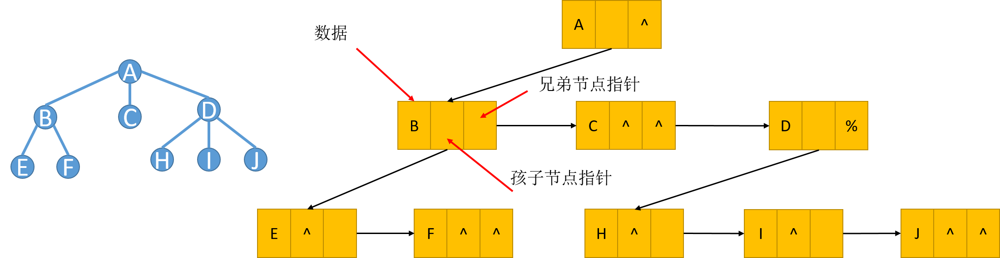

==文档制作工具：小书匠（markdown工具）==
==制作人     ：young==
==制作时间：2018-10-22==

----------

# 二叉树的定义（孩子兄弟表示法）
上一篇文章我们提到 ==双亲孩子表示法== 实现的二叉树，他的性质为：（1）每个结点都有一个指向其双亲的指针；（2） 每个结点都有若干个指向其孩子的指针。实际上我们还有另一种表示方法叫 ==孩子兄弟表示法== 。我们先看下他长什么样子。

孩子兄弟表示法模型每个结点包含一个数据指针和两个结点指针，性质如下：（1）每个结点都有一个指向其第一个孩子的指针；（2）每个结点都有一个指向其第一个右兄弟的指针。
孩子兄弟表示法的特点
* 能够表示任意的树形结构
* 每个结点中有且仅有三个指针域
 数据指针，孩子结点指针，兄弟结点指针
* 每个结点的结构简单,只有孩子结点指针和兄弟结点指针构成了“树杈”

二叉树的定义如下：二叉树是由 n ( n ≥0 ) 个结点组成的有限集合，该集合或者为空，或者是由一个根结点加上两棵分别称为左子树和右子树的、互不相交的二叉树组成。
## 特殊的二叉树

### 完全二叉树
完全二叉树 (Complete Binary Tree)如果一棵具有n个结点的高度为k的二叉树，它的每一个结点都与高度为k的满二叉树中编号为1—n的结点一一对应，则称这棵二叉树为完全二叉树。（从上到下从左到右编号）。

### 满二叉树 (Full Binary Tree)
如果二叉树中所有分支结点的度数都为2，且叶子结点都在同一层次上，则称这类二叉树为满二叉树。

