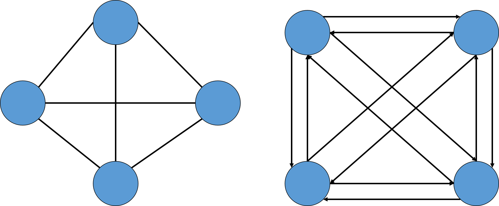
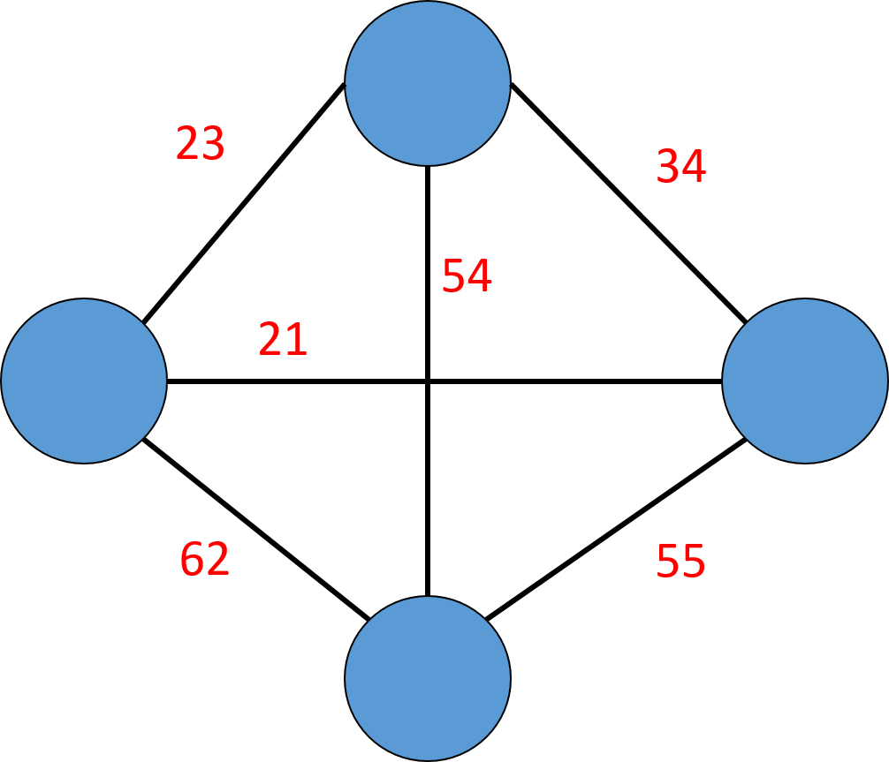

==文档制作工具：小书匠（markdown工具）==
==制作人     ：young==
==制作时间：2018-10-28==


----------

上篇讲到数据结构中的树，这篇开始我们讲解数据结构中的图了。我身边好多的同事，他们在上学的时候，老师都没讲过图或者就提及一下，除了计算机相关专业的。为嘛？太难了呗。难的东西都是值得挑战一下下。那就开写了。

# 数据结构---图

我们可能都有听过说图，那到底什么是图呢？简单的说就是由顶点集合(Vertex)及顶点间的关系集合组成的一种数据结构。用数学表达式子如下：

``` markdown
                	Graph＝( V, E )
V = { x | x ∈某个数据对象 } 是顶点的有穷非空集合；
E = { (x, y) | x, y ∈V } 是顶点之间关系的有穷集合，也叫做边(Edge)集合
```
_注意：我们一般将 **==“<>”==**  表示有向边 ，用 ==**"（）"**== 表示无向边_
如果数学方式不好理解，咱们换一种理解方式。之前我们学过树了吧，树的结构为1对多，那么图就是多对多的关系，这样理解就通俗易懂的多了。
既然是这样，那么就是一个关系： **树是图的一种特殊的数据结构，链表也是图的特殊数据结构。** 图是一种扩展的树结构，每个结点可以指向任意的其它结点。图这种数据结构常用于网络规划和路径路径规划等领域，例如GPS。



上图中的左图表示无向图，因为没有方向关系，右图有箭头的表示有向边，其中箭头开始地方我们称为头，箭头指向的地方我们称之为尾。

## 图中顶点的度

在数据结构的图中，顶点 v 的度是和 v 相关联的边的数目，我们标记为TD(v)，其中 入度是以 v 为头的边的数目，记为ID(v)；出度为以 v 为尾的边的数目，记为OD(v)。所以在图中的度为：		

``` gcode
TD(度) = ID(入度) + OD(出度)
```

## 图的权
在图中，与两顶点之间边相关的数字叫做权，权常用来表示图中顶点间的距离或者耗费。如下图：




## 应用


