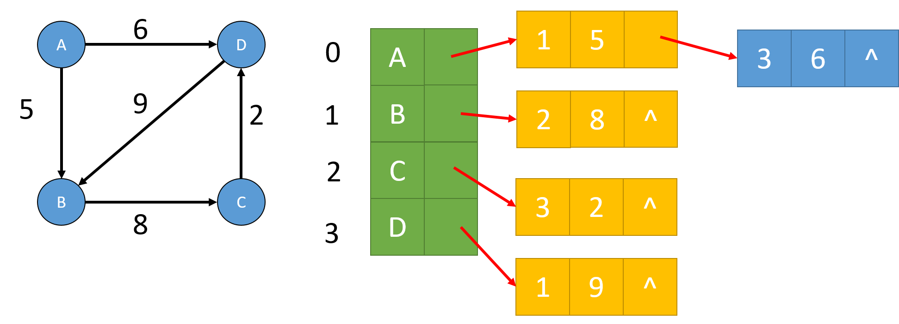

==文档制作工具：小书匠（markdown工具）==
==制作人     ：young==
==制作时间：2018-10-28==


----------

上篇讲到数据结构中的树，这篇开始我们讲解数据结构中的图了。我身边好多的同事，他们在上学的时候，老师都没讲过图或者就提及一下，除了计算机相关专业的。为嘛？太难了呗。难的东西都是值得挑战一下下。那就开写了。

# 数据结构---图

我们可能都有听过说图，那到底什么是图呢？简单的说就是由顶点集合(Vertex)及顶点间的关系集合组成的一种数据结构。用数学表达式子如下：

``` markdown
                	Graph＝( V, E )
V = { x | x ∈某个数据对象 } 是顶点的有穷非空集合；
E = { (x, y) | x, y ∈V } 是顶点之间关系的有穷集合，也叫做边(Edge)集合
```
_注意：我们一般将 **==“<>”==**  表示有向边 ，用 ==**"（）"**== 表示无向边_
如果数学方式不好理解，咱们换一种理解方式。之前我们学过树了吧，树的结构为1对多，那么图就是多对多的关系，这样理解就通俗易懂的多了。
既然是这样，那么就是一个关系： **树是图的一种特殊的数据结构，链表也是图的特殊数据结构。** 图是一种扩展的树结构，每个结点可以指向任意的其它结点。图这种数据结构常用于网络规划和路径路径规划等领域，例如GPS。


上图中的左图表示无向图，因为没有方向关系，右图有箭头的表示有向边，其中箭头开始地方我们称为头，箭头指向的地方我们称之为尾。

## 图中顶点的度

在数据结构的图中，顶点 v 的度是和 v 相关联的边的数目，我们标记为TD(v)，其中 入度是以 v 为头的边的数目，记为ID(v)；出度为以 v 为尾的边的数目，记为OD(v)。所以在图中的度为：		

``` gcode
TD(度) = ID(入度) + OD(出度)
```

## 图的权
在图中，与两顶点之间边相关的数字叫做权，权常用来表示图中顶点间的距离或者耗费。如下图：


# 图的操作及其实现

图的操作和之前的没有多大的区别，无非就是添加，删除，度呀什么的列举下：
* 图的创建
* 图的摧毁
* 图的清空
* 图的添加（边）
* 图的删除（边）
* 图顶点的获取
* 图顶点的度
* 图的边数
* 图的顶点数

关于图的实现一般有两种，一种为邻接矩阵，另一种邻接链表，下面分别介绍他们的差异与实现过程。

## 邻接矩阵实现图
什么是邻接矩阵呢？实际上就为二维数组，因为图中有顶点和边这玩意儿，我们得想办法来存储他们的信息。顶点好存，用一维数组就可以了，那两个顶点间边，我们就用二维数组存储就好了呗，权值就为二位数组的值，二维数组中的数据为0，我们就表示他们两个顶点不连接，用数学表达式表示如下：

```  gcode
设图 A = (V, E) 是一个有 n 个顶点的图，图的邻接矩阵为 Edge[n][n]，则：

         Edge[i][j] = w, W > 0   i和j 链接
		 Edge[i][j] = 0, i== j或 i 和 j 不链接
注： W为权值，当不需要权值时，取W为1表示结点间连接
``` 
基于上面的介绍我们可以得到下图的关系：


从上图我们可以发现无向图的邻接矩阵是对称的，有向图的邻接矩阵可能是不对称的。如果我们做的是无相图，关于遍历就可以选择遍历矩阵的上三角或者下三角，这样可以提高效率。这里我用有向图来实现，因为有向图也可以来表示无像图。

### 邻接矩阵法头节点定义
在图中，有顶点，有边，我们既然想到用邻接矩阵（二维数组）来表示顶点与顶点之间的关系，那么我们还得用一个空间保留定点本身信息，所以这么看我们的头节点信息大概有：节点数，节点信息指针和邻接矩阵地址，如下：

``` c
//  头指针信息 
typedef struct _tag_MGraph {
	int count;  		// 顶点数
	MVertex **v; 	// 顶点相关数据
	int **matrix; 	// 邻接矩阵 
}MGraph_t; 
```

这里节点信息和邻接链表都用的是二级指针，就是指向指针的指针，之前文章提到过。保存节点信息好理解，一般我节点信息都是字符串，所以指向字符串的指针就是指向指针的指针。
关于定义二维数组的方法为什么要用二级指针呢？实际上二维数组其实就是一维数组，我用二级指针主要是用一个指针直接访问一段空间，这样比较高效。如下图：


上图中的橙色部分就是一维指针申请的空间，蓝色部分就是二级指针，指针指针的指针，所以我们动态申请二维数组的方法大概分为3布：（1）通过二级指针动态申请一维指针数组；（2）通过一级指针动态申请数据空间地址；（3）将一维指针数据中的指针链接到数据空间；具体实现在代码中会提及。下面开始讲解邻接链表的实现了。

## 邻接链表实现图
上面讲到邻接矩阵的实现的一些前提条件，咱们还是按部就班，还是按照之前将链表和树的顺序将他一步步实现。

### 创建图
创建图的时候我们得指定该图中有多少的顶点，然后才能动态申请邻接矩阵，注意的是，根据图的定义，顶点必须是又穷非空的。代码如下：

``` c
// 创建 n个顶点的图  顶点数据为 v 
MGraph *MGraph_Create(MVertex **v, int n)
{
	MGraph_t *ret = NULL;
	
	if ((NULL != v) && (n > 0)) { //因为图是有穷非空集合 
		ret = (MGraph_t *)malloc(sizeof(MGraph_t));
		if (ret != NULL) {
			ret->count = n;
			
			int *p = NULL; 
			// 申请数节点据保存空间 
			ret->v = (MVertex **)malloc(sizeof(MVertex *) * n);
			
			//动态申请二维数组空间 用于保存邻接链表 
			ret->matrix = (int **)malloc(sizeof(int *) * n);
			p = (int *)calloc(n * n, sizeof(int)); 
			
			// 合法性判断 
			if ((NULL != ret->v) && (NULL != ret->matrix) && (NULL != p)) {
				int i = 0;
				
				// 构建二维数组
				for(i = 0; i < n; i++) {
					ret->v[i] = v[i]; // 顶点数据保存 
					ret->matrix[i] = p + i * n; // 构建二维数组 
				} 
				
			} else { // 空间失败 
				free(p);
				free(ret->matrix);
				free(ret->v); 
				free(ret);
			}
		}
	}

	return ret;
} 
```

### 摧毁图
在摧毁图的时候，我们只有将申请的空间做释放就OK，比较简单，但是有一点要注意的是：我们在释放空间的时候，是有顺序要求的，因为我们申请的一维数据指针没有保留，只是将数据域保存下来。所以我们在释放空间的时候，必须先释放数据空间，再释放指向数据域的指针域，否则数据域地址丢失，容易造成内存泄露。直观的说就是先释放上图橙色部分内容，再释放蓝色部分。代码如下：

``` c
//  摧毁图 
void MGraph_Destroy(MGraph* graph)
{
	MGraph_t *ret = (MGraph_t *)graph;
	
	if (ret != NULL) {
		free(ret->v);		//清空定点数据指针 
		free(ret->matrix[0]);//清空数据域 
		free(ret->matrix);	//清空邻接数组 
		free(ret);			//最后清空头节点数据 
	} 
}
```

### 清空图
清空图的部分比较简单，因为我们用邻接矩阵保存他们的关系，所以我们只要清空邻接矩阵就好。代码如下：

``` c
// 清空图 也就是清空顶点之间的连接 
void MGraph_Clear(MGraph* graph)
{
	MGraph_t *ret = (MGraph_t *)graph;
	
	if(ret != NULL) {
		int i = 0;
		int j = 0;
		
		// 让邻接矩阵数据清空 
		for (i = 0; i < ret->count; i++) {
			for (j = 0; j < ret->count; j++) {
				ret->matrix[i][j] = 0;
			}
		}
	} 
}
```

### 添加边（顶点间关系）
用邻接矩阵添加两顶点间关系比较简单，只是需要将邻接矩阵相应的位置填充数据即可。代码如下：

``` c
// 添加顶点之间的连接 这里我们使用的是有向图 
int MGraph_AddEdge(MGraph* graph, int v1, int v2, int w)
{
	MGraph_t *tgraph = (MGraph_t *)graph; 
	int ret = (tgraph != NULL);
	
	ret = ret && (v1 >= 0) && (v1 <= tgraph->count);
	ret = ret && (v2 >= 0) && (v2 <= tgraph->count);
	ret = ret && (w >= 0);
	
	// 插入只需要将邻接矩阵相应的位置的值置为权值即可
	if (ret) {
		tgraph->matrix[v1][v2] = w;
	}
	
	return ret;
} 
```

### 获取两定点间关系（权）
这个也是，简直不要太简单了，直接返回相应位置的权值即可。

``` c
// 获取两个顶点之间的权值  v1->v2 
int MGraph_GetEdge(MGraph* graph, int v1, int v2)
{
	MGraph_t *tgraph = (MGraph_t *)graph; 
	int flag = (tgraph != NULL);
	int ret = 0;
	
	flag = flag && (v1 >= 0) && (v1 <= tgraph->count);
	flag = flag && (v2 >= 0) && (v2 <= tgraph->count);
	
	if (flag) {
		ret = tgraph->matrix[v1][v2];
	}
	
	return ret;
}
```

### 删除边（顶点间关系）
和顶点添加一个道理，找到位置，只需要将顶点间的关系清空就可以，也就是将相应的位置置为0。简直不要太简单。

``` c
// 移除顶点间联系 
int MGraph_RemoveEdge(MGraph* graph, int v1, int v2)
{
	MGraph_t *tgraph = (MGraph_t *)graph; 
	int ret = MGraph_GetEdge(graph, v1, v2);
	
	if (ret != 0) {
		tgraph->matrix[v1][v2] = 0;
	}
	
	return ret;
} 
```

### 获取图的定点数
这个更简单了，直接返回头节点中的节点数信息即可，代码如下：

``` c
// 获取顶点数 
int MGraph_VertexCount(MGraph* graph)
{
	MGraph_t *tgraph = (MGraph_t *)graph; 
	int ret = 0;
	
	// 直接返回头节点信息中数据 
	if (tgraph != NULL) {
		ret = tgraph->count;
	} 
	return ret;
}
```

### 顶点的度

这个稍微复杂点，但是也不难，之前我们介绍过，在图中，顶点的度为：**==入度 + 出度==** ，所以这个就简单了，便利一遍邻接链表，碰到数据不为 0的数据加 1 即可。代码如下：

``` c
// 获取顶点的度  顶点的度 = 入度 + 出度 
int MGraph_TD(MGraph* graph, int v)
{
	MGraph_t *tgraph = (MGraph_t *)graph; 
	int flag = (tgraph != NULL);
	int ret = 0;
	
	flag = flag && (v >= 0) && (v < tgraph->count); 
	
	if (flag) {
		int i = 0;
		
		// 遍历数据域就可以 
		for (i = 0; i < tgraph->count; i++) {
			// 出度
			if (tgraph->matrix[v][i] != 0) {
				ret++; 
			} 
			
			if (tgraph->matrix[i][v] != 0) {
				ret++;
			}
		}
	}	
	return ret;
} 
```

### 图的表示方式与实现
好了，图的邻接矩阵的方式实现完了，不难吧，感觉比链表还要简单点。但是我们虽然实现了图，但是怎么显示他呢？所以我们还得实现一套显示图中关系的代码。
图和树不太一样，因为数是一对多的关系，直观的显示问题不大，但是图不可以呀，他是多对多的关系。怎么办呢？我们之前也说过，在图中我们表示连个定点之间的关系可以是有相图，也可以是无向图，他们分别用 **==<>==** 和 **==“()”==** 表示。那我们就用这点，将有关系的用符号打印出来就好了。

那我们缕一缕思路：（1）先将定点信息打印；（2）在打印定点与顶点之间的关系，还有权值，格式可以是 **==<a, b, w>==** 。

实现也比较简单，代码如下; 

``` c
// 打印图 
void MGraph_Display(MGraph* graph, MGraph_Printf* pFunc)
{
	MGraph_t *tgraph = (MGraph_t *)graph; 
	
	if ((tgraph != NULL) && (pFunc != NULL)) {
		int i = 0;
		int j = 0;
		
		// 先打印顶点信息 
		for(i = 0; i < tgraph->count; i++) {
			printf("%d:", i);
			pFunc(tgraph->v[i]);
			printf(" ");
		}	
		
		printf("\n");
		
		// 打印顶点之间的关系 
		for(i = 0; i < tgraph->count; i++) {
			for(j = 0; j< tgraph->count; j++) {
				
				// 直接邻接链表中的数据不为 0 表示有关系 
				if(tgraph->matrix[i][j] != 0) {
					
					// 我们一般用<> 表示有向图
					// 用（） 表示五相图 
					printf("<"); 
					pFunc(tgraph->v[i]);
					printf(",");
					pFunc(tgraph->v[j]);
					printf(", %d", tgraph->matrix[i][j]); // 权值
					printf(">");
					printf(" "); 
				} 
			}
		}
		printf("\n");	 
	}
	
}
```

## 邻接链表实现图
上面我们介绍了一种邻接矩阵实现的图，但是他的实现有一种缺陷，假如我们的顶点个数比较多，但是我们的顶点间的关系比较少的话，这种用邻接矩阵的方式效率有点低，浪费空间与时间，那有什么办法可以提高效率呢？就是现在我们说的邻接链表的形式。
那什么是邻接链表呢？其实也很简单，就从从同一个顶点发出的边链接在同一个链表中，每一个链表结点代表一条边, 结点中保存边的另一顶点的下标和权值，如下图表示：



既然是这样，那我们的邻接链表的链节点信息就可以是这样的了，如下：

``` c
// 各个节点邻接链表信息 
typedef struct _tag_ListNode {
 	LinkListNode_t header;	//	链表节点 
 	int				v;	// 节点下标 
 	int 			w;		// 权值 
 } ListNode_t; 
```
关于我们的图的头节点没是什么变化，只是将原先邻接矩阵的信息更变为链表头节点信息而已。因为我们用邻接链表的其实就是每个节点都是一个链表，如果我们添加信息只是将与其有关的节点添加到链表的位置而已。头节点信息如下：

``` c
// 各个节点邻接链表信息 
typedef struct _tag_ListNode {
 	LinkListNode_t header;	//	链表节点 
 	int				v;	// 节点下标 
 	int 			w;		// 权值 
 } ListNode_t; 
```
好了，下面我们开始按部就班的讲解怎么实现的吧！

### 创建图
和邻接链表一样，我们得输入一个有穷非空的图顶点。然后申请相应大小的顶点信息存储空间和保存相应大小的链表节点信息的存储空间，最后在给头节点信息赋值并创建n个链表头节点，将头节点地址依次赋值给图中数据节点。代码如下：

``` c
// 创建 n 个顶点，数据分别为 v的图 
LGraph* LGraph_Create(LVertex **v, int n)
{
	LGraph_t *ret = NULL;
	int flag = 1;
	
	// 定点个数必须大于0 
	if ((v != NULL) && (n > 0)) {
		// 申请顶点信息存储空间 
		ret = (LGraph_t *)malloc(sizeof(LGraph_t));
		
		if(ret != NULL) {
			ret->count = n;
			ret->v = (LVertex **)calloc(n, sizeof(LVertex *)); // 顶点信息
			ret->la = (LinkList **)calloc(n, sizeof(LinkList *));
			
			flag = (ret->la != NULL) && (ret->v != NULL);
			
			if (flag) {
				int i = 0;
				
				for (i = 0; i < n; i++) { // 赋值节点信息 
					ret->v[i] = v[i]; 
				}
				
				for (i = 0; (i < n) && flag; i++) { // 创建 n 个链表 
					flag = flag && 
					     ((ret->la[i] = LinkList_Create()) != NULL); 
				} 	 
			}
		} 
		// 只要创建链表失败 就是不成功 得销毁所有节点 
		if (!flag) {
			if (ret->la != NULL) {
				int i = 0;
				
				// 逐个释放空间
				for (i = 0; i < n; i++) {
					LinkList_Destroy(ret->la[i]);
				} 
			}
			
			free(ret->la);
			free(ret->v);
			free(ret);
			
			ret = NULL;	
		} 
	}
	
	return ret; 
} 
```
用邻接链表的方式创建会稍微复杂点，值得我们注意的是，如果我们在创建数据链表的时候 **==只要失败一次都算创建不成功==** ，所以我我们在处理创建失败的过程也必须先将创建各个链表 **==逐个摧毁释放空间==** ，然后在清空他的数据域指针空间，定点信息域指针空间和头节点空间。

### 摧毁图
在摧毁图的时，我们必须保证所有数据节点中数据空间清空，否则会导致内存溢出，所以我们应该先做清空操作，将图中的顶点间的数据清空，然后再逐个释放顶点联表空间，顶点信息存储空间和头节点。代码如下：

``` c
// 摧毁图 
void LGraph_Destroy(LGraph* graph)
{
	LGraph_t *tgraph = (LGraph_t *)graph;
	LGraph_Clear(tgraph);
	
	if (tgraph != NULL) {
		int i = 0;
		// 逐个释放空间
		for (i = 0; i < tgraph->count; i++) {
			LinkList_Destroy(tgraph->la[i]);
		} 
		
		free(tgraph->la);
		free(tgraph->v);
		free(tgraph);
	}
}
```

### 清空图
清空图的操作比较简单点，就是将图中存储的各个链表中的数据逐个清空就可以了。代码如下：

``` c
// 清空图 将邻接链表中的数据清空 
void LGraph_Clear(LGraph* graph)
{
	LGraph_t *tgraph = (LGraph_t *)graph;
	
	if(tgraph != NULL) {
		int i = 0;
		
		for (i = 0; i < tgraph->count; i++) {
			
			// 释放空间 
			while (LinkList_Length_Get(tgraph->la[i]) > 0) {
				free(LinkList_Delete(tgraph->la[i], 0));
			}
		}
	}
}
```

### 添加边
添加图的边，相对比较简单，只要找到相应的链表头节点位置，将数据插入即可。代码如下：

``` c
// 添加顶点之间联系和权 
int LGraph_AddEdge(LGraph* graph, int v1, int v2, int w)
{
	LGraph_t *tgraph = (LGraph_t *)graph;
	ListNode_t * node = (ListNode_t *)malloc(sizeof(ListNode_t));
	int ret = (tgraph != NULL);
	
	ret = ret && (v1 >= 0) && (v1 <= tgraph->count);
	ret = ret && (v2 >= 0) && (v2 <= tgraph->count);
	ret = ret && (w > 0);
	ret = ret && (node != NULL);  
	
	if (ret) {
		// 赋值 
		node->v = v2;
		node->w = w;
		
		// 插入相应位置的链表 表头位置 
		LinkList_Insert(tgraph->la[v1], 
				  (LinkListNode_t *)node, 0);
	}

	return ret;
} 
```

### 删除边
删除边也是比较简单的，就是在链表中删除相应的节点并释放空间就可以了。代码如下：

``` c
// 移除边  返回权值 
int LGraph_RemoveEdge(LGraph* graph, int v1, int v2)
{
	LGraph_t *tgraph = (LGraph_t *)graph;
	int ret = 0;
	int flag = (tgraph != NULL);
	
	flag = flag && (v1 >= 0) && (v1 <= tgraph->count);
	flag = flag && (v2 >= 0) && (v2 <= tgraph->count);

	if (flag) {
		ListNode_t * node = NULL;
		int i = 0;
		
		// 遍历对应位置链表长度 
		for (i = 0; i < LinkList_Length_Get(tgraph->la[v1]); i++) {
			node = (ListNode_t *)LinkList_Get(tgraph->la[v1], i);
			
			if(node->v == v2) {
				ret = node->w;  // 保持权值
				LinkList_Delete(tgraph->la[v1], i); // 从链表中删除 
				free(node); // 释放空间 
				
				break;
			}
		}
	}

	return ret;
} 
```

### 获取权值
这个也相对比较简单，找到节点信息，将节点中的权值返回就好了，和邻接矩阵一样，简直不要太简单。代码如下：

``` c
// 获取 v1->v2 的权  
int LGraph_GetEdge(LGraph* graph, int v1, int v2)
{
	LGraph_t *tgraph = (LGraph_t *)graph;
	int ret = 0;
	int flag = (tgraph != NULL);
	
	flag = flag && (v1 >= 0) && (v1 <= tgraph->count);
	flag = flag && (v2 >= 0) && (v2 <= tgraph->count);
	if (flag) {
		ListNode_t * node = NULL;
		int i = 0;
		
		for (i = 0; i < LinkList_Length_Get(tgraph->la[v1]); i++) {
			node = (ListNode_t *)LinkList_Get(tgraph->la[v1], i);
			
			if (node->v == v2) {
				ret = node->w;
				break;
			}
		}
	} 
	
	return ret;
}
```

### 顶点的度
顶点的度之前也介绍过，就是将该节点的 **==入度  +  出度==** ，所以我们的遍历整个图，先找到节点中的入度，在加上该节点的出度即可，就是该节点对应链表的长度，代码如下：

``` c
// 获取某个顶点的度 
int LGraph_TD(LGraph* graph, int v)
{
	LGraph_t *tgraph = (LGraph_t*)graph;
	int flag = (tgraph != NULL) && 
	 		   (v >= 0) && 
			   (v <= tgraph->count);
			   
	int ret = 0;
	
	if (flag) {
		int i = 0;
		int j = 0;
		
		for (i = 0; i < tgraph->count; i++) {
			for(j = 0; j < LinkList_Length_Get(tgraph->la[i]); j++) {
				ListNode_t *node = (ListNode_t *)LinkList_Get(tgraph->la[i], j);
				if (node->v == v) {  // 入度 获取 
					ret++;
				}
			}
		}
		ret += LinkList_Length_Get(tgraph->la[v]);
	}
	return ret;	
}
```

### 获取图的定点数
这个简单，直接放回头节点信息即可。代码如下：

``` c
// 获取图的顶点数 
int LGraph_VertexCount(LGraph* graph)
{
	LGraph_t *tgraph = (LGraph_t*)graph;
	int ret = 0;
	
	// 直接返回头节点信息 
	if (tgraph != NULL) {
		ret = tgraph->count;
	}
	return ret;
}
```

### 获取图的边数
这个也简单，直接将各个链表的长度返回并做一个累加即可。代码如下：

``` c
// 获取图的边数 
int LGraph_EdgeCount(LGraph* graph)
{
	LGraph_t *tgraph = (LGraph_t*)graph;
	int ret = 0;
	
	if(tgraph != NULL) {
		int i = 0;
		
		// 叠加数据链表个数 
		for (i = 0; i < tgraph->count; i++) {
			ret += LinkList_Length_Get(tgraph->la[i]);
		}
	} 
	
	return ret;
} 
```

### 邻接链表的显示


# 图的两种搜索方法


## 深度优先搜索


## 广度优先搜索


# 图的相关算法

## 最小连通网---prim


## 最短路径--Dijkstra与Floyd算法


