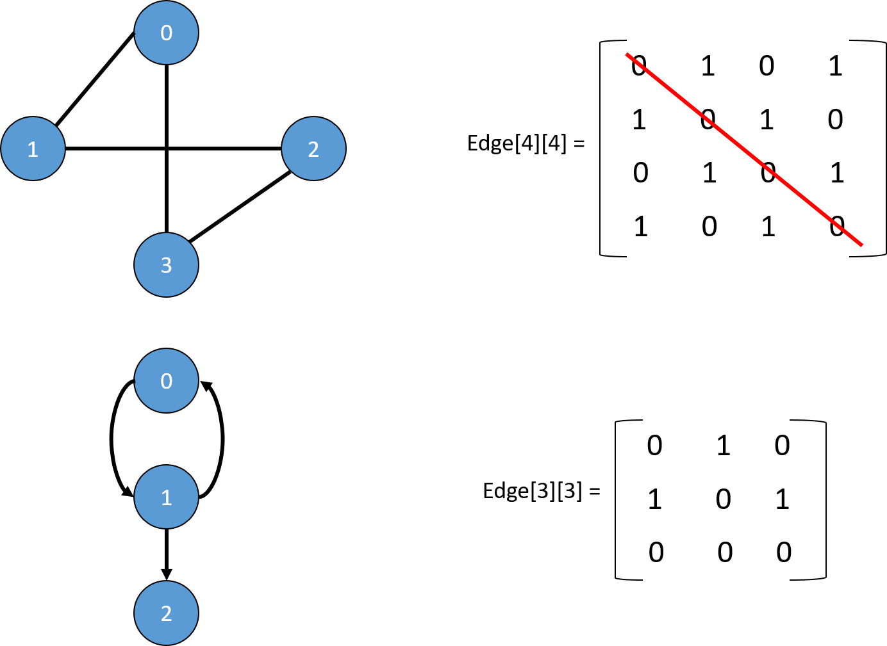
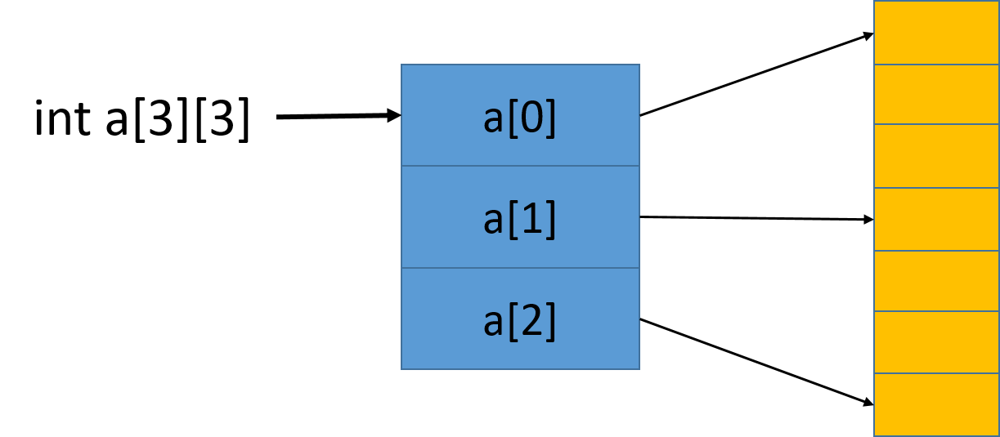

==文档制作工具：小书匠（markdown工具）==
==制作人     ：young==
==制作时间：2018-10-28==


----------

上篇讲到数据结构中的树，这篇开始我们讲解数据结构中的图了。我身边好多的同事，他们在上学的时候，老师都没讲过图或者就提及一下，除了计算机相关专业的。为嘛？太难了呗。难的东西都是值得挑战一下下。那就开写了。

# 数据结构---图

我们可能都有听过说图，那到底什么是图呢？简单的说就是由顶点集合(Vertex)及顶点间的关系集合组成的一种数据结构。用数学表达式子如下：

``` markdown
                	Graph＝( V, E )
V = { x | x ∈某个数据对象 } 是顶点的有穷非空集合；
E = { (x, y) | x, y ∈V } 是顶点之间关系的有穷集合，也叫做边(Edge)集合
```
_注意：我们一般将 **==“<>”==**  表示有向边 ，用 ==**"（）"**== 表示无向边_
如果数学方式不好理解，咱们换一种理解方式。之前我们学过树了吧，树的结构为1对多，那么图就是多对多的关系，这样理解就通俗易懂的多了。
既然是这样，那么就是一个关系： **树是图的一种特殊的数据结构，链表也是图的特殊数据结构。** 图是一种扩展的树结构，每个结点可以指向任意的其它结点。图这种数据结构常用于网络规划和路径路径规划等领域，例如GPS。


上图中的左图表示无向图，因为没有方向关系，右图有箭头的表示有向边，其中箭头开始地方我们称为头，箭头指向的地方我们称之为尾。

## 图中顶点的度

在数据结构的图中，顶点 v 的度是和 v 相关联的边的数目，我们标记为TD(v)，其中 入度是以 v 为头的边的数目，记为ID(v)；出度为以 v 为尾的边的数目，记为OD(v)。所以在图中的度为：		

``` gcode
TD(度) = ID(入度) + OD(出度)
```

## 图的权
在图中，与两顶点之间边相关的数字叫做权，权常用来表示图中顶点间的距离或者耗费。如下图：


# 图的操作及其实现

图的操作和之前的没有多大的区别，无非就是添加，删除，度呀什么的列举下：
* 图的创建
* 图的摧毁
* 图的清空
* 图的添加（边）
* 图的删除（边）
* 图顶点的获取
* 图顶点的度
* 图的边数
* 图的顶点数

关于图的实现一般有两种，一种为邻接矩阵，另一种邻接链表，下面分别介绍他们的差异与实现过程。

## 邻接矩阵实现图
什么是邻接矩阵呢？实际上就为二维数组，因为图中有顶点和边这玩意儿，我们得想办法来存储他们的信息。顶点好存，用一维数组就可以了，那两个顶点间边，我们就用二维数组存储就好了呗，权值就为二位数组的值，二维数组中的数据为0，我们就表示他们两个顶点不连接，用数学表达式表示如下：

```  gcode
设图 A = (V, E) 是一个有 n 个顶点的图，图的邻接矩阵为 Edge[n][n]，则：

         Edge[i][j] = w, W > 0   i和j 链接
		 Edge[i][j] = 0, i== j或 i 和 j 不链接
注： W为权值，当不需要权值时，取W为1表示结点间连接
``` 
基于上面的介绍我们可以得到下图的关系：



从上图我们可以发现无向图的邻接矩阵是对称的，有向图的邻接矩阵可能是不对称的。如果我们做的是无相图，关于遍历就可以选择遍历矩阵的上三角或者下三角，这样可以提高效率。这里我用有向图来实现，因为有向图也可以来表示无像图。

### 邻接矩阵法头节点定义
在图中，有顶点，有边，我们既然想到用邻接矩阵（二维数组）来表示顶点与顶点之间的关系，那么我们还得用一个空间保留定点本身信息，所以这么看我们的头节点信息大概有：节点数，节点信息指针和邻接矩阵地址，如下：

``` c
//  头指针信息 
typedef struct _tag_MGraph {
	int count;  		// 顶点数
	MVertex **v; 	// 顶点相关数据
	int **matrix; 	// 邻接矩阵 
}MGraph_t; 
```

这里节点信息和邻接链表都用的是二级指针，就是指向指针的指针，之前文章提到过。保存节点信息好理解，一般我节点信息都是字符串，所以指向字符串的指针就是指向指针的指针。
关于定义二维数组的方法为什么要用二级指针呢？实际上二维数组其实就是一维数组，我用二级指针主要是用一个指针直接访问一段空间，这样比较高效。如下图：



上图中的橙色部分就是一维指针申请的空间，蓝色部分就是二级指针，指针指针的指针，所以我们动态申请二维数组的方法大概分为3布：（1）通过二级指针动态申请一维指针数组；（2）通过一级指针动态申请数据空间地址；（3）将一维指针数据中的指针链接到数据空间；具体实现在代码中会提及。下面开始讲解邻接链表的实现了。

## 邻接链表实现图
上面讲到邻接矩阵的实现的一些前提条件，咱们还是按部就班，还是按照之前将链表和树的顺序将他一步步实现。

### 创建图
创建图的时候我们得指定该图中有多少的顶点，然后才能动态申请邻接矩阵，注意的是，根据图的定义，顶点必须是又穷非空的。代码如下：

``` c
// 创建 n个顶点的图  顶点数据为 v 
MGraph *MGraph_Create(MVertex **v, int n)
{
	MGraph_t *ret = NULL;
	
	if ((NULL != v) && (n > 0)) { //因为图是有穷非空集合 
		ret = (MGraph_t *)malloc(sizeof(MGraph_t));
		if (ret != NULL) {
			ret->count = n;
			
			int *p = NULL; 
			// 申请数节点据保存空间 
			ret->v = (MVertex **)malloc(sizeof(MVertex *) * n);
			
			//动态申请二维数组空间 用于保存邻接链表 
			ret->matrix = (int **)malloc(sizeof(int *) * n);
			p = (int *)calloc(n * n, sizeof(int)); 
			
			// 合法性判断 
			if ((NULL != ret->v) && (NULL != ret->matrix) && (NULL != p)) {
				int i = 0;
				
				// 构建二维数组
				for(i = 0; i < n; i++) {
					ret->v[i] = v[i]; // 顶点数据保存 
					ret->matrix[i] = p + i * n; // 构建二维数组 
				} 
				
			} else { // 空间失败 
				free(p);
				free(ret->matrix);
				free(ret->v); 
				free(ret);
			}
		}
	}

	return ret;
} 
```

### 摧毁图
在摧毁图的时候，我们只有将申请的空间做释放就OK，比较简单，但是有一点要注意的是：我们在释放空间的时候，是有顺序要求的，因为我们申请的一维数据指针没有保留，只是将数据域保存下来。所以我们在释放空间的时候，必须先释放数据空间，再释放指向数据域的指针域，否则数据域地址丢失，容易造成内存泄露。直观的说就是先释放上图橙色部分内容，再释放蓝色部分。代码如下：

``` c
//  摧毁图 
void MGraph_Destroy(MGraph* graph)
{
	MGraph_t *ret = (MGraph_t *)graph;
	
	if (ret != NULL) {
		free(ret->v);		//清空定点数据指针 
		free(ret->matrix[0]);//清空数据域 
		free(ret->matrix);	//清空邻接数组 
		free(ret);			//最后清空头节点数据 
	} 
}
```

### 清空图
清空图的部分比较简单，因为我们用邻接矩阵保存他们的关系，所以我们只要清空邻接矩阵就好。代码如下：

``` c
// 清空图 也就是清空顶点之间的连接 
void MGraph_Clear(MGraph* graph)
{
	MGraph_t *ret = (MGraph_t *)graph;
	
	if(ret != NULL) {
		int i = 0;
		int j = 0;
		
		// 让邻接矩阵数据清空 
		for (i = 0; i < ret->count; i++) {
			for (j = 0; j < ret->count; j++) {
				ret->matrix[i][j] = 0;
			}
		}
	} 
}
```

### 添加边（顶点间关系）
用邻接矩阵添加两顶点间关系比较简单，只是需要将邻接矩阵相应的位置填充数据即可。代码如下：

``` c
// 添加顶点之间的连接 这里我们使用的是有向图 
int MGraph_AddEdge(MGraph* graph, int v1, int v2, int w)
{
	MGraph_t *tgraph = (MGraph_t *)graph; 
	int ret = (tgraph != NULL);
	
	ret = ret && (v1 >= 0) && (v1 <= tgraph->count);
	ret = ret && (v2 >= 0) && (v2 <= tgraph->count);
	ret = ret && (w >= 0);
	
	// 插入只需要将邻接矩阵相应的位置的值置为权值即可
	if (ret) {
		tgraph->matrix[v1][v2] = w;
	}
	
	return ret;
} 
```

### 获取两定点间关系（权）
这个也是，简直不要太简单了，直接返回相应位置的权值即可。

``` c
// 获取两个顶点之间的权值  v1->v2 
int MGraph_GetEdge(MGraph* graph, int v1, int v2)
{
	MGraph_t *tgraph = (MGraph_t *)graph; 
	int flag = (tgraph != NULL);
	int ret = 0;
	
	flag = flag && (v1 >= 0) && (v1 <= tgraph->count);
	flag = flag && (v2 >= 0) && (v2 <= tgraph->count);
	
	if (flag) {
		ret = tgraph->matrix[v1][v2];
	}
	
	return ret;
}
```

### 删除边（顶点间关系）
和顶点添加一个道理，找到位置，只需要将顶点间的关系清空就可以，也就是将相应的位置置为0。简直不要太简单。

``` c
// 移除顶点间联系 
int MGraph_RemoveEdge(MGraph* graph, int v1, int v2)
{
	MGraph_t *tgraph = (MGraph_t *)graph; 
	int ret = MGraph_GetEdge(graph, v1, v2);
	
	if (ret != 0) {
		tgraph->matrix[v1][v2] = 0;
	}
	
	return ret;
} 
```

### 获取图的定点数
这个更简单了，直接返回头节点中的节点数信息即可，代码如下：

``` c
// 获取顶点数 
int MGraph_VertexCount(MGraph* graph)
{
	MGraph_t *tgraph = (MGraph_t *)graph; 
	int ret = 0;
	
	// 直接返回头节点信息中数据 
	if (tgraph != NULL) {
		ret = tgraph->count;
	} 
	return ret;
}
```

### 顶点的度

这个稍微复杂点，但是也不难，之前我们介绍过，在图中，顶点的度为：**==入度 + 出度==** ，所以这个就简单了，便利一遍邻接链表，碰到数据不为 0的数据加 1 即可。代码如下：

``` c
// 获取顶点的度  顶点的度 = 入度 + 出度 
int MGraph_TD(MGraph* graph, int v)
{
	MGraph_t *tgraph = (MGraph_t *)graph; 
	int flag = (tgraph != NULL);
	int ret = 0;
	
	flag = flag && (v >= 0) && (v < tgraph->count); 
	
	if (flag) {
		int i = 0;
		
		// 遍历数据域就可以 
		for (i = 0; i < tgraph->count; i++) {
			// 出度
			if (tgraph->matrix[v][i] != 0) {
				ret++; 
			} 
			
			if (tgraph->matrix[i][v] != 0) {
				ret++;
			}
		}
	}	
	return ret;
} 
```

### Heading

## 图的表示方式与实现


# 图的两种搜索方法


## 深度优先搜索


## 广度优先搜索


# 图的相关算法

## 最小连通网---prim


## 最短路径--Dijkstra与Floyd算法


