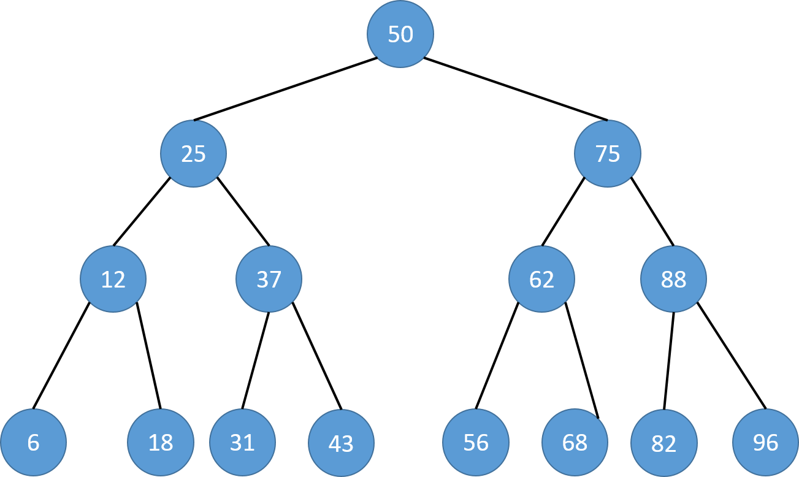
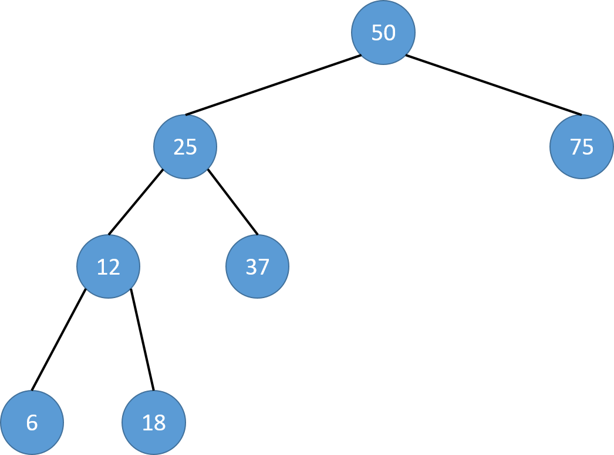
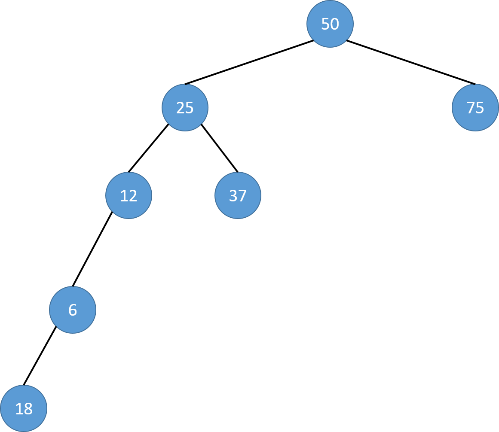

==文档制作工具：小书匠（markdown工具）==
==制作人     ：young==
==制作时间：2018-11-18==


----------

这篇文章就结束数据结构的篇章吧，下周开启新的篇章，所以呢，这篇文章可能也有点长，如果能耐心看完的话，应该会有所收获的。那这篇文章我们讲二叉排序数和基于二叉排序树的hash的实现，为什么讲这两个呢？因为在具体的工程中我们一般会采用 ==“键-值”== 的形式映射数据。

# 二叉排序树
顾名思义，二叉排序树肯定也是一种特殊的二叉树，并且是可以排序的。其实二叉排序树是改进二分查找的办法，因为二分查找是一种静态查找的办法，所以二叉排序树就是动态查找的一种办法。
我们先看一张图来说明下什么是二叉排序树呗，如下：



有没有发现，二分查找的过程实际上就是一棵二叉树。我们看看图二叉排序树有什么特性：（１）任意一个结点的值都　**==大于==**　其　**==左子树的所有结点值==**　；（２）任意一个结点的值都　**==小于==**　其　**==右子树的所有结点值==**　。

这个好理解吧，因为二叉排序树也是二叉树，所以他的操作也和二叉树是一样一样的，我就不介绍了，可以看看之前的文章有具体的介绍，这里我就介绍他们不同的地方咯。
因为二叉排序树是特殊的二叉树，所以大部分的操作是一样的，只有插入，删除和查找不一样，所以我就不重新写一个二叉树了，就那拿之前实现的代码来改改就好。

## 结构变化

因为是特殊的二叉树，所以结构肯定有所变化,我们新增一个关键字，其实就越是数据。

``` c
typedef struct _tag_BSTreeNode BSTreeNode;

struct _tag_BSTreeNode
{
    BSKey* key;				// 查找关键字 
    BSTreeNode* left;	  	// 左子树 
    BSTreeNode* right;		// 右子树 
};
```

不仅如此，我们除了定义一个打印函数的类型，还得定义一个比较函数的数据类型。如果我们想实现可以复用的二叉排序树的话，我们就得让用户传入这个函数，因为程序是不知道我们要比较的函数的数据类型，所以得用户提供一个比较函数。

``` c
typedef void (BSTree_Printf)(BSTreeNode*);		// 打印函数 
typedef int (BSTree_Compare)(BSKey*, BSKey*);	// 比较函数 
```

有一点我们要注意的是，因为我们实现的是二叉排序树，就是一个有序的二叉树，所以二叉排序树的所有操作都必须保证其二叉排序性不变！

## 二叉排序树的添加

我们插入是有一个条件的，在二叉排序树中，插入操作总是在叶结点处进行，必须遵守这条规则。
再者，因为二叉排序树实际上就是二分法，所以判断也简单，就是我们插入的节点值和二叉树的节点值比较，小于走右边，大于走左边。这么说的话，肯定得用递归实现了呗。代码如下：

``` c
int BSTree_Insert(BSTree* tree, BSTreeNode* node, BSTree_Compare* compare) 
{
    TBSTree* btree = (TBSTree*)tree;
    int ret = (btree != NULL) && 
		    (node != NULL) &&
			(compare != NULL);
    
    if(ret) {
    	// 插入节点赋值 
        node->left = NULL;
        node->right = NULL;
        
        // 根节点 
        if(btree->root == NULL) {
            btree->root = node;
        } else {
            ret = recursive_insert(btree->root, node, compare);
        }
        
        // 插入成功 count++ 
        if(ret) {
            btree->count++;
        }
    }
    
    return ret;
}
```

递归代码如下：

``` c
/**
 *  \brief 二叉排序树的插入操作
 *
 * param[in] root    节点信息
 * param[in] node    插入的节点
 * param[in] compare 比较函数
 *
 * \note 比较函数是用户传入的，我们不知数据类型，所以由用户自行处理 
 */  
static int recursive_insert(BSTreeNode* root, BSTreeNode* node, BSTree_Compare* compare)
{
    int ret = 1;
    int r = compare(node->key, root->key);
    
    // 如果ｒ = 0  表示在二叉树中已经存在该节点, 插入失败 
    if( r == 0 ) {
        ret = 0;
        
    } else if( r < 0 ) { // 选择左子树中递归 
		// 如果左子树不为空 ,递归 
        if( root->left != NULL ) {
            ret = recursive_insert(root->left, node, compare);
        } else {	// 左子树为空，表示就插入在这个位置了。 
            root->left = node;
        }
        
    } else if( r > 0 ) { // 右子树递归 
    	// 如果右子树不为空 ,递归 
        if( root->right != NULL ) {
            ret = recursive_insert(root->right, node, compare);
        } else { // 右子树为空，表示就插入在这个位置了。
            root->right = node;
        }
    }
}
```
我简单的介绍下递归的代码。之前说了，我们的插入操作应该添加都在叶节点进行。==**还有一点，二叉排序树的实现有一个缺陷，就是不允许有两个完全相同的数据节点。**== 所以我们操作的时候，发现如果节点相同，直接返回失败，然后只要递归的找到合适的节点插入就可以了。

## 二叉排序树的删除

关于二叉排序树的删除会比较麻烦，应该我们删除了二叉树中的节点是必须保证二叉排序性的。如果我们删除的是叶结点，直接删除即可；如果是非叶结点，就得查找合适的替代者后删除，删除一个节点还得找到他的中序遍历的前驱节点作为替代。
考虑下，我们有必要重新执行一次中序遍历吗？ 显然没什么必要，我们只需要找到要删除节点的左节点，然后一直找到空右节点为止。我画一个图，这样好理解点，如下：




例如上图，我进行中序遍历，那他排序应该如下：

``` markdown
6, 12, 18, 25, 37, 50, 75
```
如果我要删除25，这个节点，按照要求我应该拿他的直接前驱替代，就是18。所以看代码的实现咯。

``` c
//brief 二叉树的删除 
BSTreeNode* BSTree_Delete(BSTree* tree, BSKey* key, BSTree_Compare* compare)
{
    TBSTree* btree = (TBSTree*)tree;
    BSTreeNode* ret = NULL; 
    
    if((btree != NULL) && (key != NULL) && (compare != NULL)) {
        ret = recursive_delete(&btree->root, key, compare);
        
        // 如果删除成功 count-- 
        if( ret != NULL )
        {
            btree->count--;
        }
    }
    
    return ret;
}
```

递归查找代码如下：

``` c
/**
 * \brief 递归删除 
 *
 * param[in] pRoot     删除节点起始位置
 * param[in] key       关键字
 * param[in] compare   比较函数 
 *
 * retval 返回待删除的元素 
 */ 
static BSTreeNode* recursive_delete(BSTreeNode** pRoot, BSKey* key, BSTree_Compare* compare)
{
    BSTreeNode* ret = NULL;
    
    if( (pRoot != NULL) && (*pRoot != NULL) ) {
        int r = compare(key, (*pRoot)->key);
        
        // 找到元素 
        if( r == 0 ) {
            ret = delete_node(pRoot);
        // 左子树递归查找 
        } else if( r < 0 ) {
            ret = recursive_delete(&((*pRoot)->left), key, compare);
        // 右子树递归查找 
        } else if( r > 0 ) {
            ret = recursive_delete(&((*pRoot)->right), key, compare);
        }
    }
    
    return ret;
}
```

删除操作的代码如下：

``` c
/**
 * \brief 删除节点 
 *
 * \note 传入二级指主要是因为我们在删除操作需要需改指针数据 
 */ 
static BSTreeNode* delete_node(BSTreeNode** pRoot)
{
    BSTreeNode* ret = *pRoot;
    
    // 右节点为空时候，左节点直接上位 
    if( (*pRoot)->right == NULL ) {
        *pRoot = (*pRoot)->left;
    
    // 左节点为空时，右节点直接上位 
    } else if( (*pRoot)->left == NULL ) {
        *pRoot = (*pRoot)->right;
    
    // 如果做左右节点都不为空需要找中序遍历的直接前驱 
    } else {
        BSTreeNode* g = *pRoot;
        BSTreeNode* c = (*pRoot)->left;
        
        // 右子树为空的节点  
        while( c->right != NULL ) {
            g = c;
            c = c->right;
        }
        
        //判断while是否有执行
		//如果没有执行表示下一个节点直接满足条件 
        if( g != *pRoot ) {
            g->right = c->left;
        } else {
            g->left = c->left;
        }

		// 上位操作 
        c->left = (*pRoot)->left;
        c->right = (*pRoot)->right;
        
        *pRoot = c;
    }
    
    return ret;
}
```

在删除操作中还有一种特殊的情况，我画个图，你们可能好理解，如下：



在上图中，如果我们删除的节点是25，是加上12直接上位就可以了。所以在上面的代码中，做一个特殊处理就行：

``` c
        //判断while是否有执行
		//如果没有执行表示下一个节点直接满足条件 
        if( g != *pRoot ) {
            g->right = c->left;
        } else {
            g->left = c->left;
        }
```

## 二叉排序树中的查找节点

这个操作话就比较简单了，和之前的二叉树的查找有点类似。看代码就明白了，如下：

``` c
// 节点获取 
BSTreeNode* BSTree_Get(BSTree* tree, BSKey* key, BSTree_Compare* compare)
{
    TBSTree* btree = (TBSTree*)tree;
    BSTreeNode* ret = NULL; 
    
    if((btree != NULL) && (key != NULL) && (compare != NULL)) {
        ret = recursive_get(btree->root, key, compare);
    }
    
    return ret;
}
```

递归代码如下：

``` c
/**
 * \brief 递归查找
 *
 * param[in] root    查找节点
 * patam[in] key     查找的关键字
 * param[in] compare 比较函数 
 */ 
static BSTreeNode* recursive_get(BSTreeNode* root, BSKey* key, BSTree_Compare* compare)
{
    BSTreeNode* ret = NULL;
    
    if( root != NULL ) {
        int r = compare(key, root->key);
        
        // 如果 r = 0 表示找到 
        if( r == 0 ) {
            ret = root;
        
        // 左节点 递归查找 
        } else if( r < 0 ) {
            ret = recursive_get(root->left, key, compare);
        // 右节点 递归查找 
        } else if( r > 0 ) {
            ret = recursive_get(root->right, key, compare);
        }
    }
    return ret;
}
```

这个简单点，没啥好说明的了。


# hash表的实现

好了，上面的是二叉排序树的全部实现了，如果想要全部代码和测试工程，可以在后台回复 **【2018-11-18】** 获取咯。下面我们说说hash表。
为什么要说hash表呢？之前说过了，因为他的实现其实就是“键-值”的映射，他不是一种特殊的数据结构，只是一种形式的存在，我们就假装他是一种特殊的结构来讲解吧。
我们说说hash 的定义吧，说上是这么说的：在数据元素的存储位置和它的关键字之间建立一个映射关系f，通过f可以直接得到关键字所代表的数据元素。
这里面有两个概念，哈希表和哈希函数。简单的说， **hash表是哈希技术中用于存储数据元素的数据结构**， **哈希函数是哈希技术中的映射关系f**。是不是觉得数组和他很像，其实数组是最简单也是最高效的哈希实现。

其实hash技术的关键就是hash表和哈希函数，其他没什么，他的存储还是利用数组，链表，二叉树等存储的。
所以hash的一些常用操作如下：

``` c
 创建哈希
 销毁哈希
 清空哈希
 加入键值对
 删除键值对
 根据键获取值
 获取键值对数目
```

为了提高效率，也为了让这篇文章有点联系，我们就利用之前写的二叉排序树来实现一套hash吧。

内部结构信息如下：

``` c
// hash 内部管理结构体 
struct _tag_HashNode
{
    BSTreeNode header;	// 链信息 
    HashValue* value;		// 值保留 
};
```

## 创建哈希
这个简单呀，直接套用二叉排序树的初始化就好。如下：

``` c
// 创建hash表 
Hash* Hash_Create()
{
    return BSTree_Create();
}

```

## 加入键值对

插入操作我们得申请一段数据存储空间，然后插入数据，如果插入失败，我们得释放我们自己申请的空间。代码如下：

``` c
    BSTree_Clear(hash);
}

// 加入键值对
int Hash_Add(Hash* hash, HashKey* key, HashValue* value, Hash_Compare* compare)
{
    int ret = 0;
    // 申请 数据存储空间 
    HashNode* node = (HashNode*)malloc(sizeof(HashNode));
    
    if( ret = (node != NULL) ) {
    	// 节点初始化赋值 
        node->header.key = key;
        node->value = value;
        
        // 调用二叉排序树中的插入操作 
        ret = BSTree_Insert(hash, (BSTreeNode*)node, compare);
        
        // 如果插入失败，释放空间 
        if( !ret ) {
            free(node);
        }
    }
    
    return ret;
}
```

##  删除键值对

删除操作也容易理解，直接调用二叉排序树中的删除操作就可以了。代码如下：

``` c
// hash 表删除操作 
HashValue* Hash_Remove(Hash* hash, HashKey* key, Hash_Compare* compare)
{
    HashValue* ret = NULL;
    HashNode* node = (HashNode*)BSTree_Delete(hash, key, compare);
    
    if( node != NULL ) {
        ret = node->value;
        
        free(node);
    }
    
    return ret;
}
```

## 根据键获取值

这个函数也是服用二叉排序树中的函数，代码如下：

``` c
// 通过键值获取hash值 
HashValue* Hash_Get(Hash* hash, HashKey* key, Hash_Compare* compare)
{
    HashValue* ret = NULL;
    HashNode* node = (HashNode*)BSTree_Get(hash, key, compare);
    
    if( node != NULL ) {
        ret = node->value;
    }
    
    return ret;
}
```


## 获取键值对数目

这个操作也比较简单呀，也是复用之前的二叉排序树中的函数，代码如下;
``` c
// hash表数据获取 
int Hash_Count(Hash* hash)
{
    return BSTree_Count(hash);
}
```

## 清空hash表

我们在清空hash表的时候，必须递归的删除里面的数据，不然会造成内存泄露，代码如下：

``` c
// 清空hash 表 
void Hash_Clear(Hash* hash)
{
    recursive_clear(BSTree_Root(hash));
    BSTree_Clear(hash);
}
```
递归代码如下：


## 摧毁hash表


``` c
// 摧毁hash表 
void Hash_Destroy(Hash* hash)
{
    Hash_Clear(hash);
    BSTree_Destroy(hash);
}
```