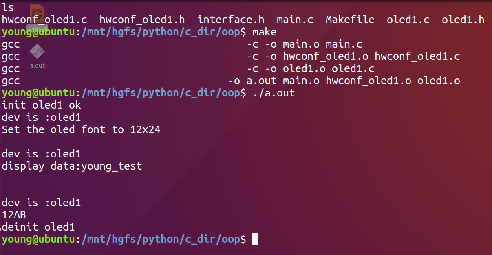

==文档制作工具：小书匠（markdown工具）==
==制作人     ：young==
==制作时间：2018-11-24==


----------


来工作了这么久，其实嘛，也学到了一些东西，实实在在东西就不说了。比如XXX驱动，XXX开发板呀啥的。我觉得嘛，我们做程序员的，不应该是码农，应该努力做一个工程师。他们有啥区别呢？
于我而言，码农，就是纯粹敲代码的人。在国内，绝大多数应该都是码农。大多没有多少的创造力，因为我们现在所做的东西，95%都能在百度找到，还有的4%应该能在google中找到，最后的1%就是属于大神们的创造了。码农的工作实际上只是为了完成任务而存在的，而对于工程师而言，他们是有一定的自我创造能力的，他们是为了解决某个具体的问题而存在的，或者在某一项领域中小有研究，能在其中找到灵感。
在某种意义上，我也是码农。所以我一就直认为，我们做程序员的，我们的工作意义不是写代码，而是理解为什么要这样写以及这样写的好处是啥，应该了解他背后的深层次的含义。
好吧好吧，扯的有点多。这周就聊聊从开始工作至今，我工作中的一些编程的想法和技巧，如果能耐心看完这篇文章的话，我想应该还是有所帮助的。

# 面向对象编程的思想

对于像我一样的嵌入式程序员来说，学会面向对象的编程思想是非常有必要的，为啥呢？因为我是做嵌入式的，举个我工作中的例子呗。
**例如要开发一款OLED液晶屏驱动，好，你写好了，给客户发过去了，客户也使用你的驱动，用的很爽，也将他的工程写好了。后来发现他选择的OLED似乎不满足要求，客户要求重新写驱动，但是不能改接口，因为代码量太大了，难以维护。**
这时候问题来了，重写？但是函数命名问题和接口定义怎么办？显然这样代码的可扩展性和复用性都特别的低。那为什么不一开始定义好接口，写通用的接口呢？下面我就说说我在工作中的做法吧。这里就以oled为例子讲解咯。

## 1.定义通用服务函数句柄

首先定义通用的服务句柄，这里用句柄的原因主要是给设备做分类，一个句柄就表示一个（一类）设备。为啥要这样呢？继续往后看。通用句柄定义如下：

``` c
/** \brief oled服务 */
typedef struct oled_serv{
	const struct oled_funcs *funcs; /**< \brief 功能函数    */
	void 						*p_arg;/**< \brief 函数第一个参数 */ 
} oled_serv_t;


typedef oled_serv_t *oled_handle;  /**< oled通用服务句柄 */
```

这里我就简单的列出几个功能函数，讲解方便点，如果需要添加，也就是依葫芦画瓢而已。结构体定义如下：

``` c
/**
 * \brief 功能函数结构体 
 */ 
struct oled_funcs {
	/** \brief 配置字体信息 */
	void (*oled_font_size_config)(void *p_drv, int request);
	
	/** \brief 显示字符串   */ 
	void (*oled_str_show)(void *p_drv, const char *p_data);
	
	/** \brief 显示图片 */ 
	void (*oled_graph_show)(void *p_drv, const char *p_data, size_t size);
}; 
```
这几个函数就是具体的OLED驱动驱动给上层接口提供的，这些接口都是抽象的行为函数，类似一个虚函数表，那具体的实现就应该在具体的驱动实现**==。因为每个函数实现都需要一个设备传入，但是每个设备的句柄都不同，我们又要做的是通用接口，所以只能做一个数据的封装(void * )，让具体的驱动自己解析句柄。==**下面是行为函数，定义如下：

``` c
/** broef 字符大小设置 */
inline
static void oled_font_size_cfg (oled_handle handle, int request)
{
	handle->funcs->oled_font_size_config(handle->p_arg, request);
}

/** \brief 显示字符 */
inline
static void oled_str_show(oled_handle handle, const char *p_str)
{
	 handle->funcs->oled_str_show(handle->p_arg, p_str);
} 

/** \brief 显示图片 */
inline
static void oled_graph_show(
	oled_handle handle, const char *p_buf, size_t size)
{
	 handle->funcs->oled_graph_show(
	 				handle->p_arg, p_buf, size);
}
```

以上就是一个通用接口的设计了，但是我这个通用接口只有一堆的虚函数，没有具体的实现，显然是不可以使用的。下面我们虚拟一个设备来实现来实现。

## 2.添加设备

==我们要使用通用接口，那具体的设备肯定要继承他的方法咯==。然后就是拓展具体设备自己的属性。示例如下：

``` c
/** \brief 设备信息结构体 */
typedef struct oled1_info {
	const char *name; /* 设备名 */
	// Users can add members... idle
}oled1_info_t; 

/** \brief oled设备 */
typedef struct oled1 {
	oled_serv_t       isa;  /**< \brief 继承oled通用设备 */ 
	const oled1_info_t  *info; /**< \brief 设备信息         */ 
	// Users can add members... idle
}oled1_t;

/** \brief oled1设备句柄 */
typedef oled1_t *oled1_handle;
```

例如例子中的oled1设备结构体就是继承及通用接口的方法，继而拓展自己的属性设备信息。设备结构体定义完毕了，接下来就是来初始化这个设备。==因为每个设备都有初始化差异，不想他们的行为一样的有共性，所以不能是通用接口。这个就得向外提供设备自己的初始化和解初始化函数。==我的例子如下：

``` c
/** \brief 初始化 */
oled_handle oled1_init(oled1_handle      handle,
				const oled1_info_t *info);

/** \brief 解初始化 */ 
void oled1_deinit(oled1_handle handle);
```

因为设备初始化中肯定是用户自己的配置，所以肯定是用户传入的。一般情况下这些初始化配置信息用户只需要配置一次，所以考虑用信息表的形式写入。这样的一个好处就是，我初始化一个设备，不需要参数进来，只需要修改参数表的信息就可以。

## 3.设备信息的设置

新建一个配置&&初始化文件，这里是一个例子，所以配置就写了一个，如果需要拓展，自己发挥咯。我的设备信息定义如下 ：

``` c
/** \brief 设备信息结构体 */
static const  oled1_info_t __g_oled_info = {
	"oled1\0",  /**< \brief 设备名 */
};

static  oled1_t __g_oled_dev; // 定义一个设备实例

/** \brief 实例初始化 */
oled_handle oled1_inst_init()
{
	return oled1_init(&__g_oled_dev, &__g_oled_info);
}


/** \brief 实例初始化 */
void oled1_inst_deinit(oled_handle handle)
{
	oled1_deinit(handle->p_arg);
}
```

所以我们就向外提供2个函数，实例初始化和解初始化函数。简化了用户使用复杂度。好， 现在简单的框架已经搭建好了，要做的只有具体实现接口了。

## 4.驱动实现

我们先来实现初始化函数和解初始化函数。初始化函数除了要初始化设备本身应该初始化的功能之外，在这之前应该填充这个设备句柄信息，示例如下：

``` c
/** \brief 初始化 */
oled_handle oled1_init(oled1_handle        handle,
			   const oled1_info_t    *info)
{
	// handle 信息填充 
	handle->info      = info;
	handle->isa.funcs = &__g_oled1_funcs;
	handle->isa.p_arg = handle;
	
	// run dev functions 
	
	printf("init oled1 ok\n"); // test print
	return (&handle->isa);
}

/** \brief 解初始化 */ 
void oled1_deinit(oled1_handle handle)
{
	printf("deinit %s \n", handle->info->name); // test print
}
```

==初始化函数中有一个功能函数的赋值，这个全局变量就是这个结构的重点，我们就是利用这个赋值实现的通用接口==，该全局变量定义如下：

``` c
/** broef 字符大小设置 */
static void __oled1_font_size_cfg (void *p_drv, int request)
{
	OLED_DECL(handle, p_drv);  // 类型定义 
	uint8_t data[][6] = {"6x8\0", "6x12\0", "12x24\0"};
	
	printf("dev is :%s\n", handle->info->name);  //设备信息打印，测试handle 
	printf("Set the oled font to %s \n",data[request]);
}

/** \brief 显示字符 */
static void __oled1_str_show(void *p_drv, const char *p_str)
{
	OLED_DECL(handle, p_drv);  // 类型定义 
	printf("dev is :%s\n", handle->info->name); //设备信息打印，测试handle 
	
	printf("display data:%s\n",p_str);
} 

/** \brief 显示图片 */
static void __oled1_graph_show(void *p_drv, const char  *p_buf, size_t size)
{
	OLED_DECL(handle, p_drv);  // 类型定义 
	printf("dev is :%s\n", handle->info->name); //设备信息打印，测试handle 
	int i = 0;
	for (i = 0; i < size; i++) {
		printf("%c", *p_buf++);
	}
	printf("\n");
}
// 功能函数赋值
static const struct oled_funcs __g_oled1_funcs = {
	__oled1_font_size_cfg,
	__oled1_str_show,
	__oled1_graph_show,
};
```

这里利用了一些宏，主要是利用这些宏，便于读者阅读函数，一些类型定义和声明的宏定义如下：

``` c
typedef unsigned char uint8_t;

// 声明
#define  OLED_DECL(handle, p_drv)  \
				oled1_handle handle = (oled1_handle) p_drv
```

到这里为止，就是已经实现一个通用OLED接口定义了，那具体能不能用呢？ 拉出来溜溜就知道了。

## 测试代码

测试代码如下：

``` c
	// 初始化 
	oled_handle handle = oled1_inst_init();
	
	// 字体设置 
	oled_font_size_cfg(handle, FONT_SIZE_12_24);
	printf("\n"); 
	
	// 打印字符 
	oled_str_show(handle, "young_test\n"); 
	printf("\n"); 
	
	char p_data[] = {0x31, 0x32, 0x41, 0x42}; // 12AB 
	oled_graph_show(handle, p_data, sizeof(p_data));
	
	// 解初始化
	oled1_inst_deinit(handle); 
```

上面代码所有的函数都测试一遍了，除了初始化和解初始化函数，其他的我们都用调用通用接口我们写一个makefile编译运行下咯，makefile如下：

``` c
objects = main.o hwconf_oled1.o oled1.o   # 项目文件
CC = gcc                                 # 全局定义编译器 

a.out : $(objects)                     # 目标
	$(CC) -o a.out $(objects)

.PHONY : clean
clean:
	rm a.out $(objects) -rf 
	clear
	ls
```

运行结果如下：



看吧，运行一切正常。如果我们一开始使用的是这样的接口，那添加新的驱动就太容易了，只需要向接口层提供一套功能函数就可以了，其他代码都不用动的 ，对于用户来说，还一个驱动只需要还一个初始化函数而已，其他不用改动，是不是将代价降到了最低，这个就是我们常说的==高内聚低耦合==。不仅仅如此，我们如果思维在开阔点，我们使用这个方式是不是可以实现驱动的跨平台呢？

好了，这篇文章是我工作的一个总结，如果看不同指针，函数指针什么的，可以看看我以往的文章，有介绍过。还是那句话，咱们写代码不能为了写代码而写代码，要多思考代码背后的思想。和往常一样，代码获取后台回复 **==【2018-11-24】==**，吃饭去了，溜了溜了...


