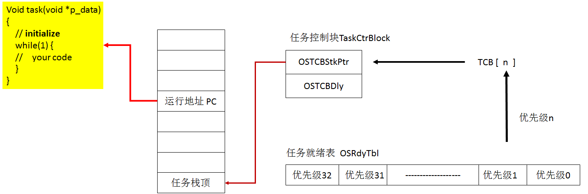
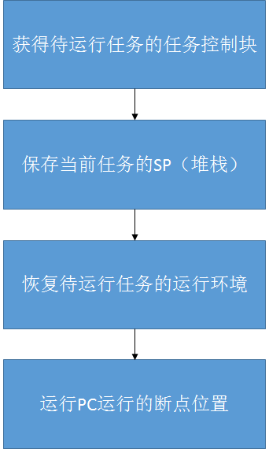

==文档制作工具：小书匠（markdown工具）==
==制作人     ：young==
==制作时间：2018-12-8==


----------

上周没有写啥笔记，心情不太好，就给自己放个假，这周咱们继续写一些东西，在任何时候，学习还有有所必要的，无论学啥。本来想写写关于编程的设计模式，但是这东西比较抽象，换句话，我也没能很好的掌握，咱们还是找个时间在说设计模式。那么这周我们聊聊ucos的一些实现过程吧，可能很多人都知道这东西，但是不太了解他们的实现，咱们还是说说这个简单的操作系统的简易实现。
ucos源码可能也就5000来行的样子，但是他的功能确实强大的，是一个实时多任务的操作系统内核。那什么是多任务呢？
# 多任务

操作系统就不多说了，我们只要知道他是在硬件之上，应用软件之下的软件平台，windows就是例子。咱么说说多任务，我们用电脑可以听歌，上网，看电影。可以同时提执行多个并行任务，并且各个任务之间相互独立互不影响，在宏观上像并发运行。
其实我们知道CPU只有一颗，不可能做到他并发运行，只有不同的任务轮流使用CPU资源，本质上还是单任务。只是CPU运行的比较快让我们感觉是多任务在跑而已。
我们使用多任务还有一个好处，很好的使用CPU资源。因为我们在delay的时，CPU其实是在空跑，这样显得有点资源浪费，在多任务是延时时候会自动调用其他任务，这样就充分的利用CPU资源，提高使用效率。
任务有三态，运行态，就绪态和挂起态。下面分析任务之间的转化。

# 任务调度

假设我们定义一个就绪列表为一个32位的数据，例如：

``` c
unsigned int os_ready_tab; //就绪列表
```

在32位变量中，每一位都表示一个任务，0表示挂起状态，1表示就绪状态，它记录了各个任务是否就绪，所以就是一个就绪表。所以他最多支持32个任务。所以，若想创建（就绪）一个任务或者删除一个任务只需要置位或者清除就绪表对应的任务。代码可以简化如下：

``` c
/* 在就绪表中登记就绪任务 */
#define OSSetPrioRdy(prio) \
{			         	  \
	OSRdyTbl |= 0x01<<prio; \
}
/* 从就绪表中删除任务 */
#define OSDelPrioRdy(prio) \
{ 							\
	OSRdyTbl &= ~(0x01<<prio); \
}
```

我们知道如何在登记表中表示任务的状态，这不够，我们还得知道任务应该选择合适的任务调度，就是系统如何知道我们要调度哪个任务?这个时候就引入优先级的概念，为每个任务安排一个唯一的优先级别，当同时有多个任务就绪时，优先运行优先级较高的任务就可以解决这个问题。
同时的，任务的优先级也是作为任务的唯一标识，这就表示在ucos中是不允许两个任务处于同一个优先级的。
所以我们在使用ucos时候会常定义这样的宏，一般来说，数字越低表示优先级越高。

``` c
/**************定义任务优先级*************/
#define		 PrioTask0 		0
#define		 PrioTask1 		1
#define	 	 PrioTask2 		2
#define    	 PrioTask3 		3
```

这中还有一个概念：**抢占式调度**，一旦就绪状态中出现优先权更高的任务，便立即剥夺当前任务的运行权，把 CPU 分配给更高优先级的任务。这样 CPU 总是执行处于就绪条件下优先级最高的任务。

要实现运行高优先级任务，我们得知道那个优先级的任务比较高，所以就得找到任务优先级高的任务，代码可以如下：

``` c
/* 在就绪表中查找更高级的就绪任务 */
#define OSGetHighRdy() \
{										 \
for(OSNextTaskPrio = 0; \
     (OSNextTaskPrio < OS_TASKS) && (!(OSRdyTbl & (0x01<<OSNextTaskPrio))); \
      OSNextTaskPrio ++ ); 		\
OSPrioHighRdy = OSNextTaskPrio; \
}
```
代码中判断优先级从高到低查找，找到数据中某位数据位为1为止，这就表示找到优先级高的任务了，直接返回或者赋值给变量。代码中这样写不是特别的好，原因有二。其一：这个函数是不可重入的函数；其二，实时操作系统有一个特征就是延时可预测，然而这种算法的延时任务的数量的变化而不同，但是这种算法是最简单的。

# 多任务的时间管理

在多任务做，也是需要一个心跳来维持系统的正常运行，和晶振一样。在系统中一般利用一个固定周期的中断来充当。所以一般在任务中有一个任务级别的延时。这个函数比较简单。就是就是先挂起当起当前任务，设定其延时节拍数，然后进行任务切换，在指定的时钟节拍数到来之后，将当前任务恢复为就绪状态。任务必须通过 任务延时 或 任务挂起的方式 让出 CPU的使用权，使更低优先级任务有机会运行。代码实现可以如下：

``` c
void OSTimeDly(INT32U ticks)
{
	if( ticks > 0 ) 		/* 当延时有效 */
	{
		OS_ENTER_CRITICAL();			/* 进入临界区 */
		OSDelPrioRdy(OSPrioCur);  /* 把当前任务从就绪表中删去 */
		TCB[OSPrioCur].OSTCBDly = ticks;  /* 设置任务延时节拍数 */
		OS_EXIT_CRITICAL();		   	 /* 推出临界区 */
		OSSched();						 /* 重新调度 */
	}
}
```

代码中有一个临界区，这个临界区的实现就是关闭中断的方式，就不多讲了。在延时函数中， 定时器的中断服务函数依次对各个延时任务的延时节拍数减 1。若发现某个任务的延时节拍数变为 0，则把它从挂起态置为就绪态。中断服务函数可以如下：

``` c
void TickInterrupt(void)
{
	static INT8U i;
	OSTime++;
	for(i = 0; i < OS_TASKS; i++) /* 刷新各任务时钟 */
	{
		// 任务块时钟更新
		if(TCB[i].OSTCBDly )
		{
			TCB[i].OSTCBDly --;
			
			/* 当任务时钟到时,必须是由定时器减时的才行*/
			if(TCB[i].OSTCBDly == 0) 
			{
				OSSetPrioRdy(i); /* 使任务可以重新运行 */
			}
		}
	} 
	rSRCPND |= BIT_TIMER0;
	rINTPND |= BIT_TIMER0;
}
```
实际上任务心跳（定时器中断）做的是任务的刷新工作，因为任务要轮流的使用CPU的使用权限。实际上系统会自动的创建一个空闲任务，为了不让系统空跑，闲置资源。他的任务优先级是最低的，做一些无关紧要的工作，类似CPU的使用率之类的。所以像这种空闲任务是一直处于就绪状态。

# 任务的切换

在我们嵌入式领域中，一般只有颗CPU，但是我们要实现多任务，这就要求我们有自己的堆栈，程序代码，数据存储区等，这一系列就是决定一个任务独立的最基本的条件。这个多说句，咱们人也是一样的，人要独立也得有自己的私有财产，让我们自己自由分配，不然怎么算的上最基本的独立呢？
## 可重入与不可重入函数
在多任务中还有一个问题，就是可重入函数与不可重入函数的概念。那什么是可重入函数，什么又是不可重入函数呢？举个例子，一个低优先级的任务正在运行，他在操作一个全局变量，可能已经改变它的数值，正想使用这个变量的时候，另一个高优先级的任务正好打断他们，也使用这个函数，改变了这个全局变量。
所以一般情况下可重入函数使用的数据为局部变量，不带静态局部变量的那种。还有一种如果有malloc和free的也不是可重入函数。这里有点比较重要的是，全局变量是系统各个任务共享的，所以在似乎用多任务操作系统中尽量不要使用全局变量。
如果两个任务共用一套数据，破坏原先的数据结构，这时候我们就引入两种方法解决：可重入函数的设计和互斥调用。互斥调用就是之前说的临界区。

## 临界区
临界区函数要求是互斥的，意思是说一次仅允许一个任务使用公共资源，中断也不可以影响，这个是为了保障数据的可靠性和完整性，我们之前使用的临界区是关中断的方式，其实还有一些，例如：使用互斥信号量，关任务调度等等。

``` c
OS_ENTER_CRITICAL()；
......；//临界代码
OS_EXIT_CRITICAL();
```

这里要注意的地方是，在临界区的代码必须成对的出现，否则会出现不可预测的问题。我们使用临界区的时候，临界区的代码尽量短，因为一直在临界区中，别的任务是无法有使用CPU的机会的，这样会影响多任务系统的使用性能。

## 任务栈

大伙也知道，我们在创建任务的时候，除了会传入任务优先级，还会传入一个任务栈，这个任务栈其实就是一个全局变量的静态数组。为啥用数组呢？主要他是地址是线性的，我们在使用的时候，如果这个栈是递增栈，只需要将栈顶指针SP指向数组首元素；如果是递减栈，SP指针指向最后一个元素，这样就实现了一个任务的私有栈了。

``` c
//LED0任务
//设置任务优先级
#define LED0_TASK_PRIO       			7 
//设置任务堆栈大小
#define LED0_STK_SIZE  		    		64
//任务堆栈	
OS_STK LED0_TASK_STK[LED0_STK_SIZE];
//任务函数
void led0_task(void *pdata);

//开始任务
void start_task(void *pdata)
{
    OS_CPU_SR cpu_sr=0;
	pdata = pdata; 
  	OS_ENTER_CRITICAL(); //进入临界区(无法被中断打断)    
 	OSTaskCreate(led0_task,(void *)0,(OS_STK*)&LED0_TASK_STK[LED0_STK_SIZE-1],LED0_TASK_PRIO);						   
 	OSTaskCreate(led1_task,(void *)0,(OS_STK*)&LED1_TASK_STK[LED1_STK_SIZE-1],LED1_TASK_PRIO);	 				   
	OSTaskSuspend(START_TASK_PRIO);	//挂起起始任务.
	OS_EXIT_CRITICAL();	//退出临界区(可以被中断打断)
}
```

要注意的是，我们传入的栈看情况设定，避免导致任务的栈溢出，出现不可预测的问题，甚至可能出现系统奔溃的问题。

到目前为止，我们只解决了一个任务栈的问题，但是还没有说明如何进行任务的切换调度的问题。我们要实现任务的切换，还有一个条件就是要知道各个任务的栈顶指针的变量。说白了就是要保存它，这里就引入一个任务控制块的概念。

## 任务控制块

什么是任务控制块呢？简单的说就是系统记录任务执行的环境，在ucos中任务控制块内容贼鸡儿长，长到什么地步呢？结构体有60多行，内容包括当前任务栈位置，任务栈大小，任务状态等等。

``` c
typedef struct os_tcb {
    OS_STK          *OSTCBStkPtr;           

#if OS_TASK_CREATE_EXT_EN > 0u
    void            *OSTCBExtPtr;           
    OS_STK          *OSTCBStkBottom;        
    INT32U           OSTCBStkSize;          
    INT16U           OSTCBOpt;              
    INT16U           OSTCBId;               
#endif

    struct os_tcb   *OSTCBNext;             
    struct os_tcb   *OSTCBPrev;             

#if (OS_EVENT_EN)
    OS_EVENT        *OSTCBEventPtr;         
#endif

#if (OS_EVENT_EN) && (OS_EVENT_MULTI_EN > 0u)
    OS_EVENT       **OSTCBEventMultiPtr;    
#endif

#if ((OS_Q_EN > 0u) && (OS_MAX_QS > 0u)) || (OS_MBOX_EN > 0u)
    void            *OSTCBMsg;               
#endif

#if (OS_FLAG_EN > 0u) && (OS_MAX_FLAGS > 0u)
#if OS_TASK_DEL_EN > 0u
    OS_FLAG_NODE    *OSTCBFlagNode;     
#endif
    OS_FLAGS         OSTCBFlagsRdy;     
#endif

    INT32U           OSTCBDly;          
    INT8U            OSTCBStat;         
    INT8U            OSTCBStatPend;     
    INT8U            OSTCBPrio;         

    INT8U            OSTCBX;            
    INT8U            OSTCBY;            
    OS_PRIO          OSTCBBitX;         
    OS_PRIO          OSTCBBitY;         

#if OS_TASK_DEL_EN > 0u
    INT8U            OSTCBDelReq;       
#endif

#if OS_TASK_PROFILE_EN > 0u
    INT32U           OSTCBCtxSwCtr;        
    INT32U           OSTCBCyclesTot;       
    INT32U           OSTCBCyclesStart;     
    OS_STK          *OSTCBStkBase;         
    INT32U           OSTCBStkUsed;         
#endif

#if OS_TASK_NAME_EN > 0u
    INT8U           *OSTCBTaskName;
#endif

#if OS_TASK_REG_TBL_SIZE > 0u
    INT32U           OSTCBRegTbl[OS_TASK_REG_TBL_SIZE];
#endif
} OS_TCB;
```

是不是特别的长，这里列出两个简单的务控制块，只包含了任务的堆栈指针和任务延时节拍数。

``` c
struct TaskCtrBlock /* 任务控制块数据结构 */
{
	INT32U OSTCBStkPtr; /* 保存任务的堆栈顶 */
	INT32U OSTCBDly; /* 任务延时时钟 */
};
struct TaskCtrBlock TCB[OS_TASKS + 1]; /* 定义任务控制块 */
```

这个任务块结构体有点要注意的是，任务栈的栈顶凡在第一个位置，为什么这样做呢?原因是结构体首元素的首地址和结构体的地址是相同的，我们访问结构体的第一个元素，只需要得到结构体的地址即可。这个方式的好处我在之前的文章有介绍。感兴趣回头瞅瞅。
任务控制块是任务切换中的关键，也是任务的唯一标识，他里面保存任务的所有信息，他将任务的代码与数据链接起来，我们只要找到任务控制块就能找到任务的所有资源信息。
任务的三要素分别为：任务程序代码，任务私有堆栈和任务控制块。看下图可能就能了解任务控制块的重要性了。



目前为止，我们了解了任务的调度过程，但是还是少了一些细节，就是任务是如何进行切换的。这里就涉及到一些arm汇编的问题了，关于汇编我也不是很懂，反正不会就百度呗。

还有一点比较重要，就是在C语言中，我们是不可以直接访问SP指针，只能用汇编的形式，我们先定义一个结构体指针指向当前任务块，然后用汇编把当前任务的栈赋值给SP指针即可。代码示例如下：

``` c
struct TaskCtrBlock *p_OSTCBCur ; /* 指向当前任务控制块的指针 */

p_OSTCBCur = &TCB[OSPrioCur]; /* 目的是在汇编中引用任务的 TCB 地址取得栈顶指针 */
```

汇编代码如下：

``` c
SaveSPToCurTcb 
ldr r4,=p_OSTCBCur ; 取出当前任务的 PCB 地址
ldr r5,[r4]
str sp,[r5] ; 保存当前任务的堆顶指针到它的TCB
```

任务切换时，把当前任务的现场数据保存在自己的任务栈里面，再把待运行的任务的数据从自己的任务栈装载到 CPU 中，改变 CPU 的 PC，SP，寄存器等。可以说，任务的切换是任务运行环境的切换。而任务的运行环境保存在任务栈中，也就是说，任务切换的关键是把任务的私有堆栈指针赋予处理器的堆栈指针 SP。部分代码示例如下：

``` c
// 任务调度函数
void OSSched (void)
{
OS_ENTER_CRITICAL();			// 进入临界区
OSGetHighRdy();					// 找出就绪表中优先级最高的任务 
if(OSPrioHighRdy != OSPrioCur) // 如果不是当前运行的任务，进行任务调度 
{
p_OSTCBCur = &TCB[OSPrioCur];	// 压栈，保持当前任务的堆栈
p_OSTCBHighRdy = &TCB[OSPrioHighRdy];
OSPrioCur = OSPrioHighRdy;		// 给SP指针赋值 
OS_TASK_SW();					// 任务调度函数 
}
OS_EXIT_CRITICAL();
}
```

任务调度的汇编函数示例如下：

``` c
OS_TASK_SW ; 任务级的任务切换

stmfd sp!,{lr}		  ; PC入栈
stmfd sp!,{r0-r12,lr} ; r0-r12，lr 入栈

PUAH_PSR
mrs r4,cpsr
stmfd sp!,{r4} ; cpsr 入栈

SaveSPToCurTcb 	; 保存当前任务的堆顶指针到它的 TCB.
ldr r4,=p_OSTCBCur ; 取出当前任务的 PCB 地址
ldr r5,[r4]
str sp,[r5] 		; 保存当前任务的堆顶指针到它的 TCB(因为
			 ;TaskCtrBlock 地址亦即 OSTCBStkPtr 的地址)

GetHigTcbSP				; 取出更高优先级任务的堆顶指针到 SP ,
ldr r6,=p_OSTCBHighRdy ; 取出更高优先级就绪任务的 PCB 的地址
ldr r6,[r6]
ldr sp,[r6] 			; 取出更高优先级任务的堆顶指针到 SP
b POP_ALL 				; 恢复待运行任务的运行环境
```

上面的代码看不同没关系，我们只需要知道的他是怎么实现任务切换的的就可以了，毕竟我们并不是写操作系统的，任务切换流程图如下：




