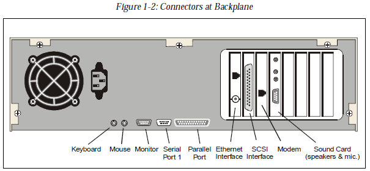
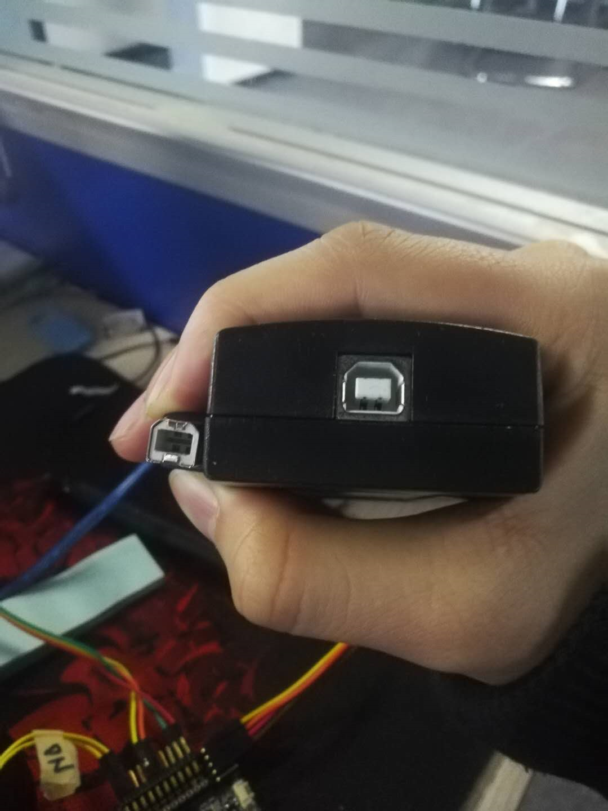
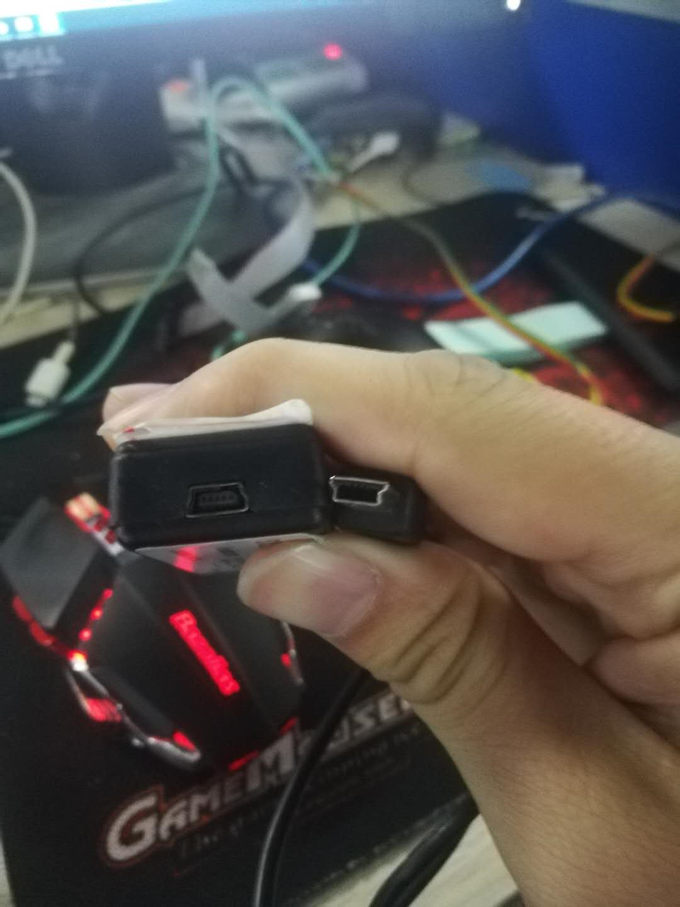
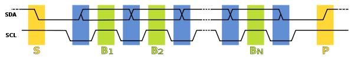
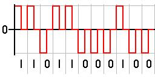
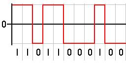
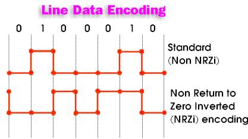
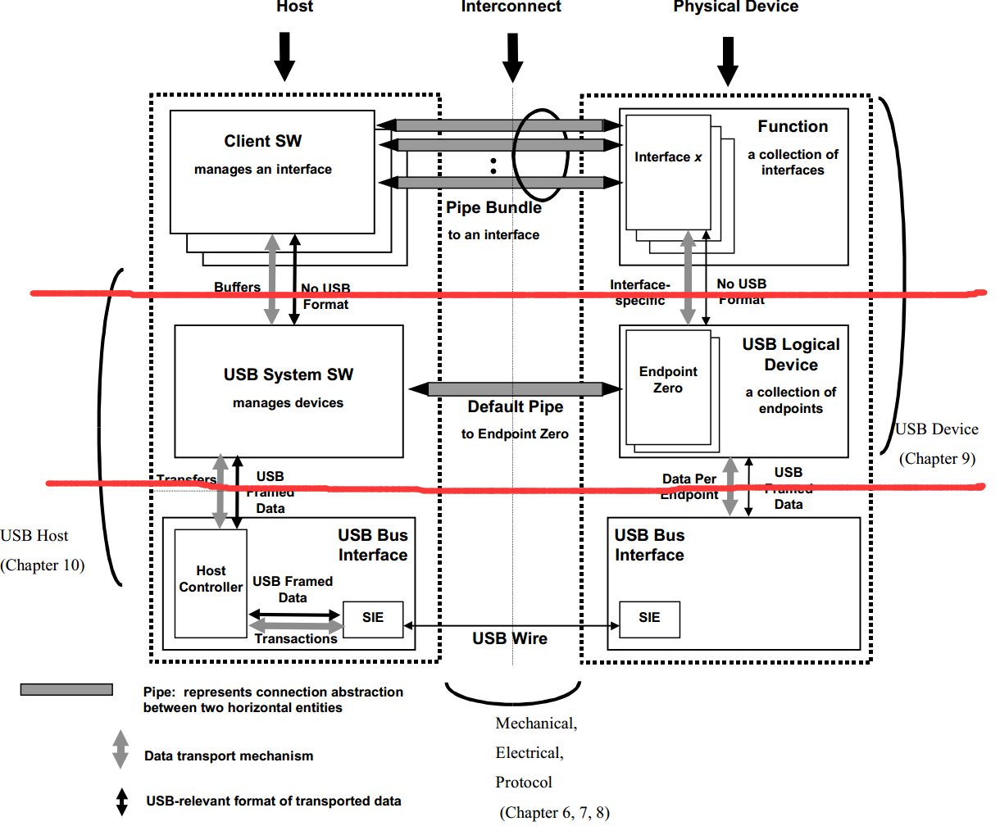
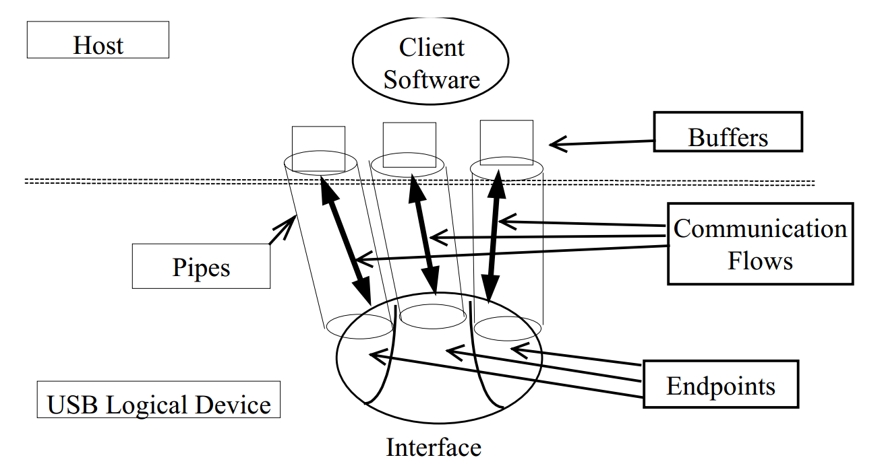

==文档制作工具：小书匠（markdown工具）==
==制作人     ：young==
==制作时间：2019-1-12==


----------

已经有几周没写东西了，上周本想写点东西的，但有几个朋友远道而来，到成都玩耍，就带他们耍了下。有段时间没见他们了，姑娘还是那样优秀，小伙依然健硕。不说了，就从这周开始咱们继续开始呗。去年写操作系统是还没讲完，我到时候看看啥时候继续接着讲，那么这周我想讲解下USB，可能有那么几篇，教你实现一个USB设备打印机类，能够实现PC端的文档数据打印（我用串口模拟数据打印过程）。
从去年的十二月中旬开始接触USB，经理要求完成USB设备类打印机，这东西上上下下还是花了我快一个月时间，毕竟从0开始接触USB，蹭我还记忆犹新，先记录下。

# USB是什么
USB是什么呢？当初我上大学那会儿和朋友调侃，USB不就是You SB嘛？哈哈哈，事实上，当然不是这样子的啦，USB是==Universal Serial Bus==的缩写，中文译为通用串行总线，也是一种通讯总线协议。实际上我们知道的BUS(总线）,例如：网口，SPI，I2C，RS-485等等。所以简单的说，USB就是一种接口，一种总线。
我们知道I2C的好处是通讯要两根线,大大的减小CPU的引脚资源，那USB有什么特殊的地方呢？其实在USB出现之前，计算机领域中的接口太多太繁杂，可以用下面这张，关于PC机箱背后的接口的图片来说明：



是不是发现接口特别的多，好多你都不认识是干嘛的，所以嘛，在USB出现之前，各种接口太多，而且都不太容易使用，互相之间的兼容性也差，这时候才诞生了USB。
所以我们生活中看到的接口大部分都是USB接口，什么硬盘，打印机，手机接口，键鼠等等。总的来说，USB的出现，是希望通过此单个的USB接口，同时支持多种不同的应用，而且用户用起来也很方便，直接插上就能用了，也方便不同的设备的之间的互联。说白了，就相当于在之前众多的接口之上，设计出一个USB这么个万能的接口，以后各种外设，都可以用这一种接口即可。

# USB相关基础

## 控制器类型

USB设备，从物理上的逻辑结构来说，包含了主机Host和设备Device。其中，主机Host端，有对应的硬件的USB的主机控制器Host Controller，而设备端，连接的是对应的USB设备。
USB控制器类型贼多，什么OHCI，UHCI,EHCI啥的，我们这次只讲USB device，不讲控制器，所以就简单了解下他们的关系就好。
==OHCI(Open Host Controller Interface)== 是美国国家半导体公司，微软等推出的,OHCI更多地把要做的事情，用硬件来实现，因此，实现OHCI的USB控制器的软件驱动的开发工作，相对要容易些，软件要做的事情，相对较少。对应地，OHCI更多地应用在扩展卡，尤其是嵌入式领域中，常见的很多开发板中的USB的控制器，很多都是OHCI的。

==UHCI(Universal Host Controller Interface)==，创立者是Intel，而UHCI把更多的功能，留给了软件，相对来说，软件做的事情，即负担要重些。但是实现对应的UHCI的硬件的USB控制器，价格上，就相对便宜些。对应地，UHCI更多地应用在PC机中的主板上的USB控制器。


# USB硬件属性

一般情况下哦， USB1.x/USB2.0使用的是4线制,而USB3.0使用9线，别慌，他们是通用的,他们引脚对应的含义一般如下 ：

表1 USB 1.x/2.0 定义
| 引脚 | 名称 | 颜色  | 描述   |
| ---- | ---- | ----- | ------ |
| 1    | VBUS | Red   | 电源   |
| 2    | D-   | White | 数据线 |
| 3    | D+   | Green | 数据线 |
| 4    | GND  | Black | 地     |


表2 USB3.0
| 引脚  | 颜色   | type A | type B |
| ----- | ------ | ------ | ------ |
| 1     | red    |     VBUS   |
| 2     | white  | D-     |
| 3     | green  | D+         |
| 4     | black  | GND     GND    |
| 5     | blue   | SSRX-  | SSTX-  |
| 6     | yellow | SSRX+  | SSTX+  |
| 7     | shield | GND        |
| 8     | purple | SSTX-  | SSRX-  |
| 9     | orange | SSTX+  | SSRX+  |
| shell | shell  | shield |

## USB分类
以上USB引脚定义,接下来介绍USB接口长什么样子的。关于分类USB应该可以分成：type，mini和micro。
那什么是type类型呢？我们生活中是不是经常听到听到type-C接口呀,就是那个苹果最先用的那种接口。其实还有type-A与type-B。type-A接口就是我们经常看到的那种，我们PC机器经常用到，99%的U盘用的就是type-A公头，自然我们大部分PC机就是那种母头接口。type-B接口可能生活中不常见，但是在嵌入式领域是肯定见过的，看下图就知道了。



对，就是J-link调试器那种接口。这里说上一句,关于type-C是基于USB3.1协议的.

那什么是USB mini呢?这个大家应该也见过,可能只是不知道叫啥，那种老人机的充电器，中间是正方形，外框是梯形的那种,看图。



上图那种叫做USB mini-B,自然肯定有USB mini-A，这个我没有图，就是我们用数码相机那接口,和这个好像，只是中间是梯形的，上图中的中间是长方形的。但是他们的接口(母口)都是一样的,所以通用。

最后还有一种USB接口,就是micro，这个大家肯定都见过，就是我们常看到安卓的接口,比mini更扁。我就不拍照了,大伙都懂。

看到这儿，下回看到USB知道那是属于什么类型的USB了，作为技术人员，咱们专业点。

# USB 协议基础

介绍完USB硬件基础，下面介绍USB协议基础，如果想详细了解USB协议的动易可以去USB官网看(https://www.usb.org/)，里面啥都有。
我们常说的USB版本大概有USB1.1，USB2.0和USB3.0。其实这三个版本是针对有限设备的。实际上,在USB2.0到3.0阶段，还发布过一个USB2.5(USB Wireless)版本，这个版本是针对USB无线设备的，例如我们用的无线鼠标，无线wifi啥的。

其中，USB 1.1中所支持的速度是低速（Low Speed）的1.5Mbits/s，全速（Full Speed）的12Mbits/s，而USB 2.0提高了速度至高速（High Speed）的480Mbits/s，而最新的USB 3.0，支持超高速（Super Speed）的5Gbits/s。
这时候，是不是在想，同样是USB，为啥他们的速度差距这么大呢？这个主要是历史原因，当初用USB1.1时,主要做的是键盘，鼠标这样的设备，那个速度完全满足用户要求;速度低，对电磁辐射的抗干扰能力较强；最主要的原因是降低成本。

为了满足人民群众日益增长的对于高速速度传输方面的需求，USB2.0就出来了，据说这个和USB1.1推出时间之差不到2年的时间。举个例子：从MP3里面拷贝歌曲出来，如果是USB 1.1，那么实际效果最快也就1MB左右，而如果是USB 2.0，平均效果大概有3MB/s,5MB/s，性能好的可达10MB/s，20MB/s，所以，如果拷贝个1G的东西，相当于USB 1.1要1小时左右，而USB 2.0只要1分钟左右。因为如果没有USB 2.0的出现的话，那么现在的人们，早就放弃了USB了，因为谁也忍受不了这个太慢的速度。所以为了满足大家的需求，才有了USB 2.0的出现。
现在的USB3.0也是一个道理，为了满足之后广大人们的"贪婪"，例如你传几个G的视频，USB2.0怎么的都要几min吧，现在只要几秒或者几十秒，哔的一下,就好了，你说刺不刺激。当然，理论上是5G，毕竟这个是和硬件和软件挂钩的,具体的还是看你设备咯。

其实USB发展到2.0阶段，还有一个概念，就是OTG，那什么是OTG呢？说白了就是模式的互转，就是一种主机协商协议，允许两个设备之间互相协商谁去当Host。不过，即使在OTG中，也只是同一时刻，只存在单个的Host，而不允许存在多个Host的。
我们生活上就有这种现象，比如我们经常用手机连接U盘，实现文件互传。数码相机直接链接打印机，打印图片等等，这种就是OTG技术。

## USB NRZI编码

有没有考虑过，同样是串行数据,为什么USB速度比串口，I2C快那么多?其实这个和他的协议传输编码有关，USB所传输的数据，用的数据编码方式是NRZI（Non-Return-to-Zero Inverted）。那什么是NRZI编码呢?这里有篇文章将的不错，我截取他的部分内容简单的介绍下：
[USB 的NRZI编码。](http://galeki.is-programmer.com/posts/10054.html)

首先，USB 的数据是串行发送的，就像 UART、I2C、SPI 等等，连续的01 信号只通过一根数据线发送给接受者。

但是因为发送者和接收者运行的频率不一样，信号的同步就是个问题，比如，接受者接收到了一个持续一段时间的低电平，无法得知这究竟是代表了5个0 还是1000个0。

为了解决这个问题，就是在传输数据信号的同时，附加一个时钟信号，用来同步两端的传输，接受者在时钟信号的辅助下对数据信号采样，就可以正确解析出发送的数据了，比如 I2C 就是这样做的，SDA 来传输数据，SCL 来传输同步时钟：



虽然这样解决了问题，但是却需要附加一根时钟信号线来传输时钟。有没有不需要附加的时钟信号，也能保持两端的同步呢？

有的，这就是 RZ 编码（Return-to-zero Code），也叫做归零编码。在 RZ 编码中，正电平代表逻辑 1，负电平代表逻辑 0，并且，每传输完一位数据，信号返回到零电平，也就是说，信号线上会出现 3 种电平：正电平、负电平、零电平：



从图上就可以看出来，因为每位传输之后都要归零，所以接收者只要在信号归零后采样即可，这样就不在需要单独的时钟信号。实际上， RZ 编码就是相当于把时钟信号用归零编码在了数据之内。这样的信号也叫做自同步（self-clocking）信号。
这样虽然省了时钟数据线，但是还是有缺点的，因为在 RZ 编码中，大部分的数据带宽，都用来传输“归零”而浪费掉了。
那么，我们去掉这个归零步骤，NRZ 编码（Non-return-to-zero Code）就出现了，和 RZ 的区别就是 NRZ 是不需要归零的：



这样，浪费的带宽又回来了，不过又丧失宝贵的自同步特性了，貌似我们又回到了原点，其实这个问题也是可以解决的，不过待会儿再讲，先看看什么是 NRZI：

NRZI 编码（Non-Return-to-Zero Inverted Code）和 NRZ 的区别就是 NRZI 用信号的翻转代表一个逻辑，信号保持不变代表另外一个逻辑。USB 传输的编码就是 NRZI 格式，在 USB 中，电平翻转代表逻辑 0，电平不变代表逻辑1：



翻转的信号本身可以作为一种通知机制，而且可以看到，即使把 NRZI 的波形完全翻转，所代表的数据序列还是一样的，对于像 USB 这种通过差分线来传输的信号特别方便。
现在再回到那个同步问题：

的确，NRZ 和 NRZI 都没有自同步特性，但是可以用一些特殊的技巧解决。

比如，先发送一个同步头，内容是 0101010 的方波，让接受者通过这个同步头计算出发送者的频率，然后再用这个频率来采样之后的数据信号，就可以了。在 USB 中，每个 USB 数据包，最开始都有个同步域（SYNC），这个域固定为 0000 0001，这个域通过 NRZI 编码之后，就是一串方波。

此外，因为在 USB 的 NRZI 编码下，逻辑 0 会造成电平翻转，所以接收者在接收数据的同时，根据接收到的翻转信号不断调整同步频率，保证数据传输正确。
但是，这样还是会有一个问题，就是虽然接收者可以主动和发送者的频率匹配，但是两者之间总会有误差。假如数据信号是 1000个逻辑1，经过 USB 的 NRZI 编码之后，就是很长一段没有变化的电平，在这种情况下，即使接受者的频率和发送者相差千分之一，就会造成把数据采样成 1001个或者 999个了。
关于这个问题，USB中用位填充(Bit-Stuffing)来解决这个问题。就是强制插0，也就是传说中的bit-stuffing，如果要传输的数据中有7个连续的1，发送前就会在第6个1后面强制插入一个0，让发送的信号强制出现翻转，从而强制接受者进行频率调整。接受者只要删除6个连续 1 之后的0，就可以恢复原始的数据了。

# USB协议细节

在讲USB协议过程，我先提两点简单，但是很重要的概念。
 * USB传输过程，都是有主机发起的。例如接受数据，发送数据，设置配置等;
 * 一个USB设备只能有一个设备描述符，一个设备描述符可以有多个配置描述符，一个配置描述符可能有多个接口描述符，一个接口描述符可能有多个端点描述符或者HID描述符，一个HID描述符有实体描述符或者报告描述符。 他们是一个树状结构。如下图


* 端点的输入输出的参考是Host，就是输出输入表示的都是对Host而言。

关于USB协议咱们先从一张图看起吧，大体上体现了USB的架构：



上图中我用两条线将他们分割，主要是体现他们的层次感。最上层是用户程序的功能函数层，中间层是USB逻辑设备层，相当于我们配置寄存器的那层，最下面的那层就是我们的硬件设备的，就是所谓的USB电缆线。
从我们编程上说还有一个关系，就是我们的USB设备配置默认使用的是端点0，数据发送等是通过其他端点完成，关于端点的概念我们之后会提及。
这么看来上面那张图就好理解了，我们先不用管左边host那套，是我们只理会右边的设备,实际上我们只要通过端点0进行配置，端点x进行相应的数据收发就就好。那么端点数据传输是什么样子的呢？如下图：



这个图比较形象了，我们将下面的那个椭圆定义为接口，接口上有好多的柱体，我们理解为柱体与椭圆面的地方就是端点，他们有自己独立的数据通道，这个通道一般是单工的，在通道的上头一般都有一个buffer缓冲区，存数据，一般深度为64不过我一般叫他为FIFO。我们用户子需要从这个FIFO中提取数据即可。

## 端点类型

我们虽然知道他大概的通讯，但是我们还是不知道他是如何进行数据交互的。在将他们的数据交互之前我们还得知道断点具体有什么特点。一般来说：**端点是支持单向数据流的单工连接，所以只能是输入或者输出**。这里有一个例外，就是==控制端点可以即可作为输入或者输出==。

既然我们提到了控制端点，那么肯定有其他端点和端点传输类型。下面我一一介绍下他们，和他们应用的场合。

### 批量传输

批量传输，从字面意思我们就能知道，应用场合肯定是传输数据的比较大的地方使用。对，关于批量数据是没有规定的数据包中数据的意义以及格式，具体的数据结构要由用户自己定义。
批量传输的特点，通常用在数据量大，对数据的实时性要求不高的场合，例如打印机，大容量存储设备等。

### 中断传输

中断传输，字面理解，就是有数据来就会打断一个进行数据传输。其实这个理解可能就不太对了。在USB中，端点的中断传输实际上是固定比时间内访问这个断点是否有数据到来。换句话说，就是以一定频率的传输方式，频率可以自定义，主机会保证小于我们预设值间安排一次数据传输。
中断传输的特点，通用用在数据量不大，但是对时间要求严格的设备，例如鼠标，键盘，轨迹球之类的场合。

### 等时传输

等时传输，字面意思就是有点类似同步传输嘛。实际上是对的，他是一种对数据实时性要求高，数据量大的传输方式。
他的特点呢，通常用在数据量大面对数据延时敏感的设备，但是对数据准确性要求不高，只要保证数据中间不停顿就好。这东西一般用在音频，视频设备。

实际上等时传输是一种比较复杂的传输类型了。

### 控制传输

控制传输，字面上理解就是控制端点数据的一种传输类型了。之前提到过，这种类型的端点是一种比较特殊端点传输类型，因为他的数据传输方向是双工的。所以这种传输类型会比较复杂，因为是双工的，所以会有数据发生的数据格式。
一般控制传输会有三个过程：
 * 建立过程（SETUP，只能使用data0）；
 * 可选择的数据过程（可选，第一个包必须是DATA1，然后是DATA0,类推）；
 * 状态过程（应答，或者无应答）

目前位置我们只需要知道，这个控制传输用在USB设备枚举过程，就可以了。

## 设备枚举过程

到这里为止呢，我们介绍了USB各种传输端点，现在我们来说说USB设备是如何构建起来的？(USB设备枚举)

我给USB设备的枚举过程做了一个形象的例子，如下

``` markdown
Host：你是什么设备？
Device: 12 01 0100.... （返回设备描述符）

Host: 你有几种功能？
Device: 09 02 09…… （返回配置描述符）

Host: 每个功能有几个接口？
Device: 09 04 00…… （返回接口描述符）

Host: 每个接口有几个端点?
Device: 06 05 82……（返回端点描述符）

Host：好了，我知道你是谁了，开始传输吧！
Device：Okey。
```

大概就是这样子的，只是他们之间还有一些细节没有讲解到。现在我们仔细的剖析下他们是如何进行数据传输的吧。
进行剖析以前我们得知道描述符是啥玩意儿?他们都有哪些类型？这里我就简单介绍下比较常用到的描述类型和他的数据意义。

### 设备描述符

| 偏移量    | 域              | 大小 | 描述                                                                                 |
| ------ | --------------- | ---- | ------------------------------------------------------------------------------------ |
| 0      | bLength         | 1    | 此描述表的字节数                                                                     |
| 1      | bDecriptorType  | 1    | 描述符的类型（此处应为0x01，即设备描述符）                                           |
| 2      | bcdUSB          | 2    | 此设备与描述表兼容的USB设备说明版本号（BCD 码）                                      |
| 4      | bDeviceClass    | 1    | 设备类码：如果此域的值为0则一个设置下每个接口指出它自己的类，各个接口各自独立工作。 |
| 5      | bDeviceSubClass | 1    | 子类掩码                                                                             |
| 6      | bDevicePortocol | 1    | 协议码                                                                               |
| 7      | bMaxPacketSize0 | 1    | 端点0的最大包大小（仅8,16,32,64为合法值）                                           |
| 8      | idVendor        | 2    | 厂商标志（由USB-IF组织赋值）                                                         |
| 10     | idProduct       | 2    | 产品标志（由厂商赋值）                                                               |
| 12     | bcdDevice       | 2    | 设备发行号（BCD 码）                                                                 |
| 14     | iManufacturer   | 1    | 描述厂商信息的字符串描述符的索引值。                                                 |
| 15     | iProduct        | 1    | 描述产品信息的字串描述符的索引值。                                                   |
| 16     | iSerialNumber   | 1    | 描述设备序列号信息的字串描述符的索引值。                                             |
| 17     | bNumConfig      | 1    | 可能的配置描述符数目                                                                 |

以上就是设备描述符的配置项信息，设备在枚举过程中会请求获取设备描述符，我们需要将设备描述符返回给Host。只有这样Host才能识别这个是什么设备。一般情况下，我会在接口描述符中提供类的值，就是在设备描述符中，将设备类码，子类掩码，协议码都设置成0x00。所以打印机的设备描述符可以是这样的：

``` c
static const uint8_t __g_usbd_printer[0x12] = {
	0x12,  // 设备描述的字节数
	0x01,  // 设备描述符编号
	0x00,0x02, // USB版本号
	0x00,  // USB设备类码
	0x00,  // 子类码
	0x00,  // 协议码
	64,   // 端点0的传输包大小
	0x22,0x1f, // 厂商编号(随便写的)
	0x2b,0x22, // 产品编号(随便写的)
	0x01,0x01, // 设备编号(随便写的)
	0x01, // 描述厂商的字符串索引
	0x02, // 描述产品的字符串缩影
	0x00, // 描述设备序列号的字符串索引
	0x01, // 配置数
}
```

上面是设备描述符的例子而已，不过要注意的一点,如果我们在做产品的话，厂商ID必须得使用自己的公司ID，避免造成侵权。

### 配置描述符

配置描述符一般是设置我的USB配置项的，格式如下：

| 偏移量 | 域                   | 大小 | 描述                                                                                 |
| ------ | -------------------- | ---- | ------------------------------------------------------------------------------------ |
| 0      | bLength              | 1    | 此描述表的字节数长度。                                                               |
| 1      | bDescriptorType      | 1    | 配置描述表类型（此处为0x02）                                                         |
| 2      | wTotalLength         | 2    | 此配置信息的总长（包括配置，接口，端点和设备类及厂商定义的描述符）                   |
| 4      | bNumInterfaces       | 1    | 此配置所支持的接口个数                                                               |
| 5      | bCongfigurationValue | 1    | 在SetConfiguration（）请求中用作参数来选定此配置。                                   |
| 6      | iConfiguration       | 1    | 描述此配置的字串描述表索引                                                           |
| 7      | bmAttributes         | 1    | 配置特性： D7： 保留（设为1） D6： 自给电源 D5： 远程唤醒 D4..0：保留（设为1） |
| 8      | MaxPower             | 1    | 在此配置下的总线电源耗费量。以 2mA 为一个单位。                                      |

以上是配置描述符的格式，重点是，我们配置描述符中的会请求信息长度那项，这个长度不是配置描述符自己的长度，而是配置描述符及其下属描述符的中长度，下设描述符都有:接口描述符，端点描述符等。
在配置描述符中还有一个比较中要的是他的属性和申请设备电流大小，属性设置有，自供电和远程唤醒的功能。这个例子下面统一给出。

### 接口描述符

　配置描述符中包含了一个或多个接口描述符，这里的“接口”并不是指物理存在的接口，在这里把它称之为“功能”更易理解些，例如一个设备既有录音的功能又有扬声器的功能，则这个设备至少就有两个“接口”。
　如果一个配置描述符不止支持一个接口描述符，并且每个接口描述符都有一个或多个端点描述符，那么在响应USB主机的配置描述符命令时，USB设备的端点描述符总是紧跟着相关的接口描述符后面，作为配置描述符的一部分被返回。

USB接口描述符的结构如下：


| 偏移量 | 域                 | 大小 | 说明                                             |
| ------ | ------------------ | ---- | ------------------------------------------------ |
| 0      | bLength            | 1    | 接口描述符字节数                                 |
| 1      | bDescriptorType    | 1    | 接口描述表类（此处应为0x04）                     |
| 2      | bInterfaceNumber   | 1    | 接口号，当前配置支持的接口数组索引（从零开始）。 |
| 3      | bAlternateSetting  | 1    | 可选设置的索引值。                               |
| 4      | bNumEndpoints      | 1    | 此接口用的端点数量                               |
| 5      | bInterfaceClass    | 1    | 接口所属的类值                                   |
| 6      | bInterfaceSubClass | 1    | 子类码                                           |
| 7      | bInterfaceProtocol | 1    | 协议码                                           |
| 8      | iInterface         | 1    | 描述此接口的字串描述表的索引值。                 |


在接口描述符中，我们一般会在接口描述符中设置设备类，设备子类以及协议码。例子后面给出。

### 端点描述符

端点是设备与主机之间进行数据传输的逻辑接口，除配置使用的端点0（控制端点，一般一个设备只有一个控制端点）为双向端口外，其它均为单向。端点描述符描述了数据的传输类型、传输方向、数据包大小和端点号（也可称为端点地址）等。

除了描述符中描述的端点外，每个设备必须要有一个默认的控制型端点，地址为0，它的数据传输为双向，而且没有专门的描述符，只是在设备描述符中定义了它的最大包长度。主机通过此端点向设备发送命令，获得设备的各种描述符的信息，并通过它来配置设备。

| 偏移量 | 域               | 大小 | 说明                                                            |
| ------ | ---------------- | ---- | --------------------------------------------------------------- |
| 0      | bLength          | 1    | 此描述表的字节数长度                                            |
| 1      | bDescriptorType  | 1    | 端点描述表类（此处应为0x05）                                    |
| 2      | bEndpointAddress | 1    | 此描述表所描述的端点的地址、方向                                |
| 3      | bmAttributes     | 1    | 此域的值描述的是在bConfigurationValue域所指的配置下端点的特性。 |
| 4      | wMaxPacketSize   | 2    | 当前配置下此端点能够接收或发送的最大数据包的大小。              |
| 6      | bInterval        | 1    | 周期数据传输端点的时间间隙。                                    |

在上面的描述符中，重点就设置端点地址,端点属性以及端点发送的数据包大小信息。

在我的打印机只用到这些描述符，这也是最基本的描述符，实际上还有HID描述符，如果有兴趣可以自己在网络上找找资料完善下，下面给出我打印机的描述符信息。

``` c
static uint8_t __g_usbd_printer_desc_conf[32] = {
	// 配置描述符
	0x09, // 配置描述符长度
	0x02, // 配置描述符编号
	0x20,0x00, // 配置描述符及其下属描述符长度
	0x01, //接口描述符个数
	0x01, // 配置值
	0x00, // 没有描述符 
	0xc0, // 总线供电，不支持远程唤醒；
	0x32, // 获取最大电流为100mA
	
	// 接口描述符
	0x09, // 接口描述符长度
	0x04, // 接口描述符编号
	0x00, // 接口编号
	0x00, // 备用编号
	0x02, // 接口使用的端点数
	0x07, // USB 打印机类码
	0x01, // USB打印机类子类码
	0x02, // 打印机使用的协议码
	0x00, // 没有描述符
	
	// 输入端点描述符
	
}
```

