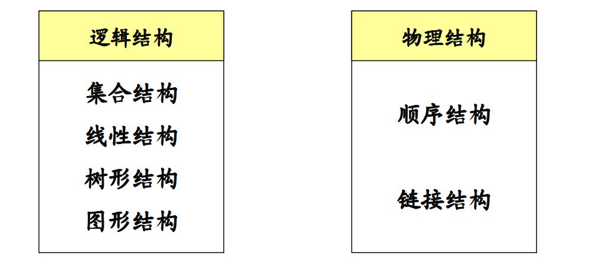
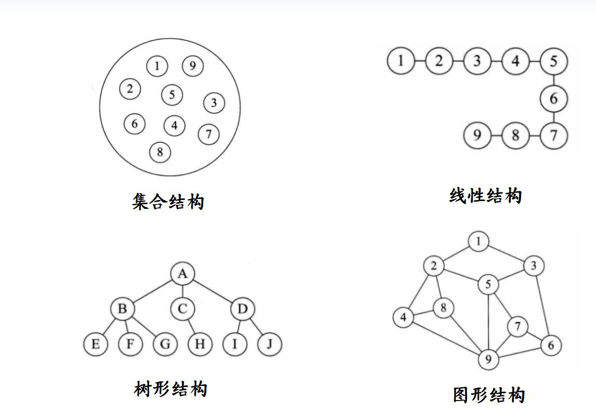
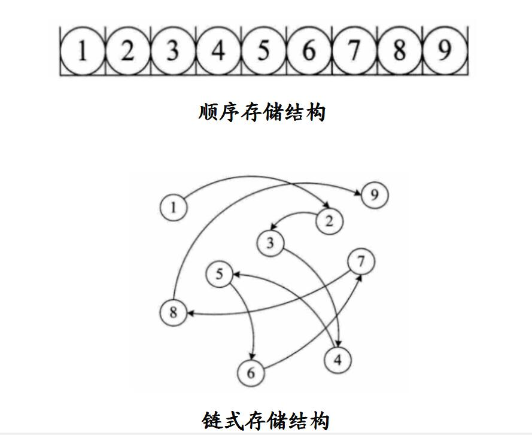
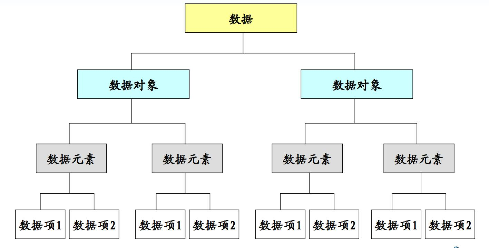
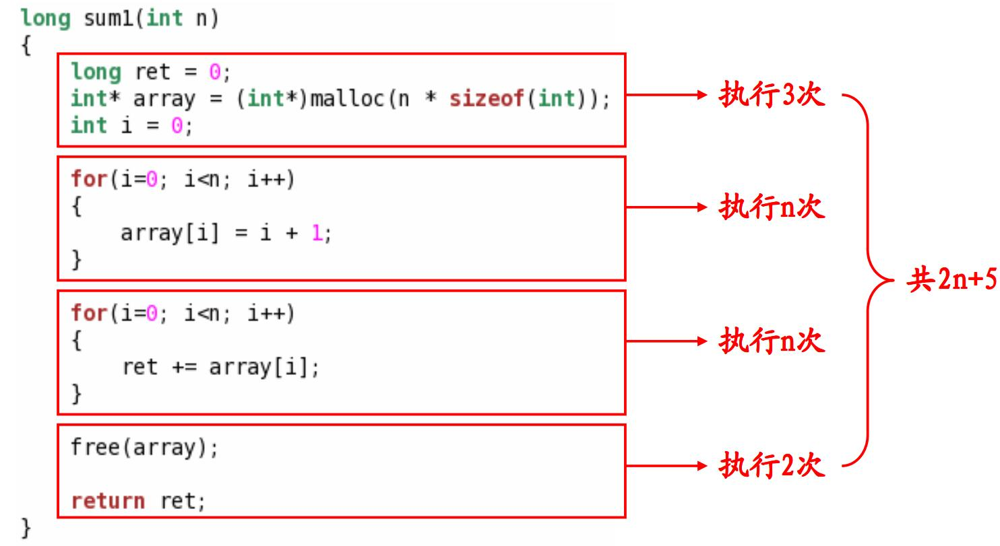
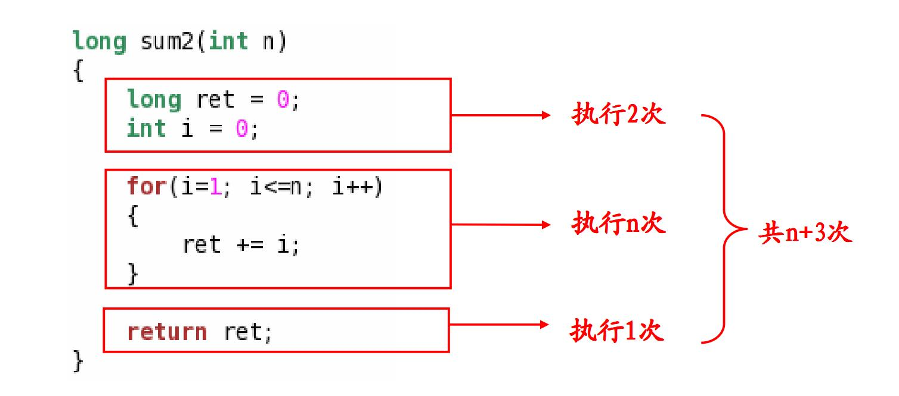
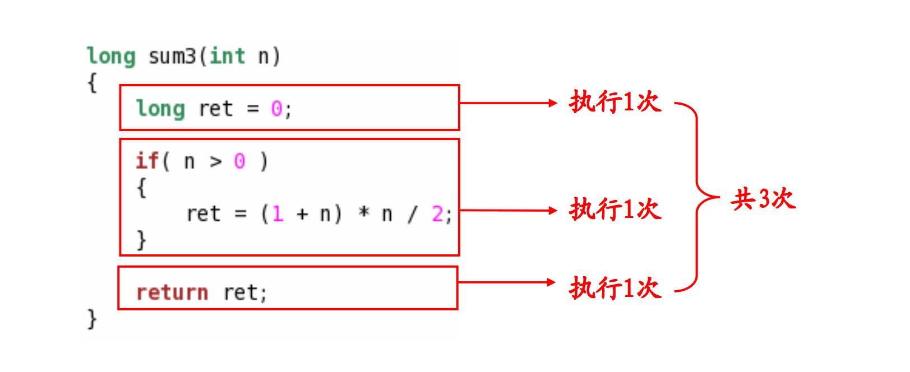
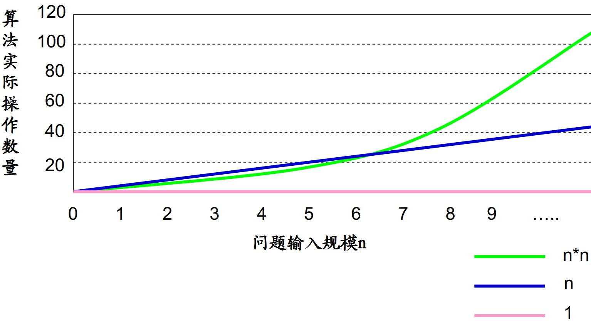
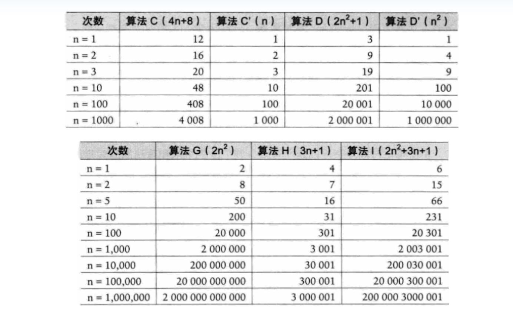
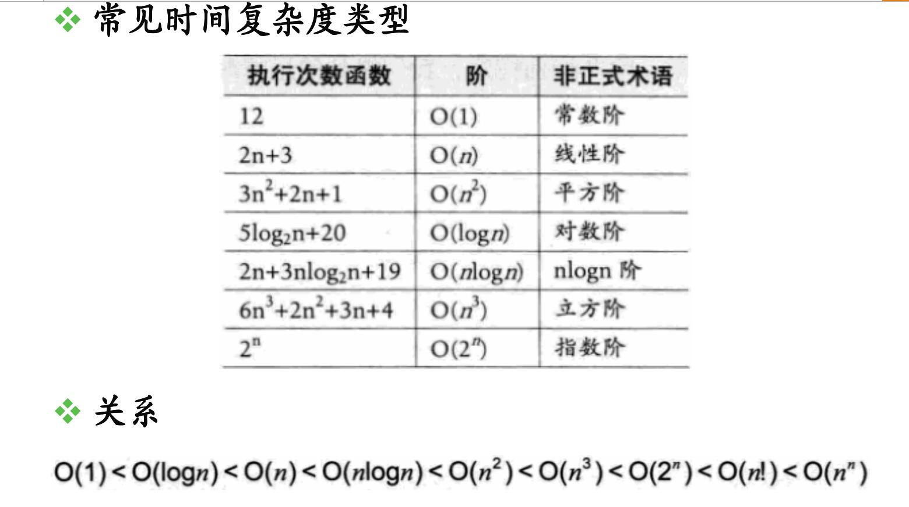

==文档制作工具：小书匠（markdown工具）==
==制作人     ：young==
==制作时间：2018.08.25==


----------

编程思想，和编程能力。理论和实践并存。重点是如何将理论带入实践中。

# 第一课： 内行看门道

## 1.1 理解程序的本质

程序的本质是为了解决实际问题而存在的，从本质上说，程序是解决问题的步骤描述。


----------


## 1.2 数据的艺术

### 1.2.1 数据结构的基本概念

数据
: 程序的操作对象，用于描述客观的事物。
数据的特点：
* 可以输入到计算机
* 可以被计算机程序处理

数据结构中的数据必须是有效的，例如我们做为循环是的临时变量i，这个就不是我们数据结构中所谈论的数据。
例如我们所说的：int,char之类的叫做数据类型。数据的分类。

数据元素
: 组成的数据的基本单位。

数据项
: 一个数据元素有若干个数据项组成。

数据对象
: 性质相同的数据元素的集合。

例:
``` cpp
struct Student      //一种数据类型
{
		char *name;
		int      age;
};

struct Student S;  //数据元素
struct Student stu[100]; // 数据对象
S.name = young";  //数据项
S.age = 20;
```
数据元素之间不是独立的，存在特定的关系，这些关系就是结构；数据结构指数据对象中数据元素之间的关系。例如：数组中各个元素之间存在固定的线性关系。所以我们编写一个好的程序之前，我们必须分析待处理问题的中各个对象的特性，以及对象之间的关系。

我们前辈给我们做了很多的总结。按照视点的不同，数据结构可以分成逻辑结构和物理结构。



### 1.2.2 逻辑结构

集合结构
: 数据元素之间没有特别的关系，仅仅是同属相同的集合。

线性结构
: 数据元素之间是==一对一==的关系。

树形结构
: 数据元素之间存在==一对多==的层次关系。

图形结构
: 数据元素之间存在==多对多==的层次结构。

下图是几个逻辑结构的图形化理解。




### 1.2.3 物理结构

物理结构
: 逻辑结构在计算机中存储形式

顺序存储结构
: 将数据存储在地址连续的存储单元。

链式存储结构
: 将是数据存储在任意的存储单元中，通过保存地址的方式找到相关联的数据元素。这个是图形结构和树形结构的基础。



上图介绍了物理结构。图中可以很直观的表现出来这两个结构的区别。特别说明下，链式结构是往深层次学习的基础。
数据，数据对象，数据元素，数据项之间的关系，如下图：




----------

## 1.3 程序的灵魂与算法

### 1.3.1 什么是算法

我们整天说的数据结构于算法，那到底他们有什么关系呢？
有人觉得算法是程序写的短，是不是算法越好呢？其实是不一定的，那我们现在来了解下什么是算法。

算法的定义
: 特定问题求解步骤的描述。

在计算机中表现为指令的有序序列。算法是独立存在的一种解决方法和思想，对于算法而言，语言是不重要的，重要的是思想。但是这个是有前提条件的，作为程序员来说，语言是很重要的。

数据结构只是静态的描述了数据元素之间的关系；高效的程序需要在数据结构的基础上设计和选择算法。
高效的程序主要靠：**恰当的数据结构**和**合适的算法**。

### 1.3.2 算法的特性

输入
: 算法具有0个或者多个输入。

输出
: 算法至少有一个或者多个输出，这里的输出不一定狭义的打印，而是有给用户的一种提示，例如点灯，或者蜂鸣器响一下等等。

有穷性
: 算法在有限的步骤之后会自动结束而不会无限循环。比如我们的qq，加入你不关闭它，原则上它就会一直执行下去，所以他只是程序，不是算法。只是这个程序中用到了很多的算法。

确定性
: 算法中的每一步都有确定的含义，不会出现二义性

可行性
: 算法的每一步都是可行性

只有程序包含以上5个特性才是算法。不然只是一系列的步骤而已。

### 1.3.3 算法设计的准则

怎么判定一个算法的好坏？比如:我们要得到一个数据的下标，你给我一个排序算法，明显这个是不对的。所以判断也是有条件的。

正确性
: 算法对于合法数据能够得到满足要求的结果;算法能够处理非法输入，并得到合理的结果；算法对于边界数据和压力数据能够得到满足要求的结果。

可读性
: 算法要方便阅读，理解和交流，算法是给人读的。

健壮性
: 算法不应该产生莫名奇妙的结果。

高性价比
: 利用最少的时间和资源得到满足要求的结果。

值得我们注意的是：算法的可读性是最容易被忽视的，然而，程序是写给人看的，而不是计算机。可读性是除了算法正确性之外最应该追求的准则。比如有人离职了，你接管他的代码，然而你看不懂，你是什么感觉？
算法是为了解决实际问题而设计的，而数据结构是算法需要处理的问题的载体，数据结构和算法相互相成的。我们的程序就是数据结构和算法组成的，所以算法和数据结构一样的重要。


----------

## 1.4 审判程序的灵魂

这小结是这章的重点，这个小结会给出一个科学的方法判定一个程序的效率。我们会学到如何判断程序的好坏。
学习之前，我们如何判断一个程序或者算法是好的呢？有人会说，程序的执行越快越好。当然这个是对的。换句话说程序的执行的效率比较高。所以我们要判断程序的执行时间，也就是执行的效率。

### 1.4.1 算法效率的度量

事后统计法
: 比较不同算法对同一组数据的运行处理时间。

他的缺陷是为了获取不同算法的时间，必须要编写相应的程序；运行时间严重依赖硬件及运行环境因素；而且算法的测试数据的选取也是相当的困难，我们需要的算法是在不确定的环境下执行。
事后统计法虽然比较直观，但是实施困难且缺陷较多，一般不考虑。

事前分析估算法
: 依据统计的方法对算法效率进行估算。

影响算法效率的主要因素
* 算法采用的策略和方法，就是算法本身。
* 问题的输入规模大小。
* 编译器所产生的代码。
* 计算机的执行速率，硬件。

根据分析，算法效率主要考虑的是算法本身的实现和问题规模最相关。算法本身其实就是解体步骤，在计算机中就是计算机语句。
假设算法的的步骤数量为m，计算机每条语句的执行时间为T,假设问题规模为n，那么

``` fix
 m = f(n) 
算法执行时间 = mT = f(n) * T

```
那么对于固定的计算机而言，执行语句的时间是固定的，所以算法的执行时间主要考虑问题规模的大小。

算法效率的简单估算的例子
下面我们举例3个累加算法的例子。第一个算法的使用堆申请空间，然后对堆中的数据进行赋值，然后在进行累加。如下图所示：



第二个算法直接用一个==for== 循环累加，来实现算法。



第三个算法采用高斯定理来进行数据求和，如下图所示：



下面我们来估算的分析下，假设我们用t1,t2,t3里表示三个算法的执行时间，所以

``` fax
t1 = (2n + 5) * T
t2 = (n + 3) * T
t3 = 3 * T
```
显然 ==t3 < t2 < t1==，所以理论上说第三中算法比前两种要优秀些。其实三种算法的关键部分的操作数量分别是2n,n和1。随着问题规模n变大，他们得操作数量的差异也会越来越大。 因此实际算法在时间效率上的差异也会表的非常明显。
我们用数学的图形的形式只管的看变化，如下图：




算法效率的度量

我们在判断一个算法的效率时，往往只需要关注操作数量的最高次项，其他次要项目和常数项可以忽略。如下图所示：



大O表示法
* 在算法效率严重依赖于操作数量
* 在判断时首先关注操作数量的最高次项
* 操作数量的估算可以作为时间复杂度的估算
* 
例

``` fax
O(5) = O(1)
O(2n + 1) = O(2n) = O(n)
O(n^2 + n +1) = O(n^2 + n) = O(n^2)
O(3n^3 + 1) = O(3n^3) = O(n^3)
```
我们从数学的角度看下算法的时间负责度，如下图：



最好与最坏的概念

``` c
#include <stdio.h>

int search(int array[], int length, int n)
{
    int ret = -1;
    int i = 0;
    
    for(i=0; i<length; i++)
    {
        if( array[i] == n )
        {
            ret = i;
            break;
        }
    }
    
    return ret;
}

int main()
{
    int array[5] = {1, 2, 3, 4, 5};
    
    printf("%d\n", search(array, 5, 1)); // 最好情况，只执行1次复杂度O(1)
    printf("%d\n", search(array, 5, 5));// 最坏情况，执行n次,负责度为O(n)
    
    return 0;
}
```

上面代码，我们在==main== 函数中会有两个最好情况和最坏情况的介绍，在实际应用中，我们一般只考虑最坏情况，因为最坏情况都满足要求，那么最好和平均情况肯定都满足。所以我们在没有特殊说明都是指最坏情况。

算法的空间复杂度

下面来看另一个概念，算法在运行过程中，运行的空间复杂度。原则和原理其实和时间复杂度类似，只是我们关注的不是操作数量了，而是实实在在占用的物理空间是多少。

``` lisp
S(n) = O(f(n))
```
*其中，n为问题规模，f(n)为在问题规模为n时所占用存储空间的函数。*

大O表示法同样适用于算法的空间复杂度，当算法执行时所需要的空间是常数时，空间复杂度为O(1).

例：

``` c
long sum1(int n)
{
    long ret = 0;  // 4byte
    int* array = (int*)malloc(n * sizeof(int)); // 4 + 4 * n
    int i = 0;  // 4 byte
    
    for(i=0; i<n; i++) {
        array[i] = i + 1;
    }
    
    for(i=0; i<n; i++) {
        ret += array[i];
    }
    
    free(array);
    
    return ret;
}

long sum2(int n)
{
    long ret = 0;  // 4byte
    int i = 0;  //byte
    
    for(i=1; i<=n; i++) {
        ret += i;
    }
    
    return ret;
}

long sum3(int n)
{
    long ret = 0;  // 4byte
    
    if( n > 0 ) {
        ret = (1 + n) * n / 2;
    }
    
    return ret;
}
```
从上面代码分析，sum1占用的字节为 ==4n + 12== byte；sum2 占用 ==8==byte，sum3占用==4==byte。很明显，从空间复杂度角度说明，sum3优于sum2由于sum1。


